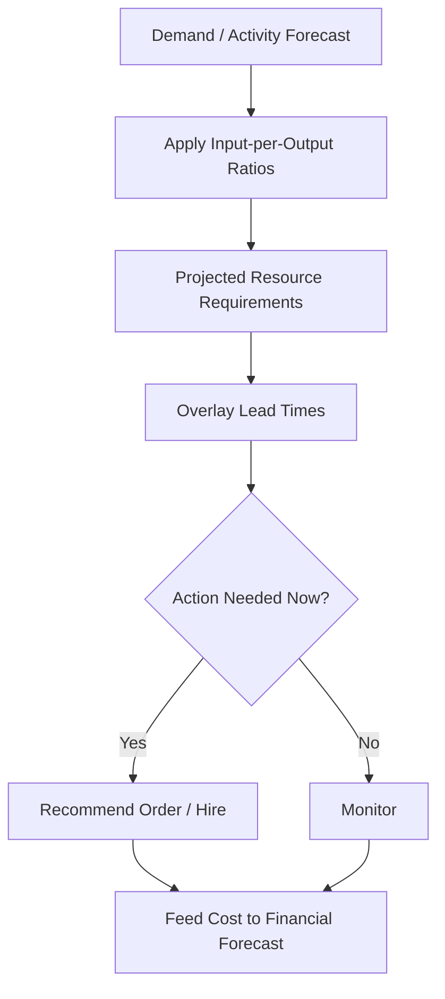

# Volume 04 - Resource Forecasting

| Field | Value |
|---|---|
| Document ID | WORLD-VOL04-041 |
| Title | Resource Forecasting |
| Version | 1.0 |
| Status | Approved |
| Classification | Internal |
| Founder | Mahesh Choudhary |

## Purpose

Resource forecasting is the discipline of estimating the people, materials, and inputs the business will need over time to meet its plans. This chapter defines how WORLD translates demand and activity forecasts into projected resource requirements and their associated timing and cost.

## Scope

This chapter covers the projection of resource requirements - labour, materials, and key inputs - and their acquisition lead times. It consumes demand forecasts (Chapter 40), informs capacity planning (Chapter 38), and feeds cost lines into financial forecasting (Chapter 39). It does not size fixed productive capacity, which is Chapter 38.

## First Principles

Resources are consumed in proportion to activity. Every unit of output requires a definable bundle of inputs - hours, materials, and services. If the relationship between output and inputs is known, then a forecast of activity implies a forecast of resource need. The complication is time: resources have acquisition lead times and minimum order or hiring increments, so the requirement must be projected far enough ahead to be met. Resource forecasting is the conversion of activity into timed, quantified input requirements.

## Why This Concept Exists

Running short of a critical input halts delivery; over-provisioning ties up cash and creates waste. Resource forecasting exists to procure and hire ahead of need with the right lead time, to reveal input dependencies before they become emergencies, and to give the financial forecast credible cost drivers. It turns a demand estimate into a concrete shopping and hiring list over time.

## Where It Is Used

Resource forecasting is used in procurement, hiring, inventory management, and supplier negotiation. It is refreshed whenever demand forecasts or the input-to-output ratios change.

| Resource Class | Driver | Lead Time | Increment |
|---|---|---|---|
| Direct labour | Output volume | Weeks to months | Per hire |
| Raw materials | Units produced | Days to weeks | Per order/MOQ |
| Contracted services | Project load | Days | Per engagement |
| Consumables | Activity level | Days | Per pack |

## How WORLD Implements It

WORLD applies known input-per-output ratios to the demand forecast, projects each resource requirement over time, overlays lead times and order increments, and flags where a requirement must be actioned now to be met later.

## Relationship with the AI Business Partner

The AI Business Partner maintains the input-per-output ratios, projects resource needs from the demand forecast, and issues timed procurement and hiring recommendations that respect lead times and increments. It highlights single-source dependencies and cost-driver changes, and hands quantified cost lines to the financial forecast.

## Relationship with ERP

A future ERP layer will record actual consumption, inventory levels, and purchase orders. Conceptually, resource forecasting predicts requirements and the ERP tracks actual usage and stock; the variance refines the input-per-output ratios over time. Procurement execution ultimately lives in the ERP; forecasting only anticipates it.

## Relationship with Business Foundation

Business Foundation (Volume 02) defines the production or service model whose input-per-output ratios resource forecasting relies on. A change to the offering or process in the foundation changes those ratios and therefore the resource forecast.

## Concrete Example

A furniture maker forecasts demand for a flagship chair. Each chair consumes a defined quantity of hardwood, fixings, and finishing hours. WORLD multiplies the demand forecast by these ratios to project monthly hardwood needs, then overlays the supplier's lead time. It finds that meeting the holiday peak requires placing a hardwood order now, and that finishing hours will exceed current staffing - recommending both a timed material order and a temporary finisher, with the resulting costs passed to the financial forecast.

## Cross-References

- [Demand Forecasting](/docs/blueprint/volume-04-business-intelligence-and-decision-science/section-e-planning-and-forecasting/40-demand-forecasting.md)
- [Capacity Planning](/docs/blueprint/volume-04-business-intelligence-and-decision-science/section-e-planning-and-forecasting/38-capacity-planning.md)
- [Financial Forecasting](/docs/blueprint/volume-04-business-intelligence-and-decision-science/section-e-planning-and-forecasting/39-financial-forecasting.md)

## References

- [Volume 01 - Vision and Philosophy](/docs/blueprint/volume-01-vision-and-philosophy/README.md)
- [Document Standards](/docs/governance/document-standards.md)

## Change Log

| Version | Date | Author | Notes |
|---|---|---|---|
| 1.0 | 2026-07-12 | Lead Software Engineer | Initial approved version. |
