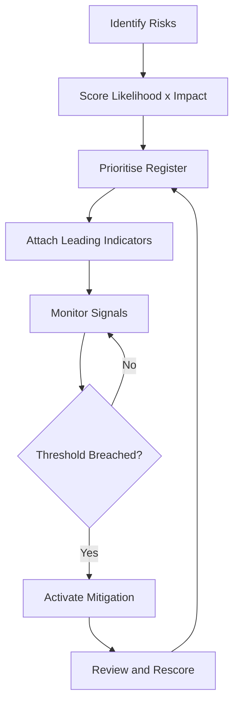

# Volume 04 - Risk Forecasting

| Field | Value |
|---|---|
| Document ID | WORLD-VOL04-042 |
| Title | Risk Forecasting |
| Version | 1.0 |
| Status | Approved |
| Classification | Internal |
| Founder | Mahesh Choudhary |

## Purpose

Risk forecasting is the discipline of anticipating events that could harm the business, estimating their likelihood and impact, and preparing responses before they occur. This chapter defines how WORLD identifies, quantifies, monitors, and mitigates risk as a forward-looking intelligence function.

## Scope

This chapter covers the identification and assessment of risks, the monitoring of leading indicators, and the linkage of risk to mitigation. It complements scenario planning (Chapter 37), which explores plausible futures, by focusing specifically on adverse events and their management. It does not cover financial variance analysis, which is part of financial forecasting (Chapter 39).

## First Principles

Risk is the product of likelihood and impact applied to an uncertain adverse event. Two ideas follow. First, risks are not all equal: a rare, catastrophic risk and a frequent, minor one demand different responses. Second, most risks announce themselves through leading indicators before they materialise, so risk can be watched rather than merely suffered. Risk forecasting is the systematic pairing of prioritised risks with the signals that precede them and the responses that contain them.

## Why This Concept Exists

Businesses fail more often from unmanaged downside than from missed upside. Risk forecasting exists to convert vague anxiety into a prioritised, monitored register, to ensure attention and mitigation go to the risks that matter most, and to pre-commit responses so a crisis is met with a plan rather than panic. It makes the fragility of the business explicit and therefore manageable.

## Where It Is Used

Risk forecasting is used in decision review, in contingency planning, in insurance and supplier decisions, and in continuous operational monitoring. It is revisited on a regular cadence and whenever a new material dependency is introduced.

| Risk | Likelihood | Impact | Leading Indicator | Response |
|---|---|---|---|---|
| Key supplier failure | Medium | High | Delivery delays rising | Qualify alternate supplier |
| Key-person dependency | Medium | High | Single owner of a function | Cross-train, document |
| Cash shortfall | Low | Severe | Runway below threshold | Trigger cost controls |
| Demand collapse | Low | High | Pipeline conversion falling | Activate downside plan |

## How WORLD Implements It

WORLD maintains a risk register, scores each risk on likelihood and impact, attaches leading indicators, monitors those indicators, and links each risk to a pre-defined mitigation that can be activated when signals cross a threshold.

## Relationship with the AI Business Partner

The AI Business Partner builds and maintains the risk register, scores and reprioritises risks, watches leading indicators continuously, and alerts the operator with the pre-committed mitigation when a threshold is breached. It surfaces emerging risks the operator has not named and prevents the register from going stale.

## Relationship with ERP

A future ERP layer will supply many of the operational signals that serve as leading indicators - delivery timeliness, cash position, order flow. Conceptually, risk forecasting defines what to watch and the ERP provides the measurements that trigger mitigation.

## Relationship with Business Foundation

Business Foundation (Volume 02) defines the dependencies, obligations, and risk appetite of the business. Risk forecasting draws its candidate risks from the foundation's declared model and calibrates severity thresholds to the foundation's stated risk tolerance.

## Concrete Example

A cloud-services reseller depends heavily on one upstream vendor. WORLD records this as a high-impact key-supplier risk, attaches leading indicators (rising vendor incident rates and lengthening support response times), and monitors them. When incident rates cross the defined threshold, the AI Business Partner alerts the operator and activates the pre-committed mitigation: begin onboarding a secondary vendor before service to customers is affected.

## Cross-References

- [Scenario Planning](/docs/blueprint/volume-04-business-intelligence-and-decision-science/section-e-planning-and-forecasting/37-scenario-planning.md)
- [Financial Forecasting](/docs/blueprint/volume-04-business-intelligence-and-decision-science/section-e-planning-and-forecasting/39-financial-forecasting.md)
- [Business Planning](/docs/blueprint/volume-04-business-intelligence-and-decision-science/section-e-planning-and-forecasting/35-business-planning.md)

## References

- [Volume 01 - Vision and Philosophy](/docs/blueprint/volume-01-vision-and-philosophy/README.md)
- [Document Standards](/docs/governance/document-standards.md)

## Change Log

| Version | Date | Author | Notes |
|---|---|---|---|
| 1.0 | 2026-07-12 | Lead Software Engineer | Initial approved version. |
