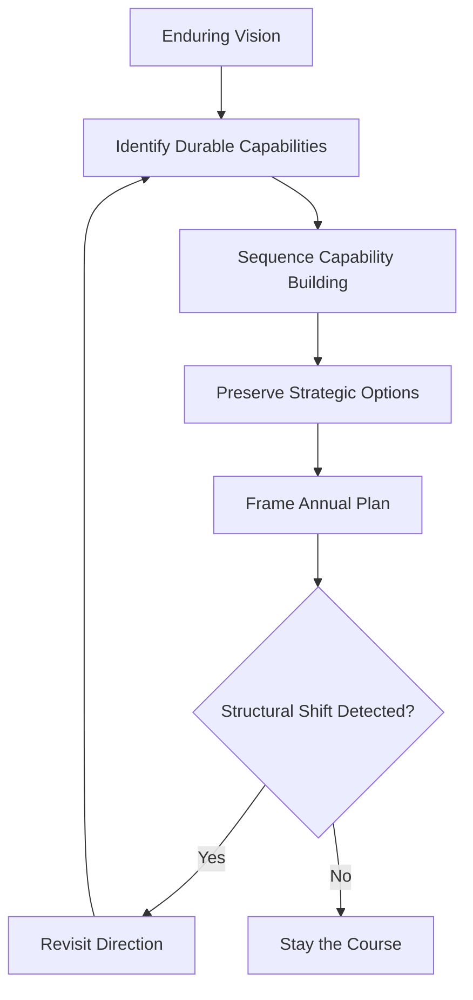

# Volume 04 - Long-Term Planning

| Field | Value |
|---|---|
| Document ID | WORLD-VOL04-043 |
| Title | Long-Term Planning |
| Version | 1.0 |
| Status | Approved |
| Classification | Internal |
| Founder | Mahesh Choudhary |

## Purpose

Long-term planning is the discipline of setting direction across multi-year horizons where specific forecasts are unreliable but strategic choices are consequential. This chapter defines how WORLD reasons about the distant future - through direction, options, and capability building rather than point prediction.

## Scope

This chapter covers planning beyond the horizon where quantitative forecasts remain credible. It sets the strategic frame within which the annual business plan (Chapter 35) and the shorter-horizon forecasts (Chapters 39-42) operate. It does not produce detailed near-term projections.

## First Principles

Forecast accuracy decays with distance; beyond a certain horizon, precise prediction becomes fiction. Yet the largest, least reversible decisions - what capabilities to build, what markets to enter, what identity to hold - play out over exactly these horizons. Long-term planning resolves this tension by shifting from prediction to positioning: instead of forecasting the distant future, it builds durable capabilities, preserves optionality, and commits to a direction robust across many futures. It plans for adaptability, not for a specific outcome.

## Why This Concept Exists

Short-term planning optimises within the current game; long-term planning chooses which game to play. Without it, a business drifts, accumulates no durable advantage, and is repeatedly surprised by structural change. Long-term planning exists to give continuity of direction, to sequence the building of hard-to-copy capabilities, and to ensure today's reversible decisions compound toward a coherent future rather than cancelling out.

## Where It Is Used

Long-term planning is used in setting vision, in major capability and market decisions, and in framing the annual plan. It is revisited on a longer cadence than operational plans and whenever a structural shift in the environment is detected.

| Horizon | Planning Mode | Primary Output | Certainty |
|---|---|---|---|
| Near (0-1 yr) | Forecast and execute | Detailed plan | High |
| Medium (1-3 yr) | Direction with options | Roadmap, hedges | Moderate |
| Long (3+ yr) | Positioning and capability | Vision, capability sequence | Low |

## How WORLD Implements It

WORLD anchors long-term planning to the enduring vision, identifies the capabilities that create durable advantage, sequences their construction, and reviews direction against detected structural shifts rather than short-term noise.

## Relationship with the AI Business Partner

The AI Business Partner holds the long-term vision as a stable reference, distinguishes structural shifts from short-term noise, and ensures near-term plans compound toward the long-term direction. It preserves institutional memory across cycles, checks that major decisions build rather than erode durable capability, and prompts a direction review only when the environment genuinely changes.

## Relationship with ERP

A future ERP layer operates on transactional, near-term horizons and does not itself perform long-term planning. Conceptually, long-term planning sets the direction that eventually shapes which operational capabilities the ERP will need to support; the relationship is one of framing rather than data exchange.

## Relationship with Business Foundation

Business Foundation (Volume 02) declares the enduring purpose and identity of the business. Long-term planning is the temporal extension of that foundation - it charts how the business grows into its declared purpose over years while keeping that identity constant. The foundation is the anchor; long-term planning is the trajectory from it.

## Concrete Example

A local logistics firm holds a vision of becoming the region's most reliable last-mile network. Precise five-year demand is unforecastable, so WORLD frames the long-term plan around durable capabilities: route-optimisation know-how, a trained driver bench, and trusted local relationships. It sequences their building and preserves the option to expand into an adjacent city. When a structural shift appears - a large competitor withdrawing from the region - the AI Business Partner flags it as genuine and recommends revisiting direction, distinguishing it from an ordinary seasonal dip.

## Cross-References

- [Business Planning](/docs/blueprint/volume-04-business-intelligence-and-decision-science/section-e-planning-and-forecasting/35-business-planning.md)
- [Goal Planning](/docs/blueprint/volume-04-business-intelligence-and-decision-science/section-e-planning-and-forecasting/36-goal-planning.md)
- [Scenario Planning](/docs/blueprint/volume-04-business-intelligence-and-decision-science/section-e-planning-and-forecasting/37-scenario-planning.md)

## References

- [Volume 01 - Vision and Philosophy](/docs/blueprint/volume-01-vision-and-philosophy/README.md)
- [Document Standards](/docs/governance/document-standards.md)

## Change Log

| Version | Date | Author | Notes |
|---|---|---|---|
| 1.0 | 2026-07-12 | Lead Software Engineer | Initial approved version. |
