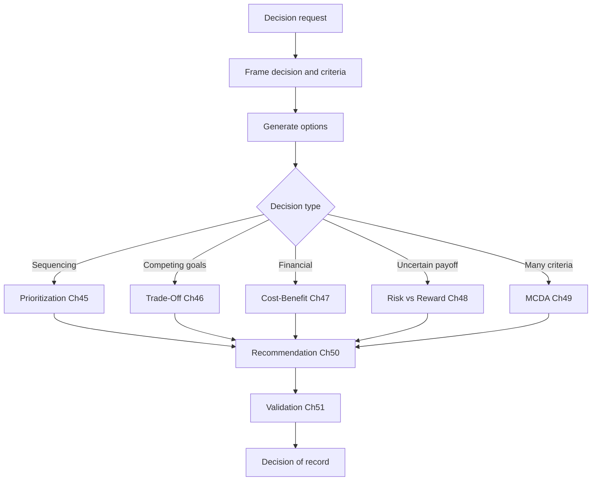

# Volume 04 - Decision Support System

| Field | Value |
|---|---|
| Document ID | WORLD-VOL04-044 |
| Title | Decision Support System |
| Version | 1.0 |
| Status | Approved |
| Classification | Internal |
| Founder | Mahesh Choudhary |

## Purpose

This chapter defines the WORLD Decision Support System (DSS): the structured capability that converts intelligence into governed, defensible decisions. It establishes the conceptual architecture that unifies the frameworks in Section F - prioritization, trade-off, cost-benefit, risk-reward, multi-criteria analysis, recommendation, and validation - into a single decision pipeline.

## Scope

This chapter covers the anatomy of a decision support system, the stages of the WORLD decision pipeline, and the orchestration logic that selects the right framework for a given decision. It does not restate the mechanics of each downstream framework; those are defined in Chapters 45-51.

## Why This Concept Exists

From first principles, an insight is not a decision. Volume 04 Sections A-E produce analysis, diagnosis, and forecasts, but analysis left unbound produces indecision or arbitrary choice. A decision support system exists to close the gap between knowing and choosing. It does not replace the decision-maker; it structures the choice so that options are explicit, criteria are stated in advance, evidence is attached, and the reasoning survives audit. Classical DSS theory frames this as the combination of a data component, a model component, and a dialogue component. WORLD retains that decomposition but makes the model and dialogue layers native to an AI Business Partner rather than a passive query tool.

## Where It Is Used

The DSS is invoked whenever a choice among alternatives carries material consequence: capital allocation, hiring, pricing, vendor selection, roadmap sequencing, or risk acceptance. It is the entry point that routes a decision to the appropriate Section F framework.

| DSS Component | Question Answered | WORLD Source |
|---|---|---|
| Data | What is true? | Volume 04 Sections A-E |
| Model | How do options compare? | Chapters 45-49 |
| Dialogue | What do we recommend and why? | Chapters 50-51 |

## How WORLD Implements It

WORLD implements the DSS as a staged pipeline. A decision request is framed, options are generated, the correct analytical framework is selected by decision type, options are scored, and a validated recommendation is issued with its evidence trail.

**Example:** A services firm must decide whether to open a second delivery centre. The DSS frames the objective (margin-safe capacity growth), routes the financial dimension to cost-benefit (NPV, payback), the uncertainty dimension to risk-reward (expected value across demand scenarios), and the location choice to MCDA. The three outputs converge in a single recommendation, validated against decision-quality criteria before it becomes the decision of record.

## Relationship with the AI Business Partner

The DSS is the operational core of the AI Business Partner's decision role, aligned with the Volume 03 Decision Support Framework (Chapter 22). The Partner frames the decision, generates and screens options, selects and runs the correct framework, and presents a recommendation rather than a raw data dump. It preserves the full reasoning chain so any decision can be explained and revisited.

## Relationship with ERP

An ERP system records the transactions a decision authorizes - a purchase order, a headcount change, a price update - but it does not decide. Conceptually, the DSS sits above the ERP as the deliberation layer, and the ERP is the execution and system-of-record layer that carries the chosen action. Concrete integration patterns are defined in a later volume.

## Relationship with Business Foundation

Business Foundation supplies the decision rights, thresholds, and policies that the DSS must honour: who may approve what, at which value, under which constraints. The DSS reads these boundaries as inputs and writes durable decisions back as precedent, keeping choices consistent with the codified operating model.

## Cross-References

- [Prioritization Framework](/docs/blueprint/volume-04-business-intelligence-and-decision-science/section-f-decision-frameworks/45-prioritization-framework.md)
- [Multi-Criteria Decision Analysis](/docs/blueprint/volume-04-business-intelligence-and-decision-science/section-f-decision-frameworks/49-multi-criteria-decision-analysis.md)
- [Decision Validation](/docs/blueprint/volume-04-business-intelligence-and-decision-science/section-f-decision-frameworks/51-decision-validation.md)
- [Volume 03 - AI Business Partner](/docs/blueprint/volume-03-ai-business-partner/README.md)

## References

- [Volume 01 - Vision and Philosophy](/docs/blueprint/volume-01-vision-and-philosophy/README.md)
- [Document Standards](/docs/governance/document-standards.md)

## Change Log

| Version | Date | Author | Notes |
|---|---|---|---|
| 1.0 | 2026-07-12 | Lead Software Engineer | Initial approved version. |
