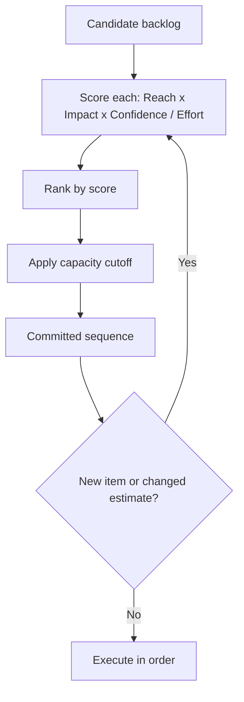

# Volume 04 - Prioritization Framework

| Field | Value |
|---|---|
| Document ID | WORLD-VOL04-045 |
| Title | Prioritization Framework |
| Version | 1.0 |
| Status | Approved |
| Classification | Internal |
| Founder | Mahesh Choudhary |

## Purpose

This chapter defines how WORLD ranks a set of candidate initiatives, requests, or problems when they compete for the same finite capacity. Prioritization is the sequencing discipline of the decision system: not whether an option is good, but which good options come first.

## Scope

This chapter covers prioritization criteria, established scoring methods (RICE, weighted scoring, value-versus-effort), and the WORLD prioritization loop. It excludes the deeper comparison of a shortlist under many criteria, which is handled by Multi-Criteria Decision Analysis (Chapter 49).

## Why This Concept Exists

From first principles, capacity is always smaller than demand for it. Every organization faces more worthwhile things to do than it can do at once, so the binding question is order, not merit. Prioritization exists to make that ordering explicit, repeatable, and defensible, replacing the loudest-voice or newest-request heuristics that quietly govern un-prioritized organizations. A good prioritization framework encodes what the business values - impact, reach, urgency, cost - into a single comparable score so that sequencing follows strategy rather than politics.

## Where It Is Used

Prioritization is used for product roadmaps, project portfolios, support and incident queues, sales pipeline focus, and remediation backlogs. Any time items wait in line for shared capacity, a prioritization framework should govern the line.

## How WORLD Implements It

WORLD applies RICE (Reach, Impact, Confidence, Effort) as its default quantitative prioritization method, with weighted scoring available when criteria differ from the RICE set. Each candidate receives a score; the queue is ordered by score and rechecked as new items arrive or estimates change.

**Example:** A product team scores four features. RICE score = (Reach x Impact x Confidence) / Effort.

| Feature | Reach (users/qtr) | Impact (0.25-3) | Confidence | Effort (person-months) | RICE Score |
|---|---|---|---|---|---|
| Onboarding redesign | 8,000 | 2.0 | 0.8 | 4 | 3,200 |
| SSO integration | 3,000 | 1.5 | 0.9 | 3 | 1,350 |
| Reporting export | 5,000 | 1.0 | 0.8 | 2 | 2,000 |
| Theme customization | 6,000 | 0.5 | 0.7 | 3 | 700 |

The ordering is onboarding redesign, reporting export, SSO, then theme customization. The high-reach, low-impact theme feature ranks last despite touching many users, because impact and effort dominate. WORLD surfaces this ranking with the assumptions attached, so a reviewer can challenge any input.

## Relationship with the AI Business Partner

The AI Business Partner maintains the prioritized queue continuously rather than at planning milestones. It estimates RICE inputs from historical data, flags low-confidence scores for human review, and re-ranks automatically when new information arrives. It also explains why an item moved, keeping the sequence transparent and defensible.

## Relationship with ERP

An ERP or work-management system executes the resulting sequence as scheduled work, allocated resources, and tracked tasks. Conceptually, prioritization decides order and the ERP enacts it; the ERP does not compute priority. Specific scheduling integration is defined in a later volume.

## Relationship with Business Foundation

Business Foundation supplies the strategic weights and constraints that prioritization must respect: which objectives matter most this period, which commitments are non-negotiable, and what capacity exists. Prioritization translates those foundational priorities into an operational order of work.

## Cross-References

- [Decision Support System](/docs/blueprint/volume-04-business-intelligence-and-decision-science/section-f-decision-frameworks/44-decision-support-system.md)
- [Trade-Off Analysis](/docs/blueprint/volume-04-business-intelligence-and-decision-science/section-f-decision-frameworks/46-trade-off-analysis.md)
- [Multi-Criteria Decision Analysis](/docs/blueprint/volume-04-business-intelligence-and-decision-science/section-f-decision-frameworks/49-multi-criteria-decision-analysis.md)

## References

- [Volume 01 - Vision and Philosophy](/docs/blueprint/volume-01-vision-and-philosophy/README.md)
- [Document Standards](/docs/governance/document-standards.md)

## Change Log

| Version | Date | Author | Notes |
|---|---|---|---|
| 1.0 | 2026-07-12 | Lead Software Engineer | Initial approved version. |
