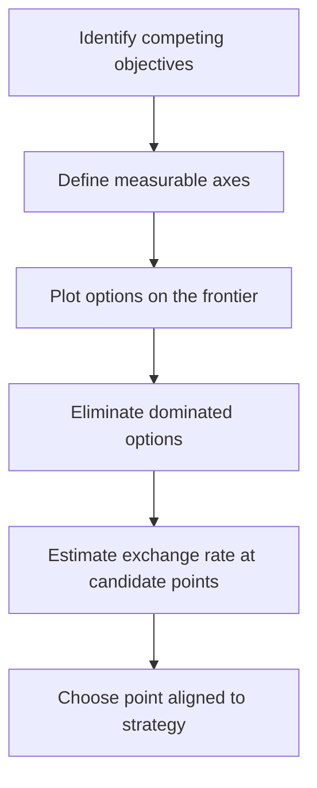

# Volume 04 - Trade-Off Analysis

| Field | Value |
|---|---|
| Document ID | WORLD-VOL04-046 |
| Title | Trade-Off Analysis |
| Version | 1.0 |
| Status | Approved |
| Classification | Internal |
| Founder | Mahesh Choudhary |

## Purpose

This chapter defines how WORLD analyses trade-offs: decisions in which improving one objective necessarily degrades another. It gives the organization a disciplined way to reason about the exchange rate between competing goods rather than pretending the conflict does not exist.

## Scope

This chapter covers the identification of competing objectives, the marginal exchange between them, and the WORLD method for making a trade-off explicit and deliberate. It complements prioritization (Chapter 45) and feeds multi-criteria analysis (Chapter 49).

## Why This Concept Exists

From first principles, in a constrained system you cannot maximize everything simultaneously; gains along one dimension are paid for along another. Speed versus quality, cost versus resilience, growth versus margin, and centralization versus autonomy are all irreducible tensions. Trade-off analysis exists because the failure mode is not choosing badly between them but refusing to acknowledge the exchange at all - promising fast, cheap, and excellent at once. Making the exchange rate explicit converts a hidden compromise into a conscious, owned choice.

## Where It Is Used

Trade-off analysis is used in engineering scope decisions, pricing and margin strategy, service-level design, staffing models, and any negotiation where more of one thing means less of another.

## How WORLD Implements It

WORLD names the competing objectives, quantifies the marginal exchange where possible, and positions options along the trade-off frontier so the decision-maker can choose a point on it deliberately. Options that are worse on every dimension than another option are dominated and eliminated.

**Example:** A delivery team weighs three release strategies against speed (time to ship) and quality (defect risk).

| Option | Time to Ship (weeks) | Expected Defect Risk | Status |
|---|---|---|---|
| Ship now | 2 | High (18%) | On frontier |
| Hardening sprint | 5 | Medium (7%) | On frontier |
| Full regression | 9 | Low (2%) | On frontier |
| Partial fix, no test | 6 | High (16%) | Dominated |

The partial-fix option is dominated - slower than shipping now and riskier than the hardening sprint - so it is discarded. The remaining three are genuine trade-offs. WORLD shows that moving from "ship now" to "hardening sprint" buys an 11-point risk reduction for three weeks, letting leadership price the exchange against a launch deadline.

## Relationship with the AI Business Partner

The AI Business Partner detects when a decision hides a trade-off and makes it visible instead of averaging it away. It quantifies exchange rates from data, discards dominated options automatically, and frames the residual choice as a deliberate position on the frontier. It records which trade-off was accepted so the rationale is auditable later.

## Relationship with ERP

An ERP system enforces the operational consequences of a chosen trade-off - for example, the service levels, lead times, or cost ceilings that follow from it - but it does not evaluate the exchange. Conceptually, trade-off analysis chooses the balance point and the ERP operationalizes it. Specifics are defined in a later volume.

## Relationship with Business Foundation

Business Foundation encodes the organization's standing preferences - its stated appetite for speed, cost, or quality - which set the default direction for recurring trade-offs. Trade-off analysis applies those preferences to the specific case and, when a novel balance is chosen, can update the foundational stance.

## Cross-References

- [Prioritization Framework](/docs/blueprint/volume-04-business-intelligence-and-decision-science/section-f-decision-frameworks/45-prioritization-framework.md)
- [Cost-Benefit Analysis](/docs/blueprint/volume-04-business-intelligence-and-decision-science/section-f-decision-frameworks/47-cost-benefit-analysis.md)
- [Multi-Criteria Decision Analysis](/docs/blueprint/volume-04-business-intelligence-and-decision-science/section-f-decision-frameworks/49-multi-criteria-decision-analysis.md)

## References

- [Volume 01 - Vision and Philosophy](/docs/blueprint/volume-01-vision-and-philosophy/README.md)
- [Document Standards](/docs/governance/document-standards.md)

## Change Log

| Version | Date | Author | Notes |
|---|---|---|---|
| 1.0 | 2026-07-12 | Lead Software Engineer | Initial approved version. |
