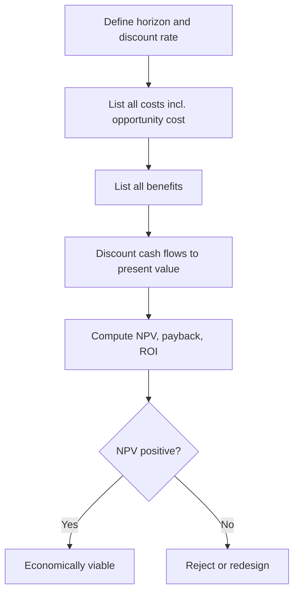

# Volume 04 - Cost-Benefit Analysis

| Field | Value |
|---|---|
| Document ID | WORLD-VOL04-047 |
| Title | Cost-Benefit Analysis |
| Version | 1.0 |
| Status | Approved |
| Classification | Internal |
| Founder | Mahesh Choudhary |

## Purpose

This chapter defines how WORLD evaluates a decision on economic grounds: comparing the full cost of an option against the full benefit it produces, adjusted for the time value of money. Cost-benefit analysis (CBA) is the financial lens of the decision system.

## Scope

This chapter covers cost and benefit identification, discounting, and the core financial measures - net present value (NPV), payback period, and return on investment (ROI). It addresses purely financial comparison; non-financial criteria are handled in Chapters 48 and 49.

## Why This Concept Exists

From first principles, resources spent on one option cannot be spent on another, so every decision has an economic cost even when no cash changes hands. Cost-benefit analysis exists to make that economics explicit and comparable across time. A benefit received in three years is worth less than the same benefit today, so nominal totals mislead; discounting to present value corrects this. CBA also forces the inclusion of costs that intuition omits - opportunity cost, ongoing operating cost, and the cost of the status quo - so the comparison is honest rather than flattering.

## Where It Is Used

CBA is used for capital investment, build-versus-buy, automation projects, hiring, and any proposal that consumes resources in expectation of return. It is the standard gate for spending decisions above a materiality threshold.

## How WORLD Implements It

WORLD enumerates all cash flows over the analysis horizon, discounts them to present value at the cost of capital, and computes NPV, payback, and ROI. A positive NPV clears the economic bar; payback and ROI provide speed and efficiency context.

**Example:** An automation tool costs 120,000 up front and returns 50,000 net benefit per year for four years, discounted at 10%.

| Year | Cash Flow | Discount Factor (10%) | Present Value |
|---|---|---|---|
| 0 | -120,000 | 1.000 | -120,000 |
| 1 | 50,000 | 0.909 | 45,450 |
| 2 | 50,000 | 0.826 | 41,300 |
| 3 | 50,000 | 0.751 | 37,550 |
| 4 | 50,000 | 0.683 | 34,150 |
| **NPV** | | | **38,450** |

NPV is positive (38,450), so the investment creates value. Undiscounted payback is 2.4 years; simple ROI over four years is 67%. WORLD presents all three, noting that the positive NPV is the decisive test while payback communicates liquidity risk.

## Relationship with the AI Business Partner

The AI Business Partner builds the cash-flow model from actuals and estimates, applies the correct discount rate, and computes NPV, payback, and ROI without spreadsheet error. It stress-tests key assumptions, exposes the break-even point, and refuses to present nominal totals as if they were comparable across years. It attaches the model so reviewers can trace every figure.

## Relationship with ERP

An ERP system holds the actual cost and revenue data that feed a CBA and later records the realized cash flows against the forecast. Conceptually, CBA is the forward-looking valuation and the ERP is the source of historical inputs and the ledger of outcomes. Specific data integration is defined in a later volume.

## Relationship with Business Foundation

Business Foundation defines the discount rate, materiality thresholds, and approval limits that govern how a CBA is conducted and who may approve the result. CBA applies those financial policies to the individual proposal, ensuring economic decisions stay consistent with the codified financial model.

## Cross-References

- [Trade-Off Analysis](/docs/blueprint/volume-04-business-intelligence-and-decision-science/section-f-decision-frameworks/46-trade-off-analysis.md)
- [Risk vs Reward Analysis](/docs/blueprint/volume-04-business-intelligence-and-decision-science/section-f-decision-frameworks/48-risk-vs-reward-analysis.md)
- [Executive Recommendation Framework](/docs/blueprint/volume-04-business-intelligence-and-decision-science/section-f-decision-frameworks/50-executive-recommendation-framework.md)

## References

- [Volume 01 - Vision and Philosophy](/docs/blueprint/volume-01-vision-and-philosophy/README.md)
- [Document Standards](/docs/governance/document-standards.md)

## Change Log

| Version | Date | Author | Notes |
|---|---|---|---|
| 1.0 | 2026-07-12 | Lead Software Engineer | Initial approved version. |
