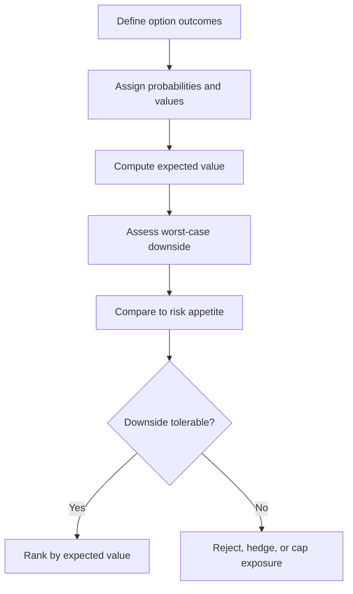

# Volume 04 - Risk vs Reward Analysis

| Field | Value |
|---|---|
| Document ID | WORLD-VOL04-048 |
| Title | Risk vs Reward Analysis |
| Version | 1.0 |
| Status | Approved |
| Classification | Internal |
| Founder | Mahesh Choudhary |

## Purpose

This chapter defines how WORLD evaluates decisions whose outcomes are uncertain, weighing the magnitude and probability of reward against the magnitude and probability of loss. It brings probabilistic reasoning to choices that cost-benefit analysis alone treats as certain.

## Scope

This chapter covers expected value, probability-weighted outcomes, downside exposure, and risk appetite. It builds on cost-benefit analysis (Chapter 47) by adding uncertainty and connects to Risk Intelligence and Risk Forecasting elsewhere in Volume 04.

## Why This Concept Exists

From first principles, most consequential decisions are made under uncertainty; the payoff is a distribution, not a number. A choice with a high expected value can still be unacceptable if its downside threatens survival, and a modest expected value can be attractive if its worst case is trivial. Risk-versus-reward analysis exists to separate two distinct questions that intuition conflates: what is the average outcome (expected value), and what is the worst plausible outcome (downside exposure). Only by evaluating both can an organization choose in line with its actual risk appetite rather than its mood.

## Where It Is Used

Risk-reward analysis is used for market entry, large bets, financial hedging, contract acceptance, security and compliance decisions, and any option where results depend on events outside the organization's control.

## How WORLD Implements It

WORLD models each option as a set of outcomes with probabilities, computes expected value, and separately examines the downside tail against the organization's risk tolerance. Options are then placed on a risk-reward grid.

**Example:** A firm weighs three growth options by expected value (EV = sum of probability x payoff).

| Option | Upside (P) | Downside (P) | Expected Value | Worst Case |
|---|---|---|---|---|
| New market entry | +900k (0.5) | -400k (0.5) | +250k | -400k |
| Adjacent product | +350k (0.7) | -100k (0.3) | +215k | -100k |
| Hold / optimize | +120k (0.9) | -20k (0.1) | +106k | -20k |

Market entry has the highest expected value (250k) but the largest downside (-400k). If that loss exceeds the firm's risk appetite, the adjacent product - nearly equal EV with a quarter of the downside - is the risk-adjusted choice. WORLD makes this appetite test explicit rather than defaulting to the highest EV.

## Relationship with the AI Business Partner

The AI Business Partner estimates outcome probabilities from data and analogues, computes expected value, and stress-tests the downside tail. Crucially, it enforces the risk-appetite check, refusing to recommend a high-EV option whose worst case breaches the organization's stated tolerance. It proposes hedges or exposure caps when the downside is otherwise disqualifying.

## Relationship with ERP

An ERP system records the realized outcome and the exposures a decision creates, providing the historical base rates that calibrate future probability estimates. Conceptually, risk-reward analysis reasons about the distribution before the fact, and the ERP records where the outcome actually landed. Specifics are defined in a later volume.

## Relationship with Business Foundation

Business Foundation codifies the organization's risk appetite and exposure limits - the maximum tolerable loss for a given decision class. Risk-reward analysis reads those limits as hard constraints, ensuring uncertain choices remain within the boundaries the business has formally accepted.

## Cross-References

- [Cost-Benefit Analysis](/docs/blueprint/volume-04-business-intelligence-and-decision-science/section-f-decision-frameworks/47-cost-benefit-analysis.md)
- [Multi-Criteria Decision Analysis](/docs/blueprint/volume-04-business-intelligence-and-decision-science/section-f-decision-frameworks/49-multi-criteria-decision-analysis.md)
- [Risk Intelligence](/docs/blueprint/volume-04-business-intelligence-and-decision-science/section-d-strategic-intelligence/33-risk-intelligence.md)

## References

- [Volume 01 - Vision and Philosophy](/docs/blueprint/volume-01-vision-and-philosophy/README.md)
- [Document Standards](/docs/governance/document-standards.md)

## Change Log

| Version | Date | Author | Notes |
|---|---|---|---|
| 1.0 | 2026-07-12 | Lead Software Engineer | Initial approved version. |
