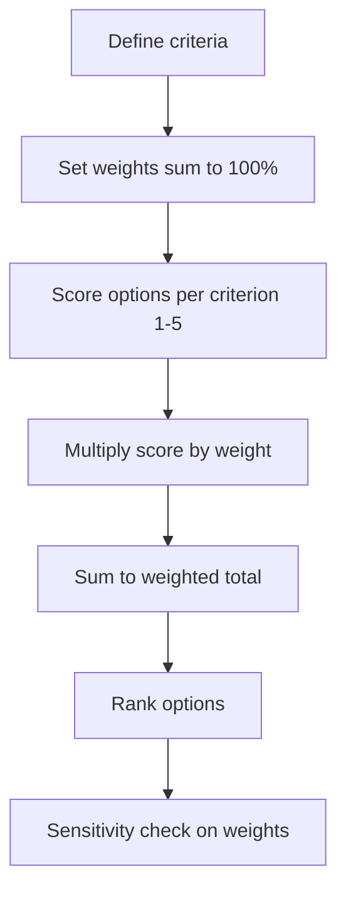

# Volume 04 - Multi-Criteria Decision Analysis

| Field | Value |
|---|---|
| Document ID | WORLD-VOL04-049 |
| Title | Multi-Criteria Decision Analysis |
| Version | 1.0 |
| Status | Approved |
| Classification | Internal |
| Founder | Mahesh Choudhary |

## Purpose

This chapter defines how WORLD compares options against several weighted criteria at once, when no single metric captures the decision. Multi-criteria decision analysis (MCDA) is the integrating framework of Section F, combining financial, risk, and qualitative dimensions into one comparable score.

## Scope

This chapter covers criteria definition, weighting, normalization, the weighted scoring matrix, and the role of the Analytic Hierarchy Process (AHP) for deriving weights. It is used when prioritization, cost-benefit, and risk-reward each capture only part of the decision.

## Why This Concept Exists

From first principles, real decisions rarely reduce to one number. A vendor choice depends on cost, capability, risk, and cultural fit at once, and these are measured in different units. MCDA exists to make such multi-dimensional choices rigorous rather than intuitive. It forces three disciplines: naming every criterion that matters, stating each criterion's weight before scoring options (so weights are not reverse-engineered to justify a favourite), and normalizing dissimilar measures onto a common scale. The result is a single, auditable score that reflects the organization's stated priorities.

## Where It Is Used

MCDA is used for vendor and supplier selection, location choice, technology selection, candidate evaluation, and strategic option appraisal - any decision with a shortlist and multiple, incommensurable criteria.

## How WORLD Implements It

WORLD defines the criteria, derives weights (optionally via AHP pairwise comparison for consistency), scores each option per criterion on a normalized scale, and computes the weighted total. Sensitivity analysis then tests whether the ranking survives reasonable changes in weights.

**Example:** Selecting a software vendor across four weighted criteria (scores 1-5).

| Criterion | Weight | Vendor A | Vendor B | Vendor C |
|---|---|---|---|---|
| Capability | 0.40 | 5 (2.00) | 4 (1.60) | 3 (1.20) |
| Total cost | 0.25 | 3 (0.75) | 5 (1.25) | 4 (1.00) |
| Risk / stability | 0.20 | 4 (0.80) | 3 (0.60) | 5 (1.00) |
| Support fit | 0.15 | 4 (0.60) | 3 (0.45) | 4 (0.60) |
| **Weighted total** | 1.00 | **4.15** | **3.90** | **3.80** |

Vendor A wins at 4.15 despite being the most expensive, because capability is weighted highest. Sensitivity analysis shows that if cost weight rose above 0.35, Vendor B would lead - a finding WORLD surfaces so leadership can confirm the weighting reflects true priorities.

## Relationship with the AI Business Partner

The AI Business Partner structures the criteria, elicits or derives weights (using AHP to check weighting consistency), scores options from evidence, and runs sensitivity analysis automatically. It highlights when a result is fragile - decided by a small weight change - so a close call is not presented as a clear winner. It preserves the full matrix for audit.

## Relationship with ERP

An ERP system supplies objective inputs to several criteria - actual costs, delivery performance, incident history - and later records the outcome of the chosen option. Conceptually, MCDA is the structured comparison and the ERP is a source of factual criterion data. Specific integration is defined in a later volume.

## Relationship with Business Foundation

Business Foundation defines which criteria are mandatory and how they should be weighted for recurring decision classes, ensuring consistency across similar choices. MCDA applies that codified weighting to the specific shortlist, and repeated decisions can refine the foundational weights over time.

## Cross-References

- [Prioritization Framework](/docs/blueprint/volume-04-business-intelligence-and-decision-science/section-f-decision-frameworks/45-prioritization-framework.md)
- [Cost-Benefit Analysis](/docs/blueprint/volume-04-business-intelligence-and-decision-science/section-f-decision-frameworks/47-cost-benefit-analysis.md)
- [Executive Recommendation Framework](/docs/blueprint/volume-04-business-intelligence-and-decision-science/section-f-decision-frameworks/50-executive-recommendation-framework.md)

## References

- [Volume 01 - Vision and Philosophy](/docs/blueprint/volume-01-vision-and-philosophy/README.md)
- [Document Standards](/docs/governance/document-standards.md)

## Change Log

| Version | Date | Author | Notes |
|---|---|---|---|
| 1.0 | 2026-07-12 | Lead Software Engineer | Initial approved version. |
