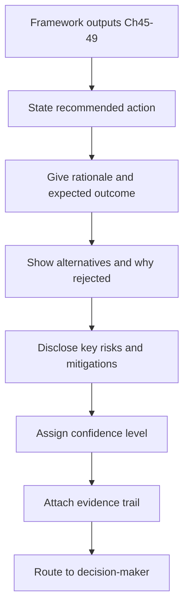

# Volume 04 - Executive Recommendation Framework

| Field | Value |
|---|---|
| Document ID | WORLD-VOL04-050 |
| Title | Executive Recommendation Framework |
| Version | 1.0 |
| Status | Approved |
| Classification | Internal |
| Founder | Mahesh Choudhary |

## Purpose

This chapter defines how WORLD converts the output of its analytical frameworks into an executive recommendation: a clear, decision-ready statement of what to do, why, and at what risk. It is the communication layer of the decision system, standardizing how choices are presented to decision-makers.

## Scope

This chapter covers the structure of a recommendation, the evidence and confidence it must carry, and the WORLD recommendation template. It follows the analytical chapters (45-49) and precedes validation (Chapter 51), and it aligns with the Volume 03 Recommendation Framework (Chapter 23).

## Why This Concept Exists

From first principles, analysis that cannot be acted on has no value. Executives decide under time pressure and cannot re-derive every model, so the recommendation must compress rigorous analysis into a form that is fast to grasp yet fully traceable. This framework exists to prevent two failure modes: the data dump that forces the executive to do the synthesis, and the bare assertion that hides its reasoning. A good recommendation leads with the decision, states the confidence, shows the alternatives considered, and keeps the full evidence one layer beneath the summary.

## Where It Is Used

The framework is used for board and leadership proposals, investment cases, strategic options papers, and any escalation where an owner must approve, reject, or amend a proposed course of action.

## How WORLD Implements It

WORLD assembles the recommendation in a fixed structure: the recommended action first, the rationale and expected outcome, the alternatives considered with the reason for rejection, the key risks and mitigations, and a stated confidence level. Every claim links back to its source analysis.

**Example:** A recommendation summary for a market-entry decision:

| Element | Content |
|---|---|
| Recommendation | Enter the adjacent product segment in Q4 |
| Rationale | EV +215k with worst case -100k, within risk appetite |
| Expected outcome | Break-even in 14 months; NPV +180k over 3 years |
| Alternatives rejected | New market (downside -400k exceeds appetite); hold (EV too low) |
| Key risks | Slower adoption; mitigation: staged spend with a 90-day gate |
| Confidence | Medium-high (0.75) |

The executive reads the decision in one line and can drill into any element. WORLD refuses to issue a recommendation without a stated confidence and an alternatives section, ensuring the choice is framed against what it beats.

## Relationship with the AI Business Partner

This framework is how the AI Business Partner speaks to leadership, realizing the Volume 03 Recommendation Framework (Chapter 23). The Partner does not merely report analysis; it takes a position, states its confidence, and shows the alternatives it rejected. It adapts depth to the audience while keeping the full reasoning retrievable, so the recommendation is both concise and accountable.

## Relationship with ERP

Once a recommendation is approved, an ERP system executes the authorized action and becomes the system of record for it. Conceptually, the recommendation framework produces the decision and the ERP enacts and logs it; the ERP does not formulate advice. Specifics are defined in a later volume.

## Relationship with Business Foundation

Business Foundation defines the approval authority a recommendation must be routed to and the standards a proposal must meet before it is considered decision-ready. The recommendation framework formats choices to satisfy those governance rules, and approved recommendations become precedent recorded against the operating model.

## Cross-References

- [Cost-Benefit Analysis](/docs/blueprint/volume-04-business-intelligence-and-decision-science/section-f-decision-frameworks/47-cost-benefit-analysis.md)
- [Multi-Criteria Decision Analysis](/docs/blueprint/volume-04-business-intelligence-and-decision-science/section-f-decision-frameworks/49-multi-criteria-decision-analysis.md)
- [Decision Validation](/docs/blueprint/volume-04-business-intelligence-and-decision-science/section-f-decision-frameworks/51-decision-validation.md)
- [Volume 03 - AI Business Partner](/docs/blueprint/volume-03-ai-business-partner/README.md)

## References

- [Volume 01 - Vision and Philosophy](/docs/blueprint/volume-01-vision-and-philosophy/README.md)
- [Document Standards](/docs/governance/document-standards.md)

## Change Log

| Version | Date | Author | Notes |
|---|---|---|---|
| 1.0 | 2026-07-12 | Lead Software Engineer | Initial approved version. |
