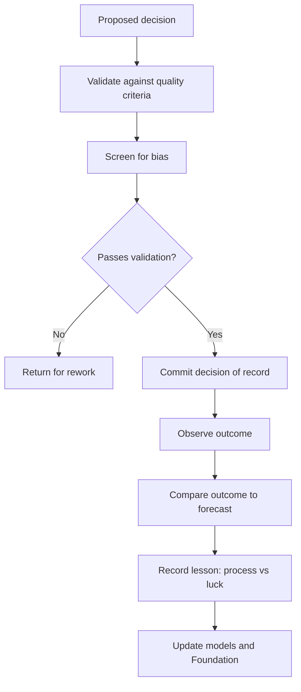

# Volume 04 - Decision Validation

| Field | Value |
|---|---|
| Document ID | WORLD-VOL04-051 |
| Title | Decision Validation |
| Version | 1.0 |
| Status | Approved |
| Classification | Internal |
| Founder | Mahesh Choudhary |

## Purpose

This chapter defines how WORLD validates a decision before it is committed and reviews it after outcomes are known. Decision validation is the quality-control and learning layer of the decision system, closing the loop that begins with the Decision Support System (Chapter 44).

## Scope

This chapter covers pre-commitment validation against decision-quality criteria, the guard against common cognitive biases, and post-decision review that compares outcome to forecast. It draws on the Decision Quality Framework in Section A.

## Why This Concept Exists

From first principles, a decision and its outcome are not the same thing: a sound decision can yield a poor result through bad luck, and a reckless decision can succeed by chance. If an organization judges decisions only by outcomes, it learns the wrong lessons and rewards luck. Decision validation exists to evaluate the quality of the decision process independently of the result - was the framing right, the information adequate, the reasoning sound, the alternatives real, and the choice free of predictable bias. It also exists to institutionalize learning by comparing what was forecast against what happened.

## Where It Is Used

Validation is applied as a gate before high-consequence decisions are committed and as a periodic review after they play out. It is standard for irreversible or high-value choices and for any decision an organization intends to learn from.

## How WORLD Implements It

WORLD runs a two-part loop. Before commitment, it checks the decision against quality criteria and screens for bias. After the outcome is observed, it compares result to forecast and records the lesson, distinguishing process quality from outcome luck.

**Example:** A pre-commitment validation checklist for a capital decision:

| Quality Criterion | Check | Result |
|---|---|---|
| Appropriate frame | Is the real decision being made? | Pass |
| Sound information | Are key estimates evidence-based? | Pass |
| Real alternatives | Were 3+ genuine options compared? | Pass |
| Clear values | Are criteria and weights explicit? | Pass |
| Sound reasoning | Does logic follow from evidence? | Flag: optimism bias in adoption estimate |
| Commitment | Is an owner and review date set? | Pass |

The optimism-bias flag sends the adoption estimate back for a base-rate check before the decision is committed. Twelve months later, WORLD compares actual adoption to forecast and records whether the miss was a process flaw or genuine uncertainty, feeding the correction into future estimates.

## Relationship with the AI Business Partner

The AI Business Partner validates every material decision against quality criteria and actively screens for biases - optimism, anchoring, sunk cost, confirmation - that human reasoning is prone to. After the fact, it runs the outcome-versus-forecast comparison and separates decision quality from result, so the organization learns from process rather than from luck. It writes each lesson back into its models.

## Relationship with ERP

An ERP system supplies the realized outcome data - actual costs, revenues, and performance - that post-decision review compares against the original forecast. Conceptually, validation is the judgment and learning layer, and the ERP is the factual record of what actually happened. Specifics are defined in a later volume.

## Relationship with Business Foundation

Business Foundation defines the decision-quality standards and validation gates that decisions must clear, and it is the repository where validated lessons become updated policy, thresholds, or estimating norms. Validation both enforces foundational standards and evolves them as outcomes teach the organization.

## Cross-References

- [Decision Support System](/docs/blueprint/volume-04-business-intelligence-and-decision-science/section-f-decision-frameworks/44-decision-support-system.md)
- [Executive Recommendation Framework](/docs/blueprint/volume-04-business-intelligence-and-decision-science/section-f-decision-frameworks/50-executive-recommendation-framework.md)
- [Decision Quality Framework](/docs/blueprint/volume-04-business-intelligence-and-decision-science/section-a-intelligence-foundation/07-decision-quality-framework.md)
- [Volume 03 - AI Business Partner](/docs/blueprint/volume-03-ai-business-partner/README.md)

## References

- [Volume 01 - Vision and Philosophy](/docs/blueprint/volume-01-vision-and-philosophy/README.md)
- [Document Standards](/docs/governance/document-standards.md)

## Change Log

| Version | Date | Author | Notes |
|---|---|---|---|
| 1.0 | 2026-07-12 | Lead Software Engineer | Initial approved version. |
