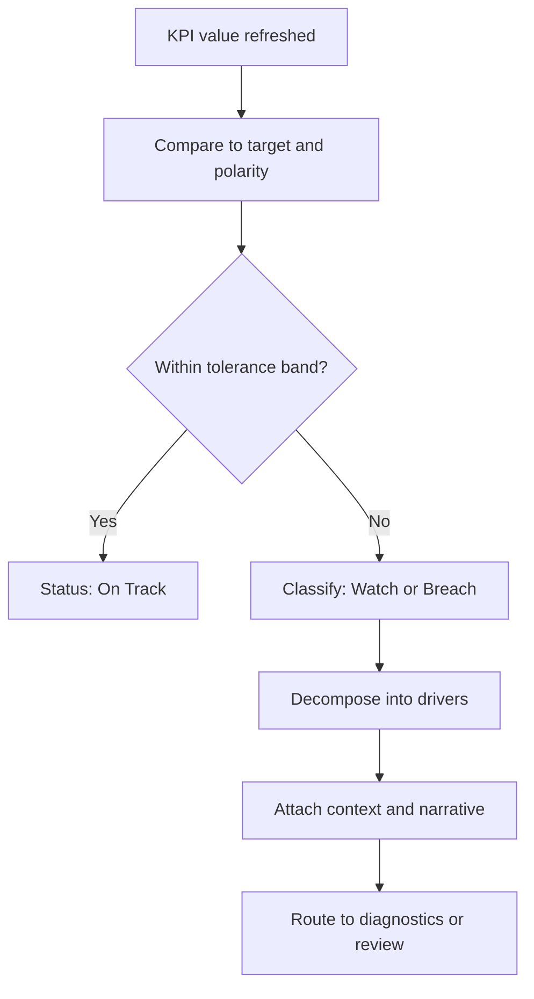

# Volume 04 - KPI Intelligence

| Field | Value |
|---|---|
| Document ID | WORLD-VOL04-052 |
| Title | KPI Intelligence |
| Version | 1.0 |
| Status | Approved |
| Classification | Internal |
| Founder | Mahesh Choudhary |

## Purpose

This chapter defines how WORLD converts a defined set of Key Performance Indicators into active intelligence. A KPI on a dashboard is a static number; KPI intelligence is the discipline of interpreting that number in context - against target, trend, threshold, and driver - so that it produces a judgement rather than a reading. This chapter opens Section G, the performance-intelligence layer that turns the metric definitions of Volume 02 into decisions.

## Scope

This chapter covers the interpretation model for individual KPIs and KPI families: target comparison, status classification, driver decomposition, and the escalation of a metric from observation to alert. It does not redefine which metrics exist - those are established in Volume 02 - and it does not cover multi-period trend mathematics (Chapter 53) or gap-to-plan mathematics (Chapter 54), which build on the foundation set here.

## Why This Concept Exists

From first principles, a measurement carries no meaning until it is compared. The number 4.2 percent is neither good nor bad until you know the target, the prior period, the peer level, and the direction of desirable movement. Organizations accumulate hundreds of metrics but starve for interpretation, so leaders either drown in reports or fixate on a few numbers they happen to trust. KPI intelligence exists to close the gap between measurement and meaning: to attach to every indicator the context that makes it actionable, and to do so consistently across the business so that a green status means the same thing everywhere.

## Where It Is Used

KPI intelligence runs continuously beneath every scorecard, executive review, and operational stand-up. It is invoked whenever a KPI is displayed, whenever a period closes, and whenever a threshold is crossed. It feeds the diagnostics, exception, and early-warning layers later in this section.

## How WORLD Implements It

WORLD binds each KPI to a definition object: its Volume 02 metric lineage, its target, its polarity (higher-is-better or lower-is-better), its thresholds, and its driver tree. On every refresh it classifies status, computes distance-to-target, and, when a band is breached, decomposes the KPI into its contributing drivers before raising it for attention.

**Example:** A subscription business tracks Gross Margin with a target of 72 percent and a Watch band of 70-72 percent.

| KPI | Target | Actual | Polarity | Status | Primary Driver |
|---|---|---|---|---|---|
| Gross Margin | 72.0% | 69.4% | Higher-is-better | Breach | Cloud hosting cost +18% |
| Net Revenue Retention | 110% | 112% | Higher-is-better | On Track | Expansion in enterprise tier |
| Support Cost per Account | GBP 18 | GBP 24 | Lower-is-better | Breach | Ticket volume +31% |

Margin at 69.4 percent breaches the 70 percent floor. WORLD does not merely flag red; it decomposes margin into revenue and cost of service, isolates the 18 percent rise in hosting cost as the dominant driver, and routes the finding to performance diagnostics with a quantified contribution, so the review starts from cause rather than symptom.

## Relationship with the AI Business Partner

The AI Business Partner is the consumer and narrator of KPI intelligence. Building on its KPI Awareness capability in Volume 03, it does not report numbers; it interprets them - stating whether a KPI is healthy, why it moved, which driver dominates, and what it implies for the goals the metric serves. It proactively surfaces the few indicators that changed materially rather than presenting the full grid, converting measurement into a conversation.

## Relationship with ERP

An ERP system is the transactional source from which most KPI values are ultimately calculated - orders, invoices, inventory, and ledger entries. Conceptually, the ERP supplies the measured facts, while KPI intelligence supplies the interpretation, targets, and thresholds that give those facts meaning. The precise integration is defined in a later volume.

## Relationship with Business Foundation

Business Foundation is where each KPI's definition, target, polarity, and tolerance bands are authored and governed. KPI intelligence executes against those definitions and, when interpretation reveals a target that is consistently unreachable or a threshold that is miscalibrated, feeds a recommendation back to refine the foundational definition.

## Cross-References

- [Trend Analysis](/docs/blueprint/volume-04-business-intelligence-and-decision-science/section-g-performance-intelligence/53-trend-analysis.md)
- [Variance Analysis](/docs/blueprint/volume-04-business-intelligence-and-decision-science/section-g-performance-intelligence/54-variance-analysis.md)
- [Volume 02 - KPIs](/docs/blueprint/volume-02-business-foundation/section-d-business-intelligence/26-kpis.md)
- [Volume 03 - KPI Awareness](/docs/blueprint/volume-03-ai-business-partner/section-d-business-understanding/28-kpi-awareness.md)

## References

- [Volume 01 - Vision and Philosophy](/docs/blueprint/volume-01-vision-and-philosophy/README.md)
- [Document Standards](/docs/governance/document-standards.md)

## Change Log

| Version | Date | Author | Notes |
|---|---|---|---|
| 1.0 | 2026-07-12 | Lead Software Engineer | Initial approved version. |
