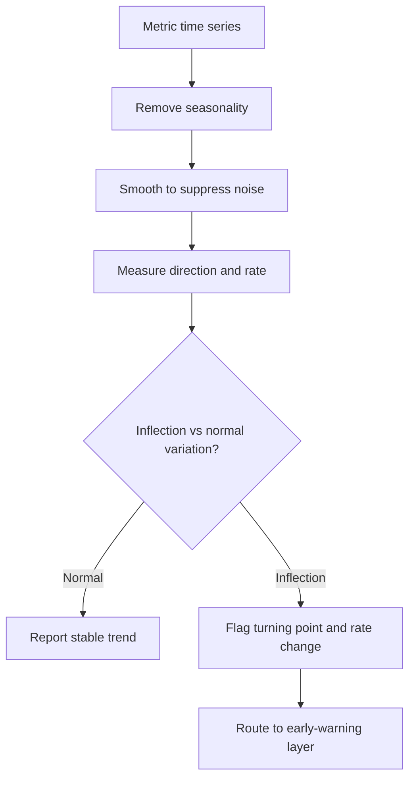

# Volume 04 - Trend Analysis

| Field | Value |
|---|---|
| Document ID | WORLD-VOL04-053 |
| Title | Trend Analysis |
| Version | 1.0 |
| Status | Approved |
| Classification | Internal |
| Founder | Mahesh Choudhary |

## Purpose

This chapter defines how WORLD reads a metric across time rather than at a single point. Trend analysis extracts the direction, rate, and shape of movement in a KPI, separating durable signal from period-to-period noise. It transforms the single-point interpretation of KPI Intelligence (Chapter 52) into a temporal judgement about where performance is heading.

## Scope

This chapter covers direction and momentum, level-versus-rate distinctions, smoothing to remove noise, seasonality adjustment, and inflection detection. It does not cover projection of trends into the future - that is forecasting, addressed in Section E - nor comparison against a fixed plan, which is variance analysis (Chapter 54).

## Why This Concept Exists

From first principles, a business does not live at a point in time; it moves. A KPI that is on target today but declining for six straight periods is a different situation from the same value climbing steadily, yet a point-in-time reading treats them identically. The human eye also misreads time series - it over-reacts to the latest data point and mistakes normal volatility for a turning point. Trend analysis exists to answer three questions a single value cannot: which way is this moving, how fast, and has the pattern changed. Without it, an organization confuses noise with news and reacts to random fluctuation as if it were meaningful.

## Where It Is Used

Trend analysis underlies every performance review, board pack, and operating rhythm. It is applied to financial, operational, quality, and customer metric families whenever more than one period of history exists, and it is the precondition for early-warning indicators, which watch trends rather than levels.

## How WORLD Implements It

For each KPI, WORLD maintains a time series, applies smoothing appropriate to the metric's volatility, removes known seasonality, and then classifies the trend by direction and momentum. It tests whether the most recent movement is within normal variation or represents a genuine inflection before it reports a change.

**Example:** A retailer reviews weekly conversion rate.

| Week | Conversion | Smoothed (3-wk) | Direction |
|---|---|---|---|
| W1 | 3.10% | 3.10% | - |
| W2 | 2.90% | 3.00% | Down |
| W3 | 3.05% | 3.02% | Flat |
| W4 | 2.70% | 2.88% | Down |
| W5 | 2.55% | 2.77% | Down |

The raw series looks jumpy, but the smoothed line shows a clear four-week decline of roughly 0.11 points per week beginning at W3. WORLD reports not "conversion is 2.55 percent" but "conversion has been declining for three weeks at an accelerating rate," and passes the inflection to the early-warning layer before the metric breaches its floor.

## Relationship with the AI Business Partner

The AI Business Partner uses trend analysis to speak about momentum rather than snapshots. It tells the operator that a metric is deteriorating, improving, or stalling, quantifies the rate, and distinguishes a real turning point from noise - precisely the discernment an inexperienced manager lacks. It links trends to their likely drivers and warns before a declining trend reaches a threshold.

## Relationship with ERP

An ERP system provides the historical transactional record from which time series are constructed. Conceptually, the ERP holds what happened each period; trend analysis interprets the sequence of those periods to reveal direction and momentum. Integration specifics are defined in a later volume.

## Relationship with Business Foundation

Business Foundation defines each metric's expected seasonality, acceptable volatility, and the reporting cadence against which trends are measured. Trend analysis honours these definitions and feeds back refinements when observed seasonality or volatility diverges from the foundational assumption.

## Cross-References

- [KPI Intelligence](/docs/blueprint/volume-04-business-intelligence-and-decision-science/section-g-performance-intelligence/52-kpi-intelligence.md)
- [Early Warning Indicators](/docs/blueprint/volume-04-business-intelligence-and-decision-science/section-g-performance-intelligence/57-early-warning-indicators.md)
- [Volume 02 - Business Metrics](/docs/blueprint/volume-02-business-foundation/section-d-business-intelligence/27-business-metrics.md)
- [Volume 04 - Financial Forecasting](/docs/blueprint/volume-04-business-intelligence-and-decision-science/section-e-planning-and-forecasting/39-financial-forecasting.md)

## References

- [Volume 01 - Vision and Philosophy](/docs/blueprint/volume-01-vision-and-philosophy/README.md)
- [Document Standards](/docs/governance/document-standards.md)

## Change Log

| Version | Date | Author | Notes |
|---|---|---|---|
| 1.0 | 2026-07-12 | Lead Software Engineer | Initial approved version. |
