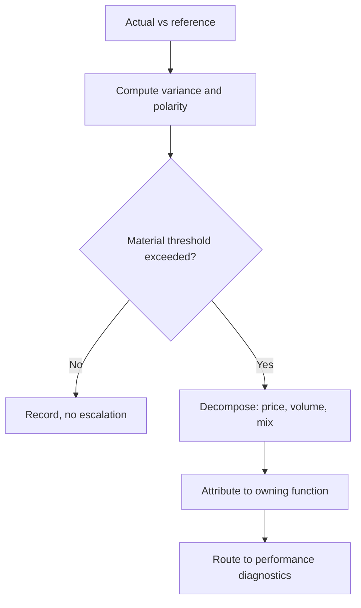

# Volume 04 - Variance Analysis

| Field | Value |
|---|---|
| Document ID | WORLD-VOL04-054 |
| Title | Variance Analysis |
| Version | 1.0 |
| Status | Approved |
| Classification | Internal |
| Founder | Mahesh Choudhary |

## Purpose

This chapter defines how WORLD measures and explains the gap between what was planned and what actually occurred. Variance analysis quantifies the difference between actual and reference - budget, forecast, or prior period - and decomposes that difference into its causes. It is the accountability mechanism that connects performance back to plans.

## Scope

This chapter covers variance calculation, favourable-versus-unfavourable classification, materiality thresholds, and decomposition of a total variance into component effects such as price, volume, and mix. It does not cover the movement of a metric through time (Chapter 53) nor the deeper causal investigation that follows a flagged variance (Chapter 55).

## Why This Concept Exists

From first principles, a plan is a hypothesis about the future, and actuals are the test of that hypothesis. The difference between them is information - but only if it is measured and explained. A total variance of a shortfall tells you something is wrong; it does not tell you what. If revenue misses plan, the miss might come from selling fewer units, selling at lower prices, or a shift toward cheaper products - each demanding a different response. Variance analysis exists to make plans accountable and to decompose an aggregate gap into the specific effects that caused it, so that management responds to the real lever rather than the headline number.

## Where It Is Used

Variance analysis is central to every budget review, monthly close, and forecast reconciliation. It is applied to financial statements, operational plans, and project baselines wherever an actual can be compared to a committed reference.

## How WORLD Implements It

WORLD computes variance against the governed reference, applies polarity to label it favourable or unfavourable, tests it against a materiality threshold, and - for material variances - decomposes the total into price, volume, and mix effects before routing it onward.

**Example:** A manufacturer plans revenue of GBP 5,000,000 and reports GBP 4,600,000 - an unfavourable variance of GBP 400,000, or 8 percent.

| Effect | Definition | Impact |
|---|---|---|
| Volume | Units sold below plan | -GBP 520,000 |
| Price | Realised price above plan | +GBP 210,000 |
| Mix | Shift to lower-margin lines | -GBP 90,000 |
| Net variance | Sum of effects | -GBP 400,000 |

The headline is an 8 percent revenue miss, but decomposition reveals that pricing was actually favourable; the real problem is a volume shortfall partly masked by higher prices. WORLD attributes the volume effect to sales operations and routes it to diagnostics, so leadership addresses demand generation rather than launching a misdirected pricing review.

## Relationship with the AI Business Partner

The AI Business Partner presents variance as an explanation, not a table. It tells the operator that revenue missed by a shortfall, that the cause is lower volume rather than pricing, and how much each effect contributed. By decomposing automatically, it gives a founder the analytical rigour of a finance team, and it connects each variance to the plan and goal it threatens.

## Relationship with ERP

An ERP system supplies the actuals - booked revenue, incurred cost, produced volume - against which the plan is compared. Conceptually, the ERP is the record of what happened, while variance analysis is the comparison to what was intended and the attribution of the difference. Specifics are defined in a later volume.

## Relationship with Business Foundation

Business Foundation holds the budgets, forecasts, and baselines that serve as references, along with the materiality thresholds that determine which variances escalate. Variance analysis executes against these and feeds back when persistent variance suggests a plan that was unrealistic rather than execution that failed.

## Cross-References

- [KPI Intelligence](/docs/blueprint/volume-04-business-intelligence-and-decision-science/section-g-performance-intelligence/52-kpi-intelligence.md)
- [Performance Diagnostics](/docs/blueprint/volume-04-business-intelligence-and-decision-science/section-g-performance-intelligence/55-performance-diagnostics.md)
- [Volume 02 - Financial Metrics](/docs/blueprint/volume-02-business-foundation/section-d-business-intelligence/28-financial-metrics.md)
- [Volume 04 - Financial Forecasting](/docs/blueprint/volume-04-business-intelligence-and-decision-science/section-e-planning-and-forecasting/39-financial-forecasting.md)

## References

- [Volume 01 - Vision and Philosophy](/docs/blueprint/volume-01-vision-and-philosophy/README.md)
- [Document Standards](/docs/governance/document-standards.md)

## Change Log

| Version | Date | Author | Notes |
|---|---|---|---|
| 1.0 | 2026-07-12 | Lead Software Engineer | Initial approved version. |
