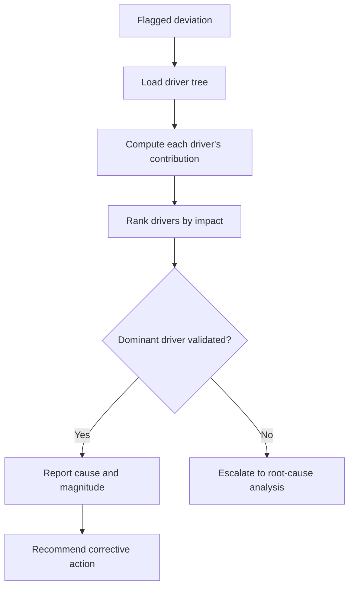

# Volume 04 - Performance Diagnostics

| Field | Value |
|---|---|
| Document ID | WORLD-VOL04-055 |
| Title | Performance Diagnostics |
| Version | 1.0 |
| Status | Approved |
| Classification | Internal |
| Founder | Mahesh Choudhary |

## Purpose

This chapter defines how WORLD moves from knowing that performance is off to understanding why. Performance diagnostics is the investigative layer that takes a flagged KPI, trend, or variance and traces it through the metric hierarchy to the operational cause. It is where measurement becomes explanation.

## Scope

This chapter covers driver-tree traversal, contribution analysis, correlation-to-cause discipline, and the handoff to formal root-cause methods. It does not redefine root-cause analysis itself, which is established in Section C and Volume 03; diagnostics is the performance-intelligence entry point that decides when and where such analysis is needed.

## Why This Concept Exists

From first principles, every headline metric is the arithmetic result of lower-level drivers, which are themselves results of operational activity. Profit is revenue minus cost; revenue is volume times price; volume is traffic times conversion. When a top metric moves, the cause lives somewhere down this tree, but the tree is large and the human tendency is to blame the most visible or most recently discussed factor. Performance diagnostics exists to impose structure on this search: to decompose systematically, quantify each driver's contribution, and distinguish the factor that actually moved the number from the many that merely correlate with it. Without it, organizations treat symptoms and mistake coincidence for cause.

## Where It Is Used

Diagnostics is triggered whenever KPI intelligence, trend analysis, or variance analysis flags a material deviation. It is used in operating reviews, incident investigations, and margin or churn deep-dives across every metric family.

## How WORLD Implements It

WORLD holds a driver tree for each headline KPI. When a deviation is flagged, it walks the tree, computes each child's contribution to the parent's movement, ranks drivers by contribution, and validates the leading candidate against corroborating evidence before either concluding or escalating to formal root-cause analysis.

**Example:** Operating margin falls from 15 percent to 11 percent. WORLD decomposes the change.

| Driver | Contribution to Margin Change | Rank |
|---|---|---|
| Higher raw-material cost | -2.6 pts | 1 |
| Lower production volume | -1.1 pts | 2 |
| Adverse product mix | -0.5 pts | 3 |
| Pricing | +0.2 pts | 4 |

The four-point margin decline is dominated by raw-material cost, not the pricing or volume factors that were the subject of anecdotal debate. WORLD validates the material-cost driver against supplier invoice data, reports it with its 2.6-point contribution, and recommends a sourcing review - directing effort to the driver that carries two-thirds of the movement.

## Relationship with the AI Business Partner

The AI Business Partner is the diagnostician the operator would otherwise lack. It does not stop at reporting a decline; it explains the decline, quantifies which driver is responsible, and resists the human bias toward the most-discussed cause. When decomposition is inconclusive, it invokes the root-cause methods of Volume 03 rather than guessing, giving a solo founder the reasoning depth of an analyst team.

## Relationship with ERP

An ERP system holds the granular transactional and operational data - cost lines, production records, order details - that diagnostics traverses to attribute cause. Conceptually, the ERP is the evidence base, and diagnostics is the structured inquiry that interrogates it. Integration specifics are defined in a later volume.

## Relationship with Business Foundation

Business Foundation defines the driver trees, the metric relationships, and the process models that diagnostics walks. When investigation reveals a driver relationship that the foundation modelled incorrectly, diagnostics feeds a correction back so the model improves.

## Cross-References

- [Variance Analysis](/docs/blueprint/volume-04-business-intelligence-and-decision-science/section-g-performance-intelligence/54-variance-analysis.md)
- [Exception Detection](/docs/blueprint/volume-04-business-intelligence-and-decision-science/section-g-performance-intelligence/56-exception-detection.md)
- [Volume 04 - Root Cause Analysis](/docs/blueprint/volume-04-business-intelligence-and-decision-science/section-c-problem-solving/19-root-cause-analysis.md)
- [Volume 03 - Root Cause Analysis](/docs/blueprint/volume-03-ai-business-partner/section-d-business-understanding/31-root-cause-analysis.md)

## References

- [Volume 01 - Vision and Philosophy](/docs/blueprint/volume-01-vision-and-philosophy/README.md)
- [Document Standards](/docs/governance/document-standards.md)

## Change Log

| Version | Date | Author | Notes |
|---|---|---|---|
| 1.0 | 2026-07-12 | Lead Software Engineer | Initial approved version. |
