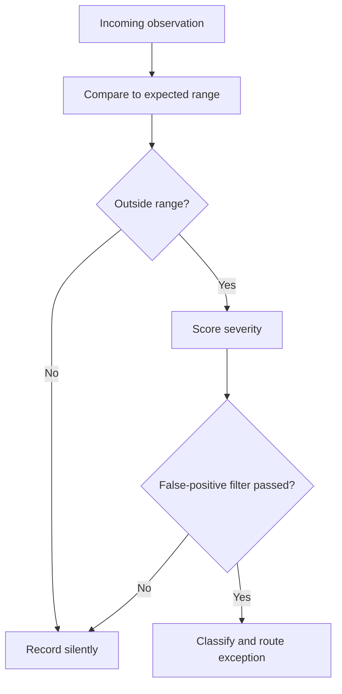

# Volume 04 - Exception Detection

| Field | Value |
|---|---|
| Document ID | WORLD-VOL04-056 |
| Title | Exception Detection |
| Version | 1.0 |
| Status | Approved |
| Classification | Internal |
| Founder | Mahesh Choudhary |

## Purpose

This chapter defines how WORLD identifies the observations that deviate meaningfully from the expected and deserve attention, while suppressing the vast majority that do not. Exception detection is the mechanism of management by exception: it filters the flow of performance data down to the few items that warrant a human decision.

## Scope

This chapter covers threshold-based and statistical anomaly detection, exception classification and severity, false-positive control, and the routing of confirmed exceptions. It does not cover leading-indicator prediction (Chapter 57), which anticipates problems before they occur; exception detection responds to deviations that have already appeared in the data.

## Why This Concept Exists

From first principles, attention is the scarcest resource in any organization. A business generates far more data than any person can review, and the overwhelming majority of it is normal - well within expected bounds and requiring no action. If everything is reported, nothing is noticed; if thresholds are too loose, real problems slip through; if too tight, users are buried in false alarms and learn to ignore the system. Exception detection exists to solve this signal-to-noise problem: to define what normal looks like for each metric and to raise only the observations that fall outside it, so that scarce human attention is spent on what matters.

## Where It Is Used

Exception detection runs continuously across financial, operational, quality, and customer data. It powers alerting, monitoring dashboards, and the exception queues that drive daily operating rhythms, and it is the trigger that hands confirmed anomalies to diagnostics.

## How WORLD Implements It

WORLD evaluates each incoming observation against an expected range - a governed threshold or a statistically learned band. Deviations are scored for severity, filtered to suppress likely false positives, classified, and routed. Normal observations are recorded silently.

**Example:** A payments business monitors daily transaction decline rate, with a normal band of 2.0-3.5 percent.

| Day | Decline Rate | Expected Band | Verdict |
|---|---|---|---|
| Mon | 3.1% | 2.0-3.5% | Normal |
| Tue | 3.4% | 2.0-3.5% | Normal |
| Wed | 6.8% | 2.0-3.5% | Exception - High |
| Thu | 3.2% | 2.0-3.5% | Normal |

Wednesday's 6.8 percent is nearly double the ceiling. WORLD scores it high-severity, confirms it is not a known settlement-batch artefact through its false-positive filter, classifies it as a payment-processing exception, and routes it to diagnostics - while the four normal days pass without adding noise to anyone's queue.

## Relationship with the AI Business Partner

The AI Business Partner is the vigilance layer the operator cannot personally sustain. It watches every metric continuously and interrupts only when something genuinely deviates, presenting the exception with its severity and likely meaning rather than a raw alert. By tuning its own thresholds against outcomes, it protects the operator's trust - alerting rarely enough to be believed and reliably enough to be safe.

## Relationship with ERP

An ERP system generates much of the transactional stream that exception detection monitors. Conceptually, the ERP produces the events; exception detection decides which of those events are abnormal enough to surface. Integration specifics are defined in a later volume.

## Relationship with Business Foundation

Business Foundation defines the expected ranges, tolerance bands, and severity policies that govern what counts as an exception. Exception detection applies these rules and feeds back recalibration when observed normal behaviour drifts away from the foundational band.

## Cross-References

- [Performance Diagnostics](/docs/blueprint/volume-04-business-intelligence-and-decision-science/section-g-performance-intelligence/55-performance-diagnostics.md)
- [Early Warning Indicators](/docs/blueprint/volume-04-business-intelligence-and-decision-science/section-g-performance-intelligence/57-early-warning-indicators.md)
- [Volume 02 - Operational Metrics](/docs/blueprint/volume-02-business-foundation/section-d-business-intelligence/29-operational-metrics.md)
- [Volume 03 - KPI Awareness](/docs/blueprint/volume-03-ai-business-partner/section-d-business-understanding/28-kpi-awareness.md)

## References

- [Volume 01 - Vision and Philosophy](/docs/blueprint/volume-01-vision-and-philosophy/README.md)
- [Document Standards](/docs/governance/document-standards.md)

## Change Log

| Version | Date | Author | Notes |
|---|---|---|---|
| 1.0 | 2026-07-12 | Lead Software Engineer | Initial approved version. |
