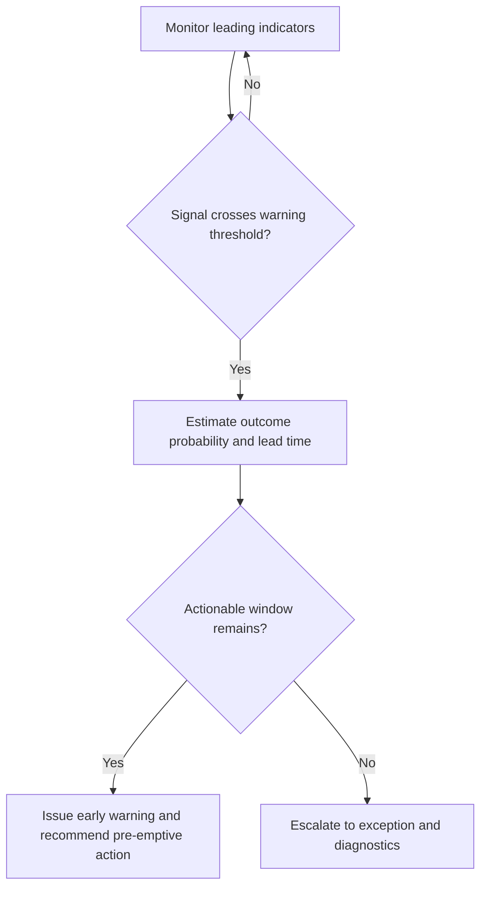

# Volume 04 - Early Warning Indicators

| Field | Value |
|---|---|
| Document ID | WORLD-VOL04-057 |
| Title | Early Warning Indicators |
| Version | 1.0 |
| Status | Approved |
| Classification | Internal |
| Founder | Mahesh Choudhary |

## Purpose

This chapter defines how WORLD anticipates problems before they appear in headline results. Early warning indicators are leading signals - metrics that move ahead of the outcomes they predict - monitored so that the organization can act while intervention is still cheap and effective. This is the shift from reactive to anticipatory performance intelligence.

## Scope

This chapter covers the identification of leading indicators, the lead-lag relationship to outcome metrics, signal thresholds, and the escalation of a warning into a recommended pre-emptive action. It does not cover detection of deviations that have already occurred (Chapter 56); early warning is inherently predictive and probabilistic.

## Why This Concept Exists

From first principles, most headline business metrics are lagging - by the time revenue, churn, or profit has moved, the causes are weeks or months old and the window for cheap correction has closed. Yet those outcomes are almost always preceded by earlier, observable signals: engagement falls before churn, pipeline thins before revenue, defect rates rise before returns. Early warning indicators exist because the cost of a problem grows with the time it goes undetected, and because acting on a leading signal is far cheaper than repairing a realised loss. They convert the organization's posture from reacting to what happened into anticipating what is about to happen.

## Where It Is Used

Early warning is used in retention management, revenue and pipeline health, quality control, cash-flow monitoring, and risk oversight - anywhere an outcome that matters is preceded by measurable precursors. It builds directly on trend analysis, watching the direction of leading metrics.

## How WORLD Implements It

WORLD maintains, for each critical outcome, a set of validated leading indicators with known lead times. It monitors these signals continuously, tests whether a signal has crossed its warning threshold, estimates the probability and timing of the outcome, and issues a pre-emptive recommendation while action still helps.

**Example:** A SaaS business predicts logo churn from leading signals with roughly a 60-day lead.

| Leading Indicator | Normal | Current | Warning |
|---|---|---|---|
| Weekly active usage | > 60% of seats | 41% of seats | Triggered |
| Support tickets per account | < 2 | 5 | Triggered |
| Executive sponsor logins | Monthly | None in 70 days | Triggered |

Three leading signals have crossed their thresholds for a strategic account whose renewal is 60 days out. No revenue has yet been lost, but WORLD estimates an elevated churn probability and issues an early warning recommending an immediate account-health intervention - giving the operator two months to act rather than a post-mortem after the account is gone.

## Relationship with the AI Business Partner

The AI Business Partner is the foresight the operator most needs and least possesses. It watches leading signals a busy founder would never track, connects them to the outcomes they predict, and warns in time to matter - "this account is likely to churn in two months unless you act now." It frames each warning with its confidence and recommended action, turning anticipation into a concrete next step rather than an abstract risk.

## Relationship with ERP

An ERP system supplies operational precursors - order cadence, usage, ticket volume, payment timing - that often serve as leading indicators. Conceptually, the ERP records early operational facts, and early warning interprets their movement as a predictor of future outcomes. Integration specifics are defined in a later volume.

## Relationship with Business Foundation

Business Foundation defines which indicators lead which outcomes, their validated lead times, and their warning thresholds. Early warning executes against these definitions and feeds back when observed lead-lag relationships strengthen, weaken, or shift, so the foundational model of causation improves.

## Cross-References

- [Trend Analysis](/docs/blueprint/volume-04-business-intelligence-and-decision-science/section-g-performance-intelligence/53-trend-analysis.md)
- [Exception Detection](/docs/blueprint/volume-04-business-intelligence-and-decision-science/section-g-performance-intelligence/56-exception-detection.md)
- [Volume 03 - Risk Awareness](/docs/blueprint/volume-03-ai-business-partner/section-d-business-understanding/29-risk-awareness.md)
- [Volume 04 - Risk Forecasting](/docs/blueprint/volume-04-business-intelligence-and-decision-science/section-e-planning-and-forecasting/42-risk-forecasting.md)

## References

- [Volume 01 - Vision and Philosophy](/docs/blueprint/volume-01-vision-and-philosophy/README.md)
- [Document Standards](/docs/governance/document-standards.md)

## Change Log

| Version | Date | Author | Notes |
|---|---|---|---|
| 1.0 | 2026-07-12 | Lead Software Engineer | Initial approved version. |
