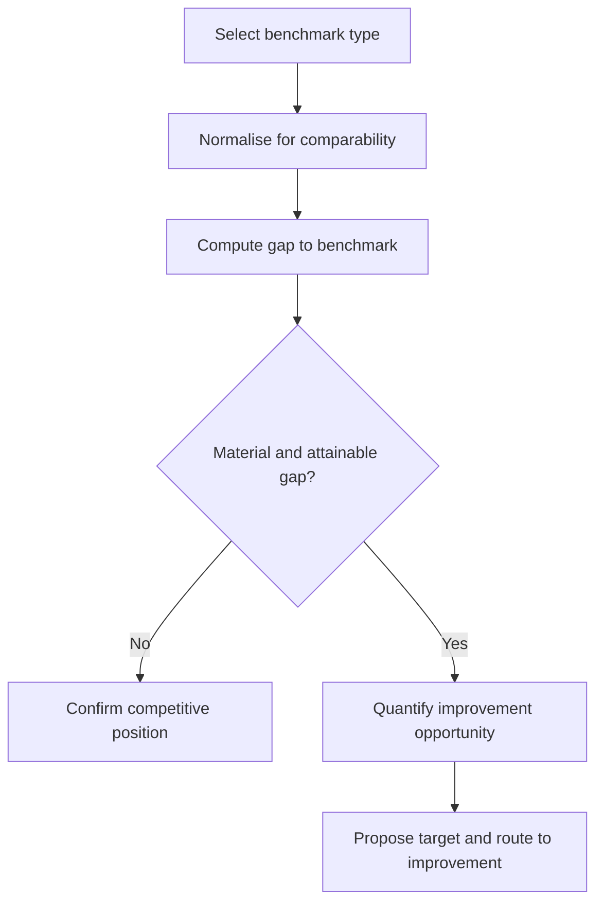

# Volume 04 - Benchmarking

| Field | Value |
|---|---|
| Document ID | WORLD-VOL04-058 |
| Title | Benchmarking |
| Version | 1.0 |
| Status | Approved |
| Classification | Internal |
| Founder | Mahesh Choudhary |

## Purpose

This chapter defines how WORLD interprets performance by comparison against an external or internal reference standard. Benchmarking answers a question that internal targets cannot: not only "did we hit our plan" but "is our plan any good" - is this level of performance strong or weak relative to what is achievable. It supplies the outside view that guards against measuring success only against oneself.

## Scope

This chapter covers the types of benchmark - internal, competitive, industry, and best-in-class - the discipline of comparability, gap quantification, and the translation of a benchmark gap into an improvement target. It does not cover the internal-target comparison of KPI intelligence (Chapter 52) nor the improvement engine that acts on benchmark gaps (Chapter 59).

## Why This Concept Exists

From first principles, a metric compared only to its own history or its own plan can look healthy while the business is quietly falling behind the field. A 5 percent growth rate feels like success until you learn competitors are growing at 20 percent. Absolute performance is meaningful only relative to what is possible, and what is possible is revealed by those who achieve it. Benchmarking exists to import this external standard - to calibrate ambition against reality, expose complacency that internal targets conceal, and quantify the distance to superior performers so that improvement effort is aimed at a real and attainable frontier rather than an arbitrary internal number.

## Where It Is Used

Benchmarking is used in strategic planning, target-setting, cost and productivity reviews, and competitive positioning. It applies across metric families - financial, operational, quality, and customer - wherever a credible comparator exists, and it feeds directly into the continuous-improvement layer.

## How WORLD Implements It

WORLD selects a comparator appropriate to the question, normalises for comparability so that like is compared with like, computes the gap, classifies the organization's relative position, and converts a material gap into a proposed improvement target.

**Example:** A services firm benchmarks its metrics against industry medians and its own best-performing region.

| Metric | Our Value | Industry Median | Internal Best | Gap to Best |
|---|---|---|---|---|
| Utilisation | 68% | 75% | 82% | 14 pts |
| Gross Margin | 34% | 38% | 41% | 7 pts |
| Revenue per Employee | GBP 120k | GBP 145k | GBP 168k | GBP 48k |

Every metric trails both the industry median and the firm's own best region, so the shortfall is not an industry constraint - it is internal and demonstrably achievable, since one region already reaches the benchmark. WORLD quantifies the utilisation gap as the largest opportunity and proposes closing it toward the 82 percent internal best, a target proven attainable within the same business.

## Relationship with the AI Business Partner

The AI Business Partner supplies the outside perspective a founder immersed in daily operations rarely has. It tells the operator not just how the business is doing against its own plan but how it compares to peers and to its own best, and it insists on comparability so the comparison is honest. It turns a benchmark gap into a credible target and a candid message: performance that feels adequate may be lagging the field.

## Relationship with ERP

An ERP system provides the internal performance data that is normalised and compared against external references. Conceptually, the ERP measures the organization's own results, while benchmarking positions those results against a standard drawn from outside or from other units. Integration specifics are defined in a later volume.

## Relationship with Business Foundation

Business Foundation holds the approved benchmark sources, comparability rules, and definitions of relative position. Benchmarking executes against these and feeds back updated targets when a benchmark reveals that a foundational goal was set below what is demonstrably achievable.

## Cross-References

- [KPI Intelligence](/docs/blueprint/volume-04-business-intelligence-and-decision-science/section-g-performance-intelligence/52-kpi-intelligence.md)
- [Continuous Improvement Intelligence](/docs/blueprint/volume-04-business-intelligence-and-decision-science/section-g-performance-intelligence/59-continuous-improvement-intelligence.md)
- [Volume 02 - Productivity Metrics](/docs/blueprint/volume-02-business-foundation/section-d-business-intelligence/30-productivity-metrics.md)
- [Volume 04 - Competitive Analysis](/docs/blueprint/volume-04-business-intelligence-and-decision-science/section-d-strategic-intelligence/28-competitive-analysis.md)

## References

- [Volume 01 - Vision and Philosophy](/docs/blueprint/volume-01-vision-and-philosophy/README.md)
- [Document Standards](/docs/governance/document-standards.md)

## Change Log

| Version | Date | Author | Notes |
|---|---|---|---|
| 1.0 | 2026-07-12 | Lead Software Engineer | Initial approved version. |
