# Volume 04 - Continuous Improvement Intelligence

| Field | Value |
|---|---|
| Document ID | WORLD-VOL04-059 |
| Title | Continuous Improvement Intelligence |
| Version | 1.0 |
| Status | Approved |
| Classification | Internal |
| Founder | Mahesh Choudhary |

## Purpose

This chapter defines how WORLD closes the performance loop by turning the outputs of the entire Section G - measured KPIs, trends, variances, diagnoses, exceptions, warnings, and benchmark gaps - into a sustained cycle of improvement. Continuous improvement intelligence ensures that insight consistently becomes action, that action is measured, and that what is learned raises the baseline for the next cycle.

## Scope

This chapter covers the improvement cycle (identify, act, measure, standardise), opportunity prioritisation, impact verification, and the institutionalisation of gains. It is the capstone of Section G; it consumes the analytical outputs of the preceding chapters rather than redefining them, and it hands sustained learning onward to the enterprise-intelligence layer.

## Why This Concept Exists

From first principles, analysis creates no value until it changes behaviour, and a single fix creates no lasting value until it is embedded and sustained. Organizations routinely detect problems, launch improvements, and then let gains erode because the improvement was never standardised or its impact never verified. Performance also has no natural endpoint - closing one gap reveals the next - so improvement must be a permanent loop rather than a project. Continuous improvement intelligence exists to make this loop systematic: to prioritise the opportunities the analytics surface, confirm that interventions actually moved the metric, and lock in successful changes as the new baseline so progress compounds instead of resetting.

## Where It Is Used

It operates in operating reviews, quality and efficiency programmes, cost-reduction initiatives, and any managed cadence of improvement. It draws opportunities from benchmarking gaps, diagnostic findings, and recurring exceptions across every metric family.

## How WORLD Implements It

WORLD maintains a ranked backlog of improvement opportunities sourced from the Section G analytics. It prioritises by impact and effort, tracks each intervention, measures the before-and-after effect against expectation, and - where the gain is confirmed - standardises the change and resets the baseline before returning to the backlog.

```mermaid
flowchart TD
    A[Opportunities from analytics] --> B[Prioritise by impact and effort]
    B --> C[Implement intervention]
    C --> D[Measure before vs after]
    D --> E{Improvement confirmed?}
    E -->|No| F[Revise or discard, record lesson]
    E -->|Yes| G[Standardise and reset baseline]
    G --> A
```

**Example:** A logistics operator runs one improvement cycle on on-time delivery.

| Stage | Detail |
|---|---|
| Opportunity | On-time delivery 88% vs benchmark 95% |
| Diagnosis | 60% of late deliveries trace to one dispatch hub |
| Intervention | Re-sequenced loading and added a shift window |
| Result | On-time delivery rises to 94% over 8 weeks |
| Standardise | New loading procedure set as baseline; target raised to 95% |

The cycle does not end at 94 percent. WORLD verifies the six-point gain against the pre-intervention baseline, confirms it is sustained over eight weeks rather than a one-off, standardises the new loading procedure so the gain does not erode, resets the target to 95 percent, and returns the next-largest opportunity to the top of the backlog.

## Relationship with the AI Business Partner

The AI Business Partner is the improvement engine that a stretched operator cannot personally maintain. It continuously converts analytical findings into a prioritised backlog, proposes the highest-return interventions, holds the operator to measuring whether a change actually worked, and remembers to standardise the ones that did. By closing the loop and resetting baselines, it makes the business improve continuously rather than lurch between one-off fixes, and it writes each verified gain and lesson into its persistent knowledge.

## Relationship with ERP

An ERP system supplies the before-and-after operational data used to verify whether an improvement actually moved the metric, and it is often where a standardised process change is ultimately enforced. Conceptually, the ERP is the system of record for execution and outcome, while continuous improvement intelligence is the learning loop that drives and validates change. Integration specifics are defined in a later volume.

## Relationship with Business Foundation

Business Foundation is where standardised improvements become the new procedures, targets, and baselines - the mechanism by which a temporary gain becomes permanent policy. Continuous improvement intelligence both draws its targets from the foundation and continually raises them, making the foundation a living record of a business that keeps getting better.

## Cross-References

- [Benchmarking](/docs/blueprint/volume-04-business-intelligence-and-decision-science/section-g-performance-intelligence/58-benchmarking.md)
- [Performance Diagnostics](/docs/blueprint/volume-04-business-intelligence-and-decision-science/section-g-performance-intelligence/55-performance-diagnostics.md)
- [Volume 02 - Quality Metrics](/docs/blueprint/volume-02-business-foundation/section-d-business-intelligence/31-quality-metrics.md)
- [Volume 04 - Corrective Actions](/docs/blueprint/volume-04-business-intelligence-and-decision-science/section-c-problem-solving/24-corrective-actions.md)

## References

- [Volume 01 - Vision and Philosophy](/docs/blueprint/volume-01-vision-and-philosophy/README.md)
- [Document Standards](/docs/governance/document-standards.md)

## Change Log

| Version | Date | Author | Notes |
|---|---|---|---|
| 1.0 | 2026-07-12 | Lead Software Engineer | Initial approved version. |
