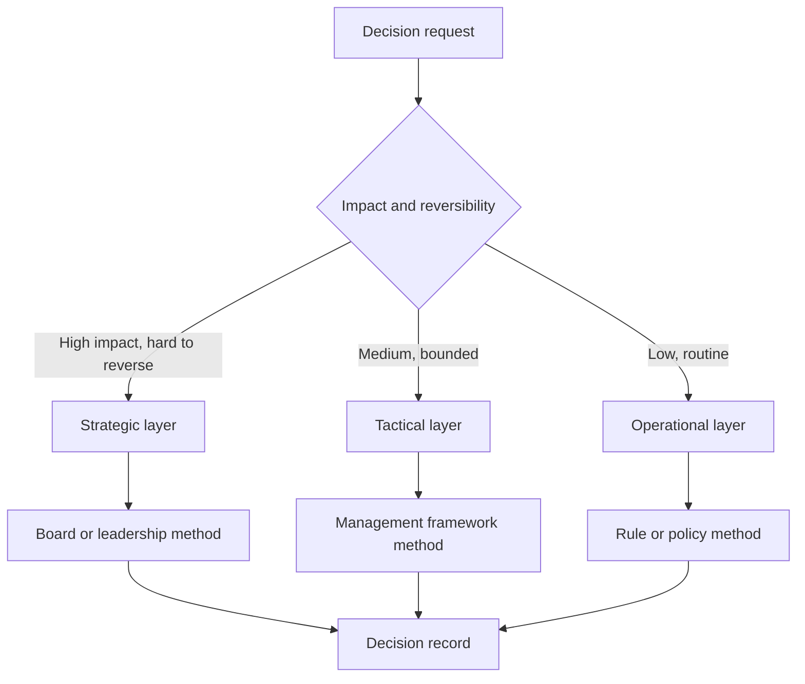

# Volume 04 - Enterprise Decision Architecture

| Field | Value |
|---|---|
| Document ID | WORLD-VOL04-060 |
| Title | Enterprise Decision Architecture |
| Version | 1.0 |
| Status | Approved |
| Classification | Internal |
| Founder | Mahesh Choudhary |

## Purpose

This chapter defines the enterprise decision architecture of WORLD: the structural design that organizes how decisions are framed, routed, made, and recorded across the whole business rather than within a single function. It synthesizes the frameworks of Volume 04 into one coherent operating structure so that every decision has a defined owner, a defined method, and a defined trail.

## Scope

This chapter covers the layers of decision-making, the routing of decisions by type and level, and the standards that make decisions consistent enterprise-wide. It sits above the individual decision frameworks (Chapters 44-51) and generalizes them to the organization as a system.

## Why This Concept Exists

From first principles, an enterprise is a network of interdependent decisions. When each function invents its own way to decide, the same choice is made differently in different places, authority is ambiguous, and reasoning is lost the moment the meeting ends. Decision architecture exists to make the act of deciding a designed, repeatable capability rather than an improvised one. It answers three structural questions before any specific decision is taken: who owns this class of decision, by what method should it be made, and where is the outcome recorded. Without this architecture, intelligence produced elsewhere in the volume has no reliable channel into action.

## Where It Is Used

The architecture governs strategic decisions at the leadership level, tactical decisions at the management level, and operational decisions at the execution level. It applies to capital allocation, market entry, hiring, pricing, and routine approvals alike, differing only in the layer and method assigned to each.

## How WORLD Implements It

WORLD models decisions in three layers and routes each decision to the correct layer by its type, reversibility, and impact. Each layer carries a defined method, an owner, and a recording obligation.

| Layer | Decision type | Owner | Method | Recorded as |
|---|---|---|---|---|
| Strategic | Direction-setting, irreversible | Leadership | Executive recommendation and validation | Board decision record |
| Tactical | Resource allocation, bounded | Management | Multi-criteria and trade-off analysis | Management decision log |
| Operational | Routine, reversible | Process owner | Policy and rule | Transaction record |

**Example:** A regional launch request arrives. The architecture classifies it as high-impact and hard to reverse, routes it to the strategic layer, applies the executive recommendation framework, assigns the regional lead as owner, and files the outcome as a board decision record. A related discount approval on the same product is classified operational, resolved by policy, and logged as a transaction. One request, two decisions, two correctly matched methods.

## Relationship with the AI Business Partner

The AI Business Partner operates this architecture on behalf of the organization. It classifies each incoming decision, selects the correct method, routes it to the accountable owner, and captures the reasoning as a durable record. The architecture is what lets the Partner act consistently across every function instead of behaving differently in each conversation, and it is the backbone that the cross-functional and executive layers described later in this section build upon.

## Relationship with ERP

An ERP system executes and records the operational decisions that the architecture routes to the rule-based layer, and it enforces the authorizations attached to higher layers. Conceptually, the architecture decides how a choice is made and by whom; the ERP enacts the authorized outcome and holds the transactional record. The ERP does not design the decision structure. Specifics are defined in a later volume.

## Relationship with Business Foundation

Business Foundation defines the operating model, the roles, and the authority matrix that the architecture uses to assign owners and route decisions. Decision architecture is the dynamic expression of that static structure: the Foundation says who may decide what, and the architecture puts that rule into motion for every live decision, recording approved outcomes back against the operating model.

## Cross-References

- [Decision Support System](/docs/blueprint/volume-04-business-intelligence-and-decision-science/section-f-decision-frameworks/44-decision-support-system.md)
- [Executive Recommendation Framework](/docs/blueprint/volume-04-business-intelligence-and-decision-science/section-f-decision-frameworks/50-executive-recommendation-framework.md)
- [Executive Intelligence Layer](/docs/blueprint/volume-04-business-intelligence-and-decision-science/section-h-enterprise-intelligence/64-executive-intelligence-layer.md)
- [Volume 02 - Business Foundation](/docs/blueprint/volume-02-business-foundation/README.md)

## References

- [Volume 01 - Vision and Philosophy](/docs/blueprint/volume-01-vision-and-philosophy/README.md)
- [Document Standards](/docs/governance/document-standards.md)

## Change Log

| Version | Date | Author | Notes |
|---|---|---|---|
| 1.0 | 2026-07-12 | Lead Software Engineer | Initial approved version. |
