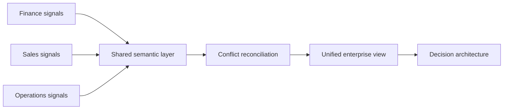

# Volume 04 - Cross-Functional Intelligence

| Field | Value |
|---|---|
| Document ID | WORLD-VOL04-061 |
| Title | Cross-Functional Intelligence |
| Version | 1.0 |
| Status | Approved |
| Classification | Internal |
| Founder | Mahesh Choudhary |

## Purpose

This chapter defines cross-functional intelligence in WORLD: the capability to combine signals from finance, sales, operations, and every other function into a single, coherent view of the business. It exists so that decisions are made against the whole picture rather than the fragment visible to one department.

## Scope

This chapter covers the integration of functional data into shared intelligence, the resolution of conflicts between functional views, and the propagation of insight across boundaries. It builds on the domain intelligence chapters of Section D and feeds the enterprise decision architecture (Chapter 60).

## Why This Concept Exists

From first principles, a business is one system, but it is observed through many functional lenses. Each function optimizes what it can see, and local optima routinely conflict: sales maximizes revenue, operations minimizes cost, finance protects margin. When intelligence stays trapped inside functions, the organization cannot see that a revenue win in one place is a cost or risk in another. Cross-functional intelligence exists to dissolve these silos, to make the second-order effects of a decision visible to whoever is deciding, and to give every function a shared, reconciled definition of the truth.

## Where It Is Used

It is used wherever a decision crosses a boundary: pricing that affects margin and demand, hiring that affects capacity and cash, product changes that affect support load and revenue, and any planning cycle that must reconcile targets across departments.

## How WORLD Implements It

WORLD unifies functional signals on a common business model, reconciles conflicting definitions, and surfaces the combined picture to the decision layer. A shared semantic layer ensures that a term such as "active customer" means the same thing to every function.

| Functional view | Local objective | Cross-functional tension | Reconciled measure |
|---|---|---|---|
| Sales | Maximize bookings | Discounts erode margin | Margin-adjusted bookings |
| Operations | Minimize unit cost | Under-capacity harms service | Cost per served demand unit |
| Finance | Protect cash and margin | Over-caution slows growth | Risk-adjusted growth |

**Example:** Sales proposes an aggressive discount to hit a quarterly bookings target. Viewed alone, it looks like a win. Cross-functional intelligence combines it with the operations view (the volume exceeds current capacity, forcing overtime) and the finance view (margin falls below the floor). The unified picture shows the discount destroys value once second-order effects are counted, and the decision is reshaped into a smaller, capacity-aware offer.

## Relationship with the AI Business Partner

The AI Business Partner is inherently cross-functional; it holds every domain view at once and reasons across them in a single conversation. Where a human specialist sees one lens, the Partner reconciles all lenses before advising, and it can explain to a functional leader how a proposal affects the departments they do not see. This chapter defines the integration discipline that keeps the Partner's cross-functional reasoning consistent and trustworthy.

## Relationship with ERP

ERP systems are a primary source of the functional transaction data that cross-functional intelligence consumes and integrates, and they execute the coordinated actions that a reconciled decision produces. Conceptually, the ERP supplies and enacts; cross-functional intelligence interprets across the functional records the ERP holds. Specifics are defined in a later volume.

## Relationship with Business Foundation

Business Foundation defines the functions, their boundaries, and the shared vocabulary of the business. Cross-functional intelligence depends on that common vocabulary to reconcile views; the Foundation's definitions are the semantic contract that makes a unified enterprise view possible rather than a merger of incompatible terms.

## Cross-References

- [Enterprise Decision Architecture](/docs/blueprint/volume-04-business-intelligence-and-decision-science/section-h-enterprise-intelligence/60-enterprise-decision-architecture.md)
- [Organizational Learning](/docs/blueprint/volume-04-business-intelligence-and-decision-science/section-h-enterprise-intelligence/62-organizational-learning.md)
- [Trade-Off Analysis](/docs/blueprint/volume-04-business-intelligence-and-decision-science/section-f-decision-frameworks/46-trade-off-analysis.md)
- [Volume 02 - Business Foundation](/docs/blueprint/volume-02-business-foundation/README.md)

## References

- [Volume 01 - Vision and Philosophy](/docs/blueprint/volume-01-vision-and-philosophy/README.md)
- [Document Standards](/docs/governance/document-standards.md)

## Change Log

| Version | Date | Author | Notes |
|---|---|---|---|
| 1.0 | 2026-07-12 | Lead Software Engineer | Initial approved version. |
