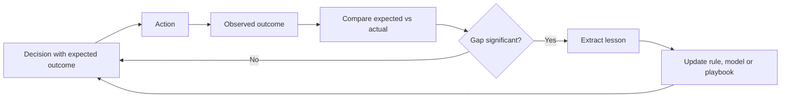

# Volume 04 - Organizational Learning

| Field | Value |
|---|---|
| Document ID | WORLD-VOL04-062 |
| Title | Organizational Learning |
| Version | 1.0 |
| Status | Approved |
| Classification | Internal |
| Founder | Mahesh Choudhary |

## Purpose

This chapter defines how WORLD makes the organization learn: how the outcomes of decisions are captured, evaluated, and fed back so that the business decides better over time. It converts individual decisions into institutional experience that outlives the people who made them.

## Scope

This chapter covers the feedback loop from decision to outcome to revised practice, the retention of lessons as reusable knowledge, and the mechanisms that prevent the same mistake from recurring. It connects decision validation (Chapter 51) to business knowledge evolution (Chapter 63).

## Why This Concept Exists

From first principles, a decision produces an outcome, and the gap between the expected and the actual outcome is information. In most organizations that information evaporates: the meeting ends, people move on, and the next similar decision starts from zero. Organizational learning exists to close the loop deliberately, treating every decision as an experiment whose result must be measured and folded back into practice. Established organizational-learning theory distinguishes single-loop learning, which corrects actions within existing rules, from double-loop learning, which questions the rules themselves. A durable enterprise must do both, and it must do so as an institution rather than relying on the memory of individuals.

## Where It Is Used

It is used in post-decision reviews, project retrospectives, forecast-versus-actual analysis, incident post-mortems, and the periodic revision of policies and playbooks that govern recurring decisions.

## How WORLD Implements It

WORLD instruments each significant decision with its expected outcome, later compares it to the actual result, extracts the lesson, and updates the relevant rule, model, or playbook. The loop is continuous and recorded.

| Learning type | Trigger | What changes | Example |
|---|---|---|---|
| Single-loop | Outcome misses target within known rules | The action or parameter | Adjust reorder threshold |
| Double-loop | The rule itself proves wrong | The rule or assumption | Replace the forecasting model |
| Deutero-learning | Learning process is too slow | How the organization learns | Shorten the review cycle |

**Example:** A demand forecast overshoots actual sales by 30 percent for two consecutive quarters. Single-loop learning would nudge the forecast down. WORLD detects the persistent, directional gap and escalates to double-loop learning: it questions the model itself, finds it ignores a seasonal channel shift, replaces the model, and updates the planning playbook so the correction persists beyond the individuals involved.

## Relationship with the AI Business Partner

The AI Business Partner is the memory and the learner of the organization. It records the expected outcome of every recommendation it makes, observes what actually happened, and refines its future advice accordingly. Unlike a human advisor whose lessons leave when they do, the Partner accumulates institutional experience permanently, making organizational learning a native property of the system rather than an occasional workshop.

## Relationship with ERP

ERP systems provide the actual outcome data, the transactions and results, against which expected outcomes are measured. Conceptually, the ERP records what happened; organizational learning interprets the difference between what happened and what was predicted, and turns it into improved practice. The ERP stores results but does not itself learn. Specifics are defined in a later volume.

## Relationship with Business Foundation

Business Foundation holds the policies, playbooks, and standards that organizational learning revises. Learning without a place to store the lesson is forgetting; the Foundation is that durable store, so improvements become part of the operating model rather than tacit knowledge in one person's head.

## Cross-References

- [Decision Validation](/docs/blueprint/volume-04-business-intelligence-and-decision-science/section-f-decision-frameworks/51-decision-validation.md)
- [Business Knowledge Evolution](/docs/blueprint/volume-04-business-intelligence-and-decision-science/section-h-enterprise-intelligence/63-business-knowledge-evolution.md)
- [Cross-Functional Intelligence](/docs/blueprint/volume-04-business-intelligence-and-decision-science/section-h-enterprise-intelligence/61-cross-functional-intelligence.md)
- [Volume 03 - AI Business Partner](/docs/blueprint/volume-03-ai-business-partner/README.md)

## References

- [Volume 01 - Vision and Philosophy](/docs/blueprint/volume-01-vision-and-philosophy/README.md)
- [Document Standards](/docs/governance/document-standards.md)

## Change Log

| Version | Date | Author | Notes |
|---|---|---|---|
| 1.0 | 2026-07-12 | Lead Software Engineer | Initial approved version. |
