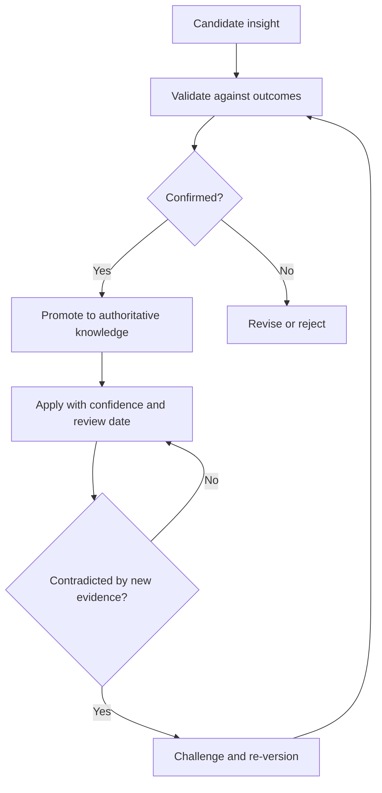

# Volume 04 - Business Knowledge Evolution

| Field | Value |
|---|---|
| Document ID | WORLD-VOL04-063 |
| Title | Business Knowledge Evolution |
| Version | 1.0 |
| Status | Approved |
| Classification | Internal |
| Founder | Mahesh Choudhary |

## Purpose

This chapter defines how the body of business knowledge in WORLD grows, ages, and is retired over time. It ensures that what the organization knows remains an accurate, current, and versioned asset rather than a static document that silently decays.

## Scope

This chapter covers the lifecycle of a knowledge element from creation to deprecation, the versioning of business knowledge, and the promotion of validated lessons into authoritative standards. It extends organizational learning (Chapter 62) and draws on the DIKW progression established in Chapter 04.

## Why This Concept Exists

From first principles, knowledge has a shelf life. A pricing rule that was correct last year may be wrong today because the market moved; an assumption baked into a model may quietly become false. If knowledge is treated as permanent, the organization confidently acts on beliefs that are no longer true. Knowledge evolution exists to make knowledge a living, dated, and challengeable asset. It builds on the DIKW hierarchy, where data becomes information, information becomes knowledge, and knowledge becomes wisdom, and it adds the missing dimension of time: every element must carry when it was learned, when it was last confirmed, and when it should be re-examined.

## Where It Is Used

It is used in the maintenance of playbooks, pricing rules, risk models, market assumptions, and any codified belief that guides recurring decisions and could be invalidated by change.

## How WORLD Implements It

WORLD treats each knowledge element as a versioned object with a confidence level and a review date. Validated lessons are promoted to authoritative status; contradicted ones are challenged, revised, or deprecated with their history preserved.

| Stage | State | Confidence | Action |
|---|---|---|---|
| Candidate | Proposed insight | Low | Validate |
| Authoritative | Confirmed knowledge | High | Apply, schedule review |
| Contested | Challenged by evidence | Falling | Re-examine |
| Deprecated | Superseded | Archived | Retain history, stop applying |

**Example:** A rule states that enterprise deals close in 60 days. It is authoritative for a year. New evidence shows deals now take 90 days after a segment shift. WORLD moves the rule to contested, re-validates against recent outcomes, re-versions it to 90 days, and deprecates the old value while keeping its history, so forecasts and staffing plans that depended on the rule are updated rather than left silently wrong.

## Relationship with the AI Business Partner

The AI Business Partner is the custodian of evolving knowledge. It applies the current authoritative version, flags knowledge that is due for review, and challenges beliefs that new evidence contradicts. Because it versions what it knows, the Partner can explain not only what it advises but on which dated belief the advice rests, and it never silently acts on knowledge that has expired.

## Relationship with ERP

ERP systems generate the ongoing transactional evidence that confirms or contradicts business knowledge over time. Conceptually, the ERP is a continuous stream of ground truth; knowledge evolution compares that stream against codified beliefs and updates them. The ERP holds facts, not the versioned knowledge derived from them. Specifics are defined in a later volume.

## Relationship with Business Foundation

Business Foundation is the authoritative repository where evolved knowledge is stored and governed. Knowledge evolution is the process that keeps the Foundation current: promoted lessons become Foundation standards, and deprecated ones are retired from it under version control, so the operating model reflects what is true now.

## Cross-References

- [Organizational Learning](/docs/blueprint/volume-04-business-intelligence-and-decision-science/section-h-enterprise-intelligence/62-organizational-learning.md)
- [Enterprise Decision Architecture](/docs/blueprint/volume-04-business-intelligence-and-decision-science/section-h-enterprise-intelligence/60-enterprise-decision-architecture.md)
- [Future Intelligence Vision](/docs/blueprint/volume-04-business-intelligence-and-decision-science/section-h-enterprise-intelligence/66-future-intelligence-vision.md)
- [Volume 02 - Business Foundation](/docs/blueprint/volume-02-business-foundation/README.md)

## References

- [Volume 01 - Vision and Philosophy](/docs/blueprint/volume-01-vision-and-philosophy/README.md)
- [Document Standards](/docs/governance/document-standards.md)

## Change Log

| Version | Date | Author | Notes |
|---|---|---|---|
| 1.0 | 2026-07-12 | Lead Software Engineer | Initial approved version. |
