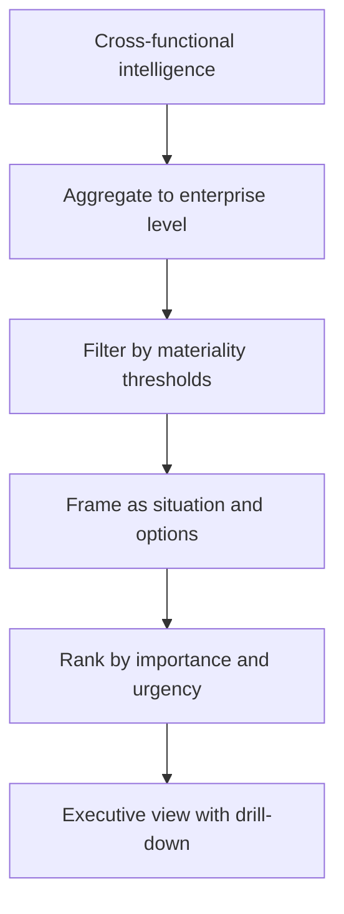

# Volume 04 - Executive Intelligence Layer

| Field | Value |
|---|---|
| Document ID | WORLD-VOL04-064 |
| Title | Executive Intelligence Layer |
| Version | 1.0 |
| Status | Approved |
| Classification | Internal |
| Founder | Mahesh Choudhary |

## Purpose

This chapter defines the executive intelligence layer of WORLD: the highest tier of synthesis that presents the state of the business, its risks, and its options to leadership. It compresses everything below it into a leadership-grade view that supports direction-setting decisions.

## Scope

This chapter covers the aggregation of enterprise intelligence into executive form, the surfacing of what requires leadership attention, and the standards for how the business speaks to its leaders. It sits atop the decision architecture (Chapter 60) and consumes cross-functional intelligence (Chapter 61).

## Why This Concept Exists

From first principles, leadership has the widest span of responsibility and the least time per decision. Executives cannot inspect every metric, so they need intelligence that is radically compressed yet fully trustworthy: the few things that matter, why they matter, and what to do about them. The executive intelligence layer exists to perform that compression without distortion. It filters the enormous volume of operational and cross-functional signal down to the small set of items that demand a leadership decision, while keeping the full evidence one layer beneath the summary for anyone who wants to drill in.

## Where It Is Used

It is used in board reporting, leadership reviews, strategic planning sessions, and real-time executive briefings where a leader must grasp the state of the business and decide quickly.

## How WORLD Implements It

WORLD aggregates enterprise signals, filters them by materiality against leadership thresholds, frames each material item as a situation with options, and presents a ranked executive view with drill-down to evidence.

| Executive need | What the layer provides | Example item |
|---|---|---|
| Awareness | Current state versus plan | Revenue tracking 6% below target |
| Attention | What has changed materially | Churn up sharply in one segment |
| Options | Decision-ready choices | Three responses with trade-offs |
| Confidence | The certainty of each signal | High-confidence on churn cause |

**Example:** Instead of a hundred-tile dashboard, a leader receives three items: revenue is tracking six percent below target driven by one segment's churn (high confidence), a supply constraint threatens next quarter's delivery (medium confidence), and a new competitor is pressuring price in one region (low confidence). Each item arrives framed with options and a confidence level, and each can be expanded into its full supporting analysis on request.

## Relationship with the AI Business Partner

The executive intelligence layer is the AI Business Partner acting as a chief of staff to leadership. The Partner continuously watches the enterprise, decides what rises to the executive's attention, and presents it in decision-ready form with stated confidence. It adapts depth to the leader and the moment, offering a one-line summary or the full model beneath it, and it is the voice through which the whole intelligence system reaches the top of the organization.

## Relationship with ERP

ERP systems supply the operational and financial ground truth that the executive layer aggregates upward, and they execute the directives that flow down once leadership decides. Conceptually, the ERP is the transactional floor and the executive layer is the interpretive ceiling; the layer summarizes from ERP data but does not replace it. Specifics are defined in a later volume.

## Relationship with Business Foundation

Business Foundation defines the goals, thresholds, and materiality standards that determine what counts as executive-worthy. The executive layer measures the enterprise against those Foundation-defined targets, so what reaches leadership is filtered by the organization's own definition of what matters rather than by arbitrary noise.

## Cross-References

- [Enterprise Decision Architecture](/docs/blueprint/volume-04-business-intelligence-and-decision-science/section-h-enterprise-intelligence/60-enterprise-decision-architecture.md)
- [Cross-Functional Intelligence](/docs/blueprint/volume-04-business-intelligence-and-decision-science/section-h-enterprise-intelligence/61-cross-functional-intelligence.md)
- [Executive Recommendation Framework](/docs/blueprint/volume-04-business-intelligence-and-decision-science/section-f-decision-frameworks/50-executive-recommendation-framework.md)
- [Volume 03 - AI Business Partner](/docs/blueprint/volume-03-ai-business-partner/README.md)

## References

- [Volume 01 - Vision and Philosophy](/docs/blueprint/volume-01-vision-and-philosophy/README.md)
- [Document Standards](/docs/governance/document-standards.md)

## Change Log

| Version | Date | Author | Notes |
|---|---|---|---|
| 1.0 | 2026-07-12 | Lead Software Engineer | Initial approved version. |
