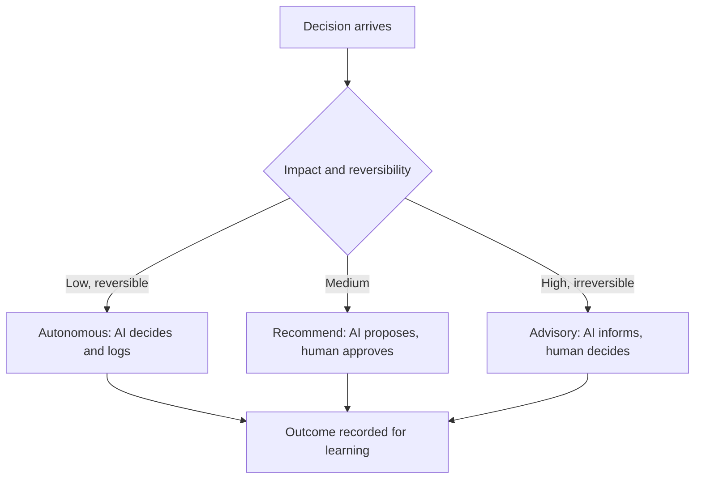

# Volume 04 - AI-Driven Decision Support

| Field | Value |
|---|---|
| Document ID | WORLD-VOL04-065 |
| Title | AI-Driven Decision Support |
| Version | 1.0 |
| Status | Approved |
| Classification | Internal |
| Founder | Mahesh Choudhary |

## Purpose

This chapter defines how artificial intelligence actively supports decisions in WORLD: not merely reporting on the past but proposing, reasoning about, and helping execute choices. It describes the model of collaboration between the AI and the human decision-maker across the full decision lifecycle.

## Scope

This chapter covers the spectrum from advisory to autonomous decision support, the guardrails that govern each level, and the human-in-the-loop model. It generalizes the decision support system (Chapter 44) into an AI-native capability and sets up the future vision (Chapter 66).

## Why This Concept Exists

From first principles, traditional decision support was passive: it presented data and left all reasoning to the human. That is too slow and too shallow for a business facing more decisions than any team can consider carefully. AI-driven decision support exists to shift the machine from a passive reporter to an active partner that frames the decision, generates options, evaluates them, and recommends with stated confidence, while keeping the human in control of consequential choices. The reason to keep humans in the loop is not distrust of the machine but accountability: some decisions carry values, ethics, and irreversibility that must remain a human responsibility.

## Where It Is Used

It is used across the decision spectrum: fully autonomous handling of routine, reversible, low-impact decisions; recommendation with human approval for consequential ones; and pure advisory support for the most strategic and value-laden choices.

## How WORLD Implements It

WORLD assigns each decision an autonomy level based on impact and reversibility, applies matching guardrails, and routes accordingly. The AI proposes and reasons; the human approves where the stakes require it.

| Level | Human role | Decision type | Guardrail |
|---|---|---|---|
| Autonomous | Monitors | Routine, reversible | Policy limits and audit log |
| Recommend | Approves | Bounded, consequential | Mandatory confidence and alternatives |
| Advisory | Decides | Strategic, irreversible | AI informs, cannot execute |

**Example:** A stock replenishment within policy limits is handled autonomously and logged. A supplier switch that affects cost and risk is presented as a recommendation with confidence and alternatives for a manager to approve. A decision to exit a market is advisory only: the AI supplies the full analysis and options, but a human leader owns the choice. Each outcome feeds back into organizational learning.

## Relationship with the AI Business Partner

AI-driven decision support is the operating mode of the AI Business Partner. The Partner is not a dashboard the user reads; it is a colleague that takes positions, acts within its authority, and escalates what exceeds it. This chapter defines the autonomy model and guardrails that let the Partner be genuinely useful without overstepping the human accountability that consequential decisions demand.

## Relationship with ERP

ERP systems are where autonomous and approved decisions are executed and recorded as transactions. Conceptually, AI-driven support decides or recommends, and the ERP carries out the authorized action and holds the record. The autonomy level determines whether a decision reaches ERP execution directly or only after human approval. Specifics are defined in a later volume.

## Relationship with Business Foundation

Business Foundation defines the authority limits and policies that set each decision's autonomy level. The Foundation is what tells the AI which decisions it may make alone, which it must recommend, and which it may only advise on, so AI autonomy is bounded by the organization's own governance rather than by the model's confidence.

## Cross-References

- [Decision Support System](/docs/blueprint/volume-04-business-intelligence-and-decision-science/section-f-decision-frameworks/44-decision-support-system.md)
- [Enterprise Decision Architecture](/docs/blueprint/volume-04-business-intelligence-and-decision-science/section-h-enterprise-intelligence/60-enterprise-decision-architecture.md)
- [Future Intelligence Vision](/docs/blueprint/volume-04-business-intelligence-and-decision-science/section-h-enterprise-intelligence/66-future-intelligence-vision.md)
- [Volume 03 - AI Business Partner](/docs/blueprint/volume-03-ai-business-partner/README.md)

## References

- [Volume 01 - Vision and Philosophy](/docs/blueprint/volume-01-vision-and-philosophy/README.md)
- [Document Standards](/docs/governance/document-standards.md)

## Change Log

| Version | Date | Author | Notes |
|---|---|---|---|
| 1.0 | 2026-07-12 | Lead Software Engineer | Initial approved version. |
