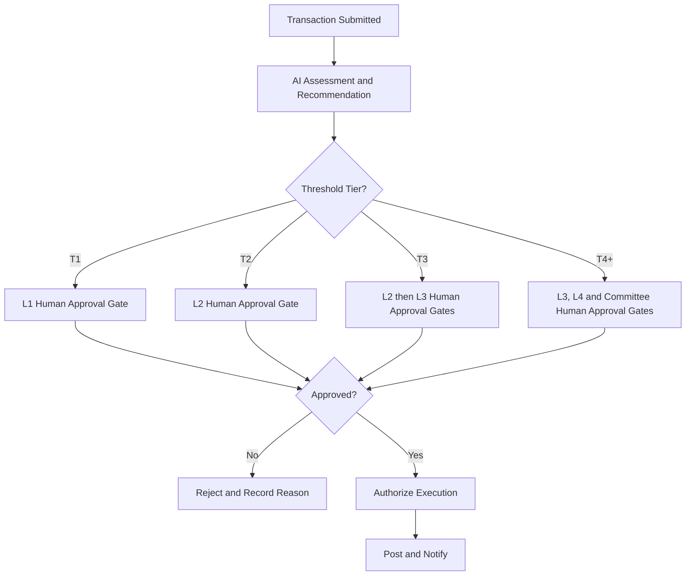

# Volume 05 - Approval Templates

| Field | Value |
|---|---|
| Document ID | WORLD-VOL05-A6 |
| Title | Approval Templates |
| Version | 1.0 |
| Status | Approved |
| Classification | Internal |
| Founder | Mahesh Choudhary |

## Purpose

This appendix provides reusable approval templates for WORLD's ERP framework: approval matrices, threshold tables, a delegation-of-authority template, and a multi-level approval pattern with explicit human-approval gates. These templates operationalize control and accountability so that financial and contractual commitments are authorized by the right roles at the right thresholds.

## Scope

These templates govern how approvals are structured and configured across ERP workflows (see WORLD-VOL05-A5). They define matrices, thresholds, delegation, and escalation. They do not define the underlying business processes themselves, nor the technical role model, which is covered by design and data standards. Amounts shown are illustrative defaults; tenants configure their own thresholds within governance.

## 1. Approval Matrix Template

An approval matrix maps a transaction type and value band to the required approving role and level.

| Transaction Type | Value Band | Required Approver | Approval Level | Segregation Rule |
|---|---|---|---|---|
| Purchase Order | 0 to 5,000 | Team Lead | L1 | Requester cannot self-approve |
| Purchase Order | 5,001 to 50,000 | Department Head | L2 | Approver distinct from Buyer |
| Purchase Order | 50,001 to 250,000 | Finance Director | L3 | Two-level approval required |
| Purchase Order | Above 250,000 | Executive Committee | L4 | Board-informed |
| Sales Discount | 0 to 5% | Sales Lead | L1 | Within pricing policy |
| Sales Discount | Above 5% | Commercial Director | L2 | Margin review required |
| Vendor Payment | Any | AP Approver + Finance | L2 | Preparer distinct from approver |
| Master Data Change | Any | Data Steward | L1 | Owner approval for Restricted data |

## 2. Threshold Table Template

Thresholds define the value boundaries that determine the number and seniority of approvals.

| Threshold Tier | Lower Bound | Upper Bound | Minimum Approvals | Highest Level |
|---|---|---|---|---|
| T1 | 0 | 5,000 | 1 | L1 |
| T2 | 5,001 | 50,000 | 1 | L2 |
| T3 | 50,001 | 250,000 | 2 | L3 |
| T4 | 250,001 | 1,000,000 | 3 | L4 |
| T5 | Above 1,000,000 | Unbounded | 3 + Committee | L4+ |

| Rule | Description |
|---|---|
| TH-01 | Thresholds are defined per tenant and per currency. |
| TH-02 | A transaction is evaluated against the highest applicable tier. |
| TH-03 | Splitting a transaction to avoid a threshold is a policy violation and is monitored. |

## 3. Delegation-Of-Authority (DoA) Template

Delegation allows an authorized approver to temporarily assign their authority to a delegate.

| Attribute | Value / Description |
|---|---|
| Delegation ID | Unique identifier for the delegation record |
| Delegator | Role or person granting authority |
| Delegate | Role or person receiving authority |
| Scope | Transaction types and value bands covered |
| Limit | Maximum value the delegate may approve |
| Effective From | Start date and time |
| Effective To | End date and time |
| Reason | Business justification (for example, leave) |
| Revocable | Whether the delegator may revoke early |
| Audit | All delegated approvals are logged as acting-on-behalf-of |

| Rule | Description |
|---|---|
| DOA-01 | A delegate cannot exceed the delegator's own limit. |
| DOA-02 | Delegation is time-bounded and automatically expires. |
| DOA-03 | Delegated approvals are fully attributable to both delegate and delegator. |
| DOA-04 | Restricted transaction types may be marked non-delegable. |

## 4. Multi-Level Approval With Human-Approval Gates

High-impact transactions require sequential approvals, with explicit human sign-off at each gate even when AI provides recommendations.

| Gate Principle | Description |
|---|---|
| HG-01 | AI may recommend, prioritize, and pre-validate, but never grants final approval on committed value. |
| HG-02 | Each gate captures the approver identity, decision, timestamp, and rationale. |
| HG-03 | Escalation triggers automatically if a gate is not actioned within its defined timeout. |
| HG-04 | Rejection at any gate returns the transaction with a recorded reason. |

## 5. Escalation Template

| Condition | Escalation Action | Target |
|---|---|---|
| Gate timeout exceeded | Notify and reassign | Next approver in hierarchy |
| Approver unavailable | Route to active delegate | Delegate per DoA |
| Threshold exceeded mid-process | Re-evaluate and add gate | Higher approval level |
| Repeated rejection | Route to review board | Governance |

## Cross-References

- [Workflow Templates](/docs/blueprint/volume-05-erp-foundation/appendices/workflow-templates.md)
- [ERP Design Standards](/docs/blueprint/volume-05-erp-foundation/appendices/erp-design-standards.md)
- [Enterprise Data Standards](/docs/blueprint/volume-05-erp-foundation/appendices/enterprise-data-standards.md)

## References

- [Volume 01 - Vision and Philosophy](/docs/blueprint/volume-01-vision-and-philosophy/README.md)
- [Document Standards](/docs/governance/document-standards.md)

## Change Log

| Version | Date | Author | Summary |
|---|---|---|---|
| 1.0 | 2026-07-12 | Lead Software Engineer | Initial approved version. |
