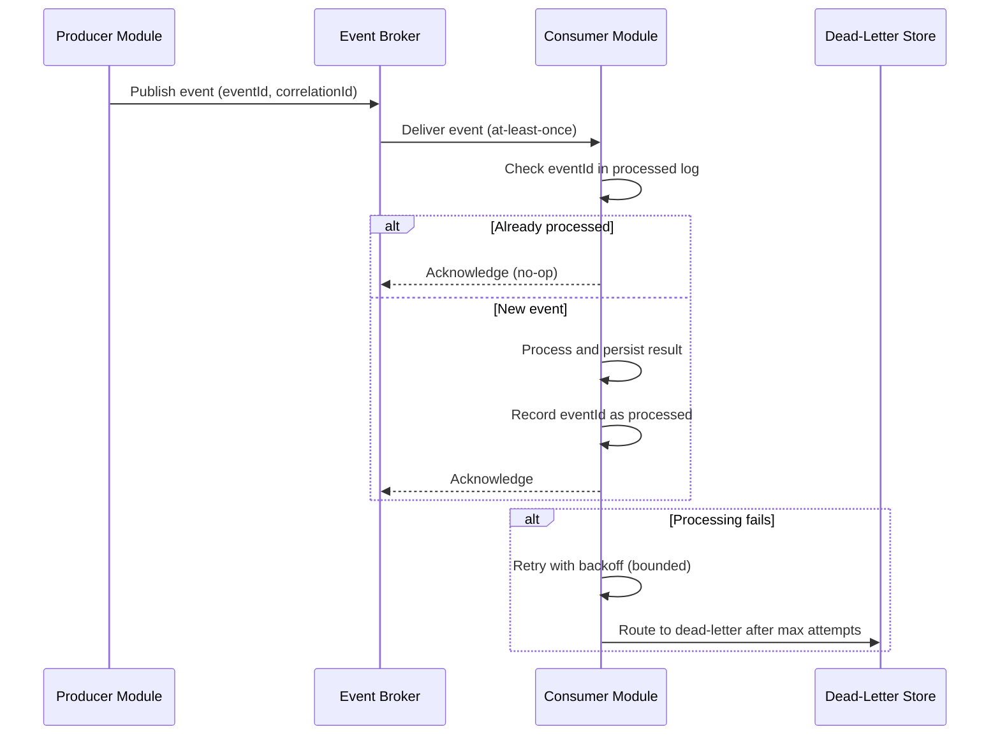

# Volume 05 - Integration Templates

| Field | Value |
|---|---|
| Document ID | WORLD-VOL05-A7 |
| Title | Integration Templates |
| Version | 1.0 |
| Status | Approved |
| Classification | Internal |
| Founder | Mahesh Choudhary |

## Purpose

This appendix provides reusable integration templates for connecting ERP modules to one another and to external systems within WORLD. It supplies concrete skeletons for event contracts, API contracts, data-synchronization patterns, and idempotency and retry handling, so that integrations are consistent, resilient, and observable by default.

## Scope

These templates apply to all cross-module and external integrations in WORLD's ERP layer. They cover contract definition, synchronization patterns, and reliability mechanics, illustrated with tables and a Mermaid sequence. They build on the event and idempotency standards in WORLD-VOL05-A3. Transport and platform selection are deployment concerns and are referenced only where they affect contract design.

## 1. Integration Style Selection

| Style | When to Use | Coupling |
|---|---|---|
| Event-driven (asynchronous) | State changes other modules react to | Loose |
| Request-response (synchronous API) | Immediate result or query needed | Moderate |
| Batch data sync | Bulk or periodic reference data alignment | Loose |

## 2. Event Contract Template

| Field | Type | Required | Description |
|---|---|---|---|
| eventId | string (UUID) | Yes | Globally unique event identifier |
| eventType | string | Yes | Canonical event name, past tense (e.g. GoodsReceiptPosted) |
| eventVersion | string | Yes | Semantic version of the event schema |
| tenantId | string | Yes | Owning tenant identifier |
| occurredAt | string (ISO 8601) | Yes | Time the event occurred |
| correlationId | string | Yes | Ties related events across a process |
| causationId | string | No | The event or command that caused this event |
| source | string | Yes | Producing module |
| payload | object | Yes | Minimal business data for consumers |

### Example Event Envelope

```json
{
  "eventId": "a3f1c2e4-9b7d-4a10-8f22-1c9e0b4d5678",
  "eventType": "PurchaseOrderApproved",
  "eventVersion": "1.0",
  "tenantId": "TNT-000042",
  "occurredAt": "2026-07-12T09:30:00Z",
  "correlationId": "PO-2026-00008830",
  "source": "Procurement",
  "payload": {
    "purchaseOrderId": "PO-2026-00008830",
    "vendorId": "VEND-00004821",
    "totalAmount": 48250.00,
    "currency": "USD"
  }
}
```

## 3. API Contract Skeleton

| Element | Convention / Value |
|---|---|
| Resource | /purchase-orders |
| Operations | GET (list, read), POST (create), PATCH (update state) |
| Versioning | Path or header version, e.g. /v1/purchase-orders |
| Authentication | Bearer token, tenant-scoped |
| Authorization | Role-based, enforced per operation |
| Idempotency | Idempotency-Key header on POST and PATCH |
| Errors | Typed error object with stable code, message, correlationId |
| Pagination | Cursor-based with page size limit |

### Example Request And Error

```http
POST /v1/purchase-orders
Authorization: Bearer <token>
Idempotency-Key: 8f14e45f-ceea-467a-9c2b-1a2b3c4d5e6f
Content-Type: application/json

{ "vendorId": "VEND-00004821", "lines": [ ... ] }
```

```json
{
  "error": {
    "code": "VALIDATION_FAILED",
    "message": "Vendor is inactive",
    "correlationId": "req-6b1f-2026"
  }
}
```

## 4. Data-Sync Pattern Template

| Attribute | Description |
|---|---|
| Direction | One-way (source to target) or bidirectional |
| Trigger | Event-driven, scheduled, or on-demand |
| Grain | Full snapshot or incremental change (delta) |
| Key | Stable business key used to match records |
| Conflict Policy | Source-of-truth wins; last-writer-wins only for non-authoritative fields |
| Reconciliation | Periodic comparison to detect and repair drift |

| Rule | Description |
|---|---|
| SYNC-01 | Each synchronized entity has one authoritative source of truth. |
| SYNC-02 | Incremental sync uses change markers (version or timestamp) to avoid full reloads. |
| SYNC-03 | Reconciliation runs on a defined cadence and reports discrepancies. |

## 5. Idempotency And Retry Template

| Concern | Standard |
|---|---|
| Idempotency key | Client-supplied on writes; server stores and replays original result |
| Deduplication | Consumers deduplicate by eventId |
| Retry policy | Exponential backoff with jitter, capped delay, bounded attempts |
| Dead-letter | Exhausted retries route to a dead-letter store for inspection |
| Poison handling | Malformed or repeatedly failing messages are quarantined, not endlessly retried |

### Reliable Integration Sequence



## Integration Review Checklist

- [ ] Correct integration style chosen for the interaction.
- [ ] Event or API contract fully specified and versioned.
- [ ] Idempotency key handled on all writes.
- [ ] Consumers deduplicate and tolerate replay.
- [ ] Retry, backoff, and dead-letter policy defined.
- [ ] Authoritative source of truth identified for synced data.
- [ ] Correlation ID propagated end to end for tracing.

## Cross-References

- [ERP Design Standards](/docs/blueprint/volume-05-erp-foundation/appendices/erp-design-standards.md)
- [Enterprise Data Standards](/docs/blueprint/volume-05-erp-foundation/appendices/enterprise-data-standards.md)
- [Workflow Templates](/docs/blueprint/volume-05-erp-foundation/appendices/workflow-templates.md)

## References

- [Volume 01 - Vision and Philosophy](/docs/blueprint/volume-01-vision-and-philosophy/README.md)
- [Document Standards](/docs/governance/document-standards.md)

## Change Log

| Version | Date | Author | Summary |
|---|---|---|---|
| 1.0 | 2026-07-12 | Lead Software Engineer | Initial approved version. |
