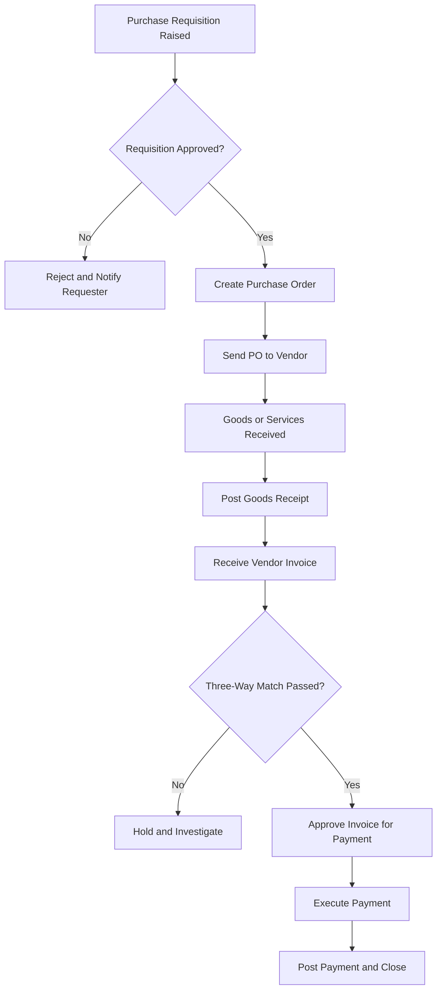
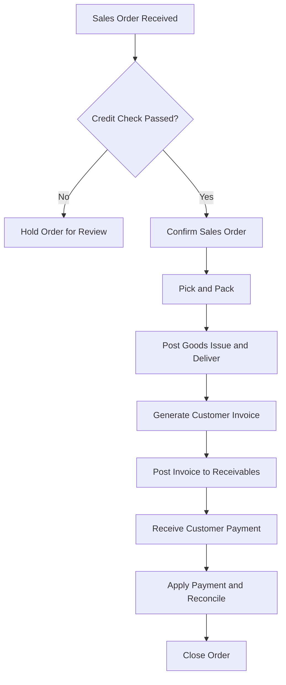
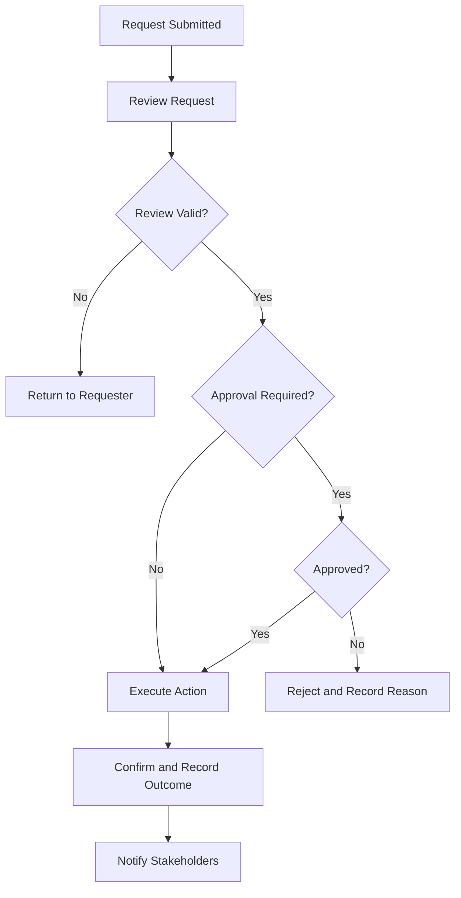

# Volume 05 - Workflow Templates

| Field | Value |
|---|---|
| Document ID | WORLD-VOL05-A5 |
| Title | Workflow Templates |
| Version | 1.0 |
| Status | Approved |
| Classification | Internal |
| Founder | Mahesh Choudhary |

## Purpose

This appendix provides reusable workflow templates for the most common ERP business processes in WORLD. Each template defines the participating roles, the ordered steps, the decision points, and the systems of record, together with a visual flow. Teams adopt and adapt these templates rather than designing common processes from scratch, ensuring consistency and reuse across the operating system.

## Scope

The templates cover cross-cutting operational workflows: Procure-to-Pay, Order-to-Cash, and the generic Request-Review-Approve-Execute pattern. Each includes a Mermaid flow diagram and a structured template table. Approval-matrix mechanics and delegation-of-authority are detailed in WORLD-VOL05-A6. These templates are starting points; tenant-specific variations are configured within the governed extension model.

## Template Structure

Every workflow template records the following attributes.

| Attribute | Description |
|---|---|
| Workflow ID | Stable identifier for the template. |
| Trigger | The event or request that starts the workflow. |
| Roles | Participants and their responsibilities. |
| Steps | Ordered activities and decisions. |
| Controls | Approvals, validations, and segregation-of-duties points. |
| Outcome | The terminal business result and documents produced. |

## 1. Procure-to-Pay (P2P)

| Attribute | Value |
|---|---|
| Workflow ID | WF-P2P-01 |
| Trigger | Approved purchase requisition |
| Roles | Requester, Buyer, Approver, Receiver, Accounts Payable |
| Controls | Requisition approval, three-way match, payment authorization |
| Outcome | Vendor paid; posted invoice and payment documents |

## 2. Order-to-Cash (O2C)

| Attribute | Value |
|---|---|
| Workflow ID | WF-O2C-01 |
| Trigger | Confirmed customer order |
| Roles | Sales, Credit Controller, Warehouse, Billing, Accounts Receivable |
| Controls | Credit check, delivery confirmation, invoice approval |
| Outcome | Cash collected; posted invoice and receipt documents |

## 3. Request-Review-Approve-Execute (Generic)

| Attribute | Value |
|---|---|
| Workflow ID | WF-RRAE-01 |
| Trigger | Any change or action request requiring authorization |
| Roles | Requester, Reviewer, Approver, Executor |
| Controls | Review validation, approval gate, execution confirmation |
| Outcome | Requested action executed and recorded, or rejected with reason |

## Reuse Guidance

| Guideline | Description |
|---|---|
| Adopt before adapt | Start from the closest template; document any deviation. |
| Preserve control points | Never remove approval or segregation-of-duties gates without governance sign-off. |
| Human-approval gates | Retain explicit human approval where financial or contractual commitment occurs, even under AI assistance. |
| Instrument every step | Emit domain events at each transition to support tracing and analytics. |

## Cross-References

- [Approval Templates](/docs/blueprint/volume-05-erp-foundation/appendices/approval-templates.md)
- [ERP Design Standards](/docs/blueprint/volume-05-erp-foundation/appendices/erp-design-standards.md)
- [Integration Templates](/docs/blueprint/volume-05-erp-foundation/appendices/integration-templates.md)

## References

- [Volume 01 - Vision and Philosophy](/docs/blueprint/volume-01-vision-and-philosophy/README.md)
- [Document Standards](/docs/governance/document-standards.md)

## Change Log

| Version | Date | Author | Summary |
|---|---|---|---|
| 1.0 | 2026-07-12 | Lead Software Engineer | Initial approved version. |
