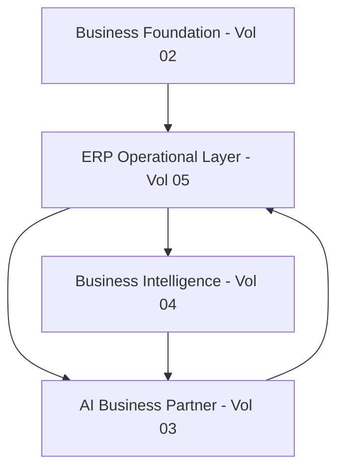

# Volume 05 - What is ERP

| Field | Value |
|---|---|
| Document ID | WORLD-VOL05-001 |
| Title | What is ERP |
| Version | 1.0 |
| Status | Approved |
| Classification | Internal |
| Founder | Mahesh Choudhary |

## Purpose

This chapter establishes a precise, WORLD-specific definition of Enterprise Resource Planning (ERP) as it is used throughout Volume 05. It clarifies what ERP means within an AI-Native Business Operating System, and why WORLD treats ERP as the operational execution and record layer rather than as the product itself.

## Scope

The scope covers the conceptual definition of ERP, its core structural characteristics, and its position inside the WORLD architecture. It does not cover module-level design (Volume 06) or vendor-style feature comparisons. It is a foundational definition intended to align every subsequent chapter in this volume.

## ERP as Designed for WORLD

In conventional systems, ERP is a suite of integrated applications that record and manage core business transactions - finance, procurement, inventory, manufacturing, sales, and human resources - against a shared data model. WORLD retains this integration discipline but reframes ERP's role. In WORLD, ERP is the **system of record and system of execution**: the authoritative layer where business events become durable, governed, auditable facts, and where operational transactions are carried out.

WORLD is explicitly "not merely an ERP." The product is an AI Business Partner (Volume 03). ERP exists to serve that partner by giving it a trustworthy operational substrate. Every AI decision, recommendation, and autonomous action ultimately reads from and writes to the ERP layer. ERP is therefore defined by three commitments: a single governed data model, transactional integrity, and native multi-dimensionality across company, tenant, and location.

| Dimension | Traditional ERP | WORLD ERP |
|---|---|---|
| Primary role | Business application suite | Operational execution and record layer |
| Serves | End users via screens | AI Business Partner and users |
| Data model | Integrated but module-centric | Unified, AI-consumable, event-rich |
| Intelligence | Bolt-on analytics | AI-native by design |
| Structure | Often single-entity | Multi-company, multi-tenant, multi-location |

## Business Value

Defining ERP correctly is itself a source of enterprise value. A shared, authoritative operational layer eliminates reconciliation between disconnected systems, reduces data duplication, and provides a defensible audit trail. Because WORLD ERP is designed as the substrate for automation, it converts routine transactional work into governed, machine-executable flows, lowering operational cost while raising accuracy and compliance.

## Relationship to the AI Business Partner

The AI Business Partner (Volume 03) cannot reason about a business it cannot observe or act upon. WORLD ERP provides both: a complete, structured record of what has happened, and a governed set of operations the partner can invoke to make things happen. ERP is the partner's hands and memory.

## Relationship to Business Foundation

The Business Foundation (Volume 02) defines the enterprise's structure - entities, roles, policies, and the meaning of core business concepts. ERP operationalizes that foundation: the definitions in Volume 02 become the master data, document types, and posting rules that ERP enforces at runtime.

## Relationship to Business Intelligence

Business Intelligence (Volume 04) is only as reliable as the operational data beneath it. Because WORLD ERP records events in a rich, consistent, AI-consumable form, BI can derive metrics, forecasts, and insights without brittle extract-transform pipelines. ERP is the trusted source; BI is the interpretive layer.

## Enterprise Implementation Approach

Implementation begins by mapping the Business Foundation to ERP master data and document models, establishing the multi-company and multi-tenant boundaries, and defining the transactional flows that the AI Business Partner will later automate. Teams should treat ERP as infrastructure: stabilize the record and execution layer first, then layer intelligence and automation on top.

**Enterprise example:** A multi-national distributor operating three legal entities across five warehouses configures WORLD ERP so that a single customer order flows through credit checks, allocation, fulfilment, and revenue recognition under one governed data model. The AI Business Partner observes stock risk and automatically proposes a stock transfer, executed through the same ERP transaction set that a human would use.

## Cross-References

- [Why WORLD ERP Exists](/docs/blueprint/volume-05-erp-foundation/section-a-erp-foundation/02-why-world-erp-exists.md)
- [AI-Native ERP Concept](/docs/blueprint/volume-05-erp-foundation/section-a-erp-foundation/06-ai-native-erp-concept.md)
- [Volume 03 - AI Business Partner](/docs/blueprint/volume-03-ai-business-partner/README.md)

## References

- [Volume 01 - Vision and Philosophy](/docs/blueprint/volume-01-vision-and-philosophy/README.md)
- [Document Standards](/docs/governance/document-standards.md)

## Change Log

| Version | Date | Author | Notes |
|---|---|---|---|
| 1.0 | 2026-07-12 | Lead Software Engineer | Initial approved version. |
