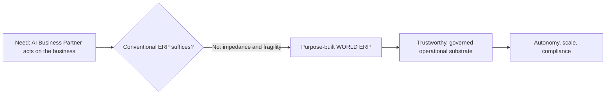

# Volume 05 - Why WORLD ERP Exists

| Field | Value |
|---|---|
| Document ID | WORLD-VOL05-002 |
| Title | Why WORLD ERP Exists |
| Version | 1.0 |
| Status | Approved |
| Classification | Internal |
| Founder | Mahesh Choudhary |

## Purpose

This chapter explains the rationale for building a purpose-designed ERP layer within WORLD rather than integrating a third-party ERP. It articulates the structural gaps in conventional ERP that make it unsuitable as the operational substrate for an AI Business Partner, and the deliberate reasons WORLD requires its own.

## Scope

The scope covers the motivating problems, the strategic rationale, and the boundaries of what WORLD ERP is responsible for. It does not restate the definition (Chapter 01) or enumerate objectives (Chapter 04); it addresses the question of "why" at the architectural level.

## Why WORLD Requires Its Own ERP

WORLD's product is an AI Business Partner. For that partner to be genuinely useful, it must be able to read the full operational state of a business and act within it safely. Conventional ERP systems were designed for human operators and screen-based workflows. Their data models are optimized for transactional consistency, not for machine reasoning; their automation is rule-bound and shallow; and their extension points assume integration, not native intelligence. Bolting an AI layer onto such systems produces fragile, translation-heavy architectures.

WORLD ERP exists to remove that impedance. It is built so that every business event is captured as a structured, contextual, AI-consumable fact, and so that every operation is exposed as a governed capability the AI Business Partner can invoke. It exists to be multi-company, multi-tenant, multi-location, and industry-independent from the ground up, because WORLD serves many organizations under one operating model.

| Problem with conventional ERP | Consequence for AI | WORLD ERP response |
|---|---|---|
| Screen-centric data model | Poor machine readability | Event-rich, AI-consumable model |
| Shallow rule automation | Limited autonomy | Native, governed execution capabilities |
| Single-entity assumptions | Costly scaling | Multi-company / multi-tenant core |
| Integration-first extension | Fragile intelligence | Intelligence designed in, not bolted on |

## Business Value

A purpose-built ERP layer removes the integration tax that erodes value in bolt-on architectures. Enterprises gain a single operational truth, faster automation delivery, lower total cost of ownership, and the confidence that AI actions are executed through the same governed, auditable pathways as human ones. The value is compounding: each new automation reuses the same substrate rather than rebuilding integrations.

## Relationship to the AI Business Partner

WORLD ERP exists primarily to serve the AI Business Partner (Volume 03). Without a native operational layer, the partner would be an advisor that cannot act. With it, the partner becomes an operator that can observe, decide, and execute within governed limits, closing the loop between insight and action.

## Relationship to Business Foundation

The Business Foundation (Volume 02) declares how an enterprise is structured and governed. WORLD ERP exists to make that declaration executable: policies become posting rules, entities become companies and ledgers, and roles become authorization boundaries enforced at every transaction.

## Relationship to Business Intelligence

Because WORLD ERP records operational reality faithfully and consistently, Business Intelligence (Volume 04) can trust its inputs. WORLD ERP exists in part to give BI a clean, real-time source, eliminating the reconciliation and data-quality problems that undermine analytics built on disconnected systems.

## Enterprise Implementation Approach

Adoption starts with a deliberate decision to make WORLD ERP the authoritative operational layer, migrating systems of record onto it rather than federating around it. Legacy systems are retired or reduced to edge integrations. The implementation prioritizes the transaction sets that the AI Business Partner will automate first, proving the value of a native substrate early.

**Enterprise example:** A services group previously ran finance in one package, projects in another, and payroll in a third, stitched together nightly. AI recommendations arrived a day late and often conflicted. Consolidating onto WORLD ERP gave the AI Business Partner real-time visibility of margin by project, enabling it to flag over-runs and re-plan staffing within the same governed system, in the same hour they occurred.

## Cross-References

- [What is ERP](/docs/blueprint/volume-05-erp-foundation/section-a-erp-foundation/01-what-is-erp.md)
- [ERP Philosophy](/docs/blueprint/volume-05-erp-foundation/section-a-erp-foundation/03-erp-philosophy.md)
- [Volume 02 - Business Foundation](/docs/blueprint/volume-02-business-foundation/README.md)

## References

- [Volume 01 - Vision and Philosophy](/docs/blueprint/volume-01-vision-and-philosophy/README.md)
- [Document Standards](/docs/governance/document-standards.md)

## Change Log

| Version | Date | Author | Notes |
|---|---|---|---|
| 1.0 | 2026-07-12 | Lead Software Engineer | Initial approved version. |
