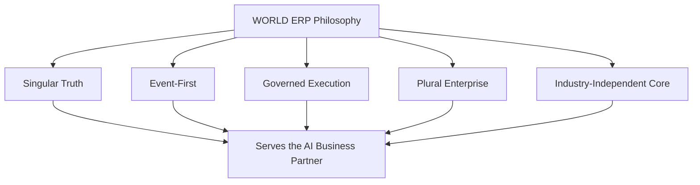

# Volume 05 - ERP Philosophy

| Field | Value |
|---|---|
| Document ID | WORLD-VOL05-003 |
| Title | ERP Philosophy |
| Version | 1.0 |
| Status | Approved |
| Classification | Internal |
| Founder | Mahesh Choudhary |

## Purpose

This chapter sets out the guiding philosophy of WORLD ERP - the set of beliefs and convictions that shape every design decision in Volume 05. Philosophy precedes principles and objectives; it explains the worldview from which they are derived.

## Scope

The scope covers the foundational beliefs about data, execution, intelligence, and governance that define WORLD ERP's character. It excludes concrete rules (Chapter 05) and measurable objectives (Chapter 04), which operationalize this philosophy.

## The Philosophy of WORLD ERP

WORLD ERP is built on a single conviction: **the record of a business and the intelligence that guides it must not be separated.** Traditional architectures divorce operations from analytics and both from decision-making, then spend enormous effort reconnecting them. WORLD rejects this separation. The ERP layer is designed so that recording, executing, understanding, and deciding are facets of one coherent system serving the AI Business Partner.

From this flow several convictions. First, **truth is singular**: there is one governed operational reality, not many reconciled copies. Second, **events are first-class**: the system captures not only current state but the stream of business events that produced it, because intelligence lives in context and history. Third, **execution is governed**: any actor, human or AI, operates within the same authorization and audit fabric. Fourth, **the enterprise is plural**: multi-company, multi-tenant, and multi-location realities are the norm, not exceptions to be retrofitted. Fifth, **industry is a configuration, not a rewrite**: the core is industry-independent.

| Belief | What it rejects | What it enables |
|---|---|---|
| Truth is singular | Reconciled data silos | One operational reality |
| Events are first-class | State-only records | Contextual AI reasoning |
| Execution is governed | Ungoverned automation | Safe autonomy and audit |
| The enterprise is plural | Single-entity assumptions | Scale across companies |
| Industry is configuration | Vertical rewrites | Reuse across sectors |

## Business Value

A coherent philosophy prevents architectural drift and rework. When every team shares the same convictions, features compose cleanly, automation reuses the same substrate, and governance is uniform. The business gains a system that grows without fragmenting, and whose behavior remains predictable and auditable as scope expands.

## Relationship to the AI Business Partner

The philosophy exists to make the AI Business Partner (Volume 03) possible. Singular truth and event-first design give the partner a reliable, contextual view; governed execution lets it act safely. The philosophy is, in effect, a contract that the operational layer will always be trustworthy enough for autonomy.

## Relationship to Business Foundation

WORLD ERP philosophy honors the Business Foundation (Volume 02) by treating its definitions as authoritative. "Singular truth" begins with the single definition of an entity, product, or policy in the foundation, which ERP then enforces consistently at runtime.

## Relationship to Business Intelligence

Because the philosophy makes events first-class and truth singular, Business Intelligence (Volume 04) inherits a clean, historical, real-time source. BI does not have to reconstruct meaning; it interprets an operational stream that was designed to be understood.

## Enterprise Implementation Approach

Teams internalize the philosophy before configuring anything. Design reviews test each decision against the five convictions: does this preserve singular truth, capture events, keep execution governed, respect the plural enterprise, and keep the core industry-independent? Decisions that violate a conviction are reworked, not waived.

**Enterprise example:** A manufacturer initially proposed a bespoke, industry-specific quality module with its own private data store. Reviewed against the philosophy, the private store violated singular truth and industry-independence. The team instead modeled quality events in the shared event stream and configured industry-specific behavior, preserving one truth while meeting the manufacturer's needs - and making the same quality intelligence reusable for other tenants.

## Cross-References

- [ERP Objectives](/docs/blueprint/volume-05-erp-foundation/section-a-erp-foundation/04-erp-objectives.md)
- [ERP Design Principles](/docs/blueprint/volume-05-erp-foundation/section-a-erp-foundation/05-erp-design-principles.md)
- [Volume 03 - AI Business Partner](/docs/blueprint/volume-03-ai-business-partner/README.md)

## References

- [Volume 01 - Vision and Philosophy](/docs/blueprint/volume-01-vision-and-philosophy/README.md)
- [Document Standards](/docs/governance/document-standards.md)

## Change Log

| Version | Date | Author | Notes |
|---|---|---|---|
| 1.0 | 2026-07-12 | Lead Software Engineer | Initial approved version. |
