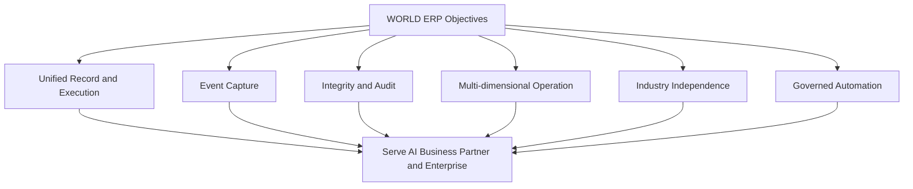

# Volume 05 - ERP Objectives

| Field | Value |
|---|---|
| Document ID | WORLD-VOL05-004 |
| Title | ERP Objectives |
| Version | 1.0 |
| Status | Approved |
| Classification | Internal |
| Founder | Mahesh Choudhary |

## Purpose

This chapter defines the concrete objectives that WORLD ERP must achieve as the operational execution and record layer of an AI-Native Business Operating System. Objectives translate the philosophy (Chapter 03) into targeted outcomes that guide design and measure progress.

## Scope

The scope covers the primary functional and architectural objectives of WORLD ERP and how they support the wider WORLD architecture. It excludes success measurement thresholds (Chapter 08) and detailed design rules (Chapter 05).

## Objectives of WORLD ERP

WORLD ERP pursues a coherent set of objectives, each derived from its role as the substrate for the AI Business Partner. The foremost objective is to provide a **single governed system of record and execution** across all operational domains. Supporting objectives include capturing business activity as **structured, AI-consumable events**; enforcing **transactional integrity and auditability**; delivering **native multi-company, multi-tenant, and multi-location** operation; remaining **industry-independent and configurable**; and exposing **governed capabilities for automation** that the AI Business Partner can safely invoke.

These objectives are interdependent. A single system of record is only valuable if it is governed and auditable; multi-tenancy is only safe if execution is governed; automation is only trustworthy if the underlying record is complete and consistent.

| Objective | Description | Primary beneficiary |
|---|---|---|
| Unified record and execution | One authoritative operational layer | Whole enterprise |
| Event capture | Structured, contextual events | AI Business Partner |
| Integrity and audit | Consistent, traceable transactions | Governance and compliance |
| Multi-dimensional operation | Company, tenant, location native | Scaling organizations |
| Industry independence | Configurable core | Cross-sector reuse |
| Governed automation | Safe machine-executable capabilities | AI Business Partner |

## Business Value

Each objective maps to measurable business value: a unified record reduces reconciliation cost; event capture accelerates automation; integrity and audit reduce compliance risk; multi-dimensional operation lowers the cost of growth; industry independence maximizes reuse; governed automation converts labor into scalable capability. Together they raise operational throughput while lowering cost and risk.

## Relationship to the AI Business Partner

The objectives are chosen so that the AI Business Partner (Volume 03) can observe and act with confidence. Event capture and unified records give it perception; governed automation gives it agency; integrity and audit give it accountability. The objectives collectively define what the partner is permitted to rely upon.

## Relationship to Business Foundation

Objectives are grounded in the Business Foundation (Volume 02). The unified record enforces foundation definitions; governed execution enforces foundation policies and roles. Meeting the objectives is, in practice, faithfully executing the Business Foundation at operational scale.

## Relationship to Business Intelligence

The event-capture and integrity objectives directly enable Business Intelligence (Volume 04). Clean, complete, real-time events allow BI to compute trustworthy metrics and forecasts, and to feed insight back to the AI Business Partner without a separate data-quality remediation effort.

## Enterprise Implementation Approach

Implementation teams translate each objective into a backlog with clear acceptance criteria, then sequence delivery so that the record-and-execution and event-capture objectives are met first, since automation and BI depend on them. Objectives are reviewed at each milestone to ensure no domain is delivered in a way that undermines integrity or tenancy isolation.

**Enterprise example:** A retail enterprise sets the event-capture objective as a milestone: every point-of-sale, inventory, and pricing action emits a structured event. Once met, the AI Business Partner immediately begins detecting margin erosion in near real time and proposing price corrections, and BI produces daily contribution reporting - both reusing the same event stream rather than new integrations.

## Cross-References

- [ERP Philosophy](/docs/blueprint/volume-05-erp-foundation/section-a-erp-foundation/03-erp-philosophy.md)
- [ERP Success Criteria](/docs/blueprint/volume-05-erp-foundation/section-a-erp-foundation/08-erp-success-criteria.md)
- [Volume 04 - Business Intelligence](/docs/blueprint/volume-04-business-intelligence/README.md)

## References

- [Volume 01 - Vision and Philosophy](/docs/blueprint/volume-01-vision-and-philosophy/README.md)
- [Document Standards](/docs/governance/document-standards.md)

## Change Log

| Version | Date | Author | Notes |
|---|---|---|---|
| 1.0 | 2026-07-12 | Lead Software Engineer | Initial approved version. |
