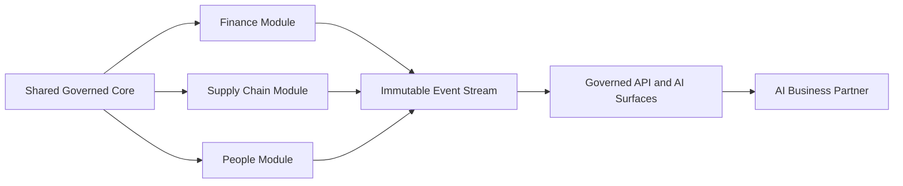

# Volume 05 - ERP Design Principles

| Field | Value |
|---|---|
| Document ID | WORLD-VOL05-005 |
| Title | ERP Design Principles |
| Version | 1.0 |
| Status | Approved |
| Classification | Internal |
| Founder | Mahesh Choudhary |

## Purpose

This chapter defines the design principles that govern how WORLD ERP is built. Principles are the actionable rules derived from the philosophy (Chapter 03) and objectives (Chapter 04); they constrain concrete architecture and implementation decisions across the operational layer.

## Scope

The scope covers the enduring design principles applied to data, transactions, tenancy, extensibility, and automation. It excludes module specifications (Volume 06) and non-binding stylistic conventions.

## Design Principles of WORLD ERP

WORLD ERP adheres to a compact set of binding principles. **Unified data model:** all domains share one governed model with a single definition per concept. **Event-sourced operations:** business actions emit immutable events that constitute the authoritative history. **Modularity with cohesion:** the system is composed of loosely coupled modules over a shared core, so capabilities can evolve independently without fragmenting truth. **Tenancy isolation by design:** company, tenant, and location boundaries are enforced structurally, never by convention. **Governed extensibility:** the platform is extended through declared, versioned extension points, not by forking the core. **API- and AI-first surfaces:** every capability is exposed as a governed programmatic interface before it is exposed as a screen. **Security and audit as defaults:** every transaction is authorized and traceable.

| Principle | Rule | Rationale |
|---|---|---|
| Unified data model | One definition per concept | Preserve singular truth |
| Event-sourced operations | Immutable event history | Enable AI reasoning and audit |
| Modularity with cohesion | Loose modules, shared core | Evolve without fragmenting |
| Tenancy isolation | Structural boundaries | Safe multi-tenant scale |
| Governed extensibility | Versioned extension points | Extend without forking |
| API- and AI-first | Interfaces before screens | Native automation |
| Security and audit | Authorized, traceable by default | Trust and compliance |

## Business Value

Design principles protect long-term value by keeping the system coherent as it grows. Tenancy isolation prevents costly breaches and cross-contamination; governed extensibility avoids the maintenance debt of forked customizations; API- and AI-first surfaces mean every capability is automatable from day one. The enterprise avoids the slow decay that afflicts heavily customized ERP estates.

## Relationship to the AI Business Partner

The API- and AI-first principle exists specifically so the AI Business Partner (Volume 03) can invoke any capability programmatically and safely. Event-sourcing gives the partner a complete history to reason over, and security-by-default ensures its actions are authorized and auditable like any other actor.

## Relationship to Business Foundation

The unified data model principle enforces the Business Foundation (Volume 02) by admitting only one definition per concept, sourced from the foundation. Governed extensibility ensures that adaptations to a specific enterprise still respect foundation-level definitions and policies.

## Relationship to Business Intelligence

Event-sourcing and the unified model give Business Intelligence (Volume 04) a canonical, high-fidelity source. Because events are immutable and consistently structured, BI computations are reproducible and auditable, and insights can be traced back to originating transactions.

## Enterprise Implementation Approach

Principles are enforced through architecture governance: design reviews, automated checks on tenancy boundaries and extension points, and a rule that new capabilities ship an API surface first. Deviations require explicit architectural exception approval and a remediation plan, keeping the estate principled over time.

**Enterprise example:** A tenant requests a custom approval step in procurement. Rather than modifying core code, the team uses a versioned extension point to inject the step, emitting standard events. The AI Business Partner immediately recognizes the new approval events and can monitor their cycle time, and BI reports on approval bottlenecks - all without any change to the shared core.

## Cross-References

- [ERP Objectives](/docs/blueprint/volume-05-erp-foundation/section-a-erp-foundation/04-erp-objectives.md)
- [AI-Native ERP Concept](/docs/blueprint/volume-05-erp-foundation/section-a-erp-foundation/06-ai-native-erp-concept.md)
- [Volume 02 - Business Foundation](/docs/blueprint/volume-02-business-foundation/README.md)

## References

- [Volume 01 - Vision and Philosophy](/docs/blueprint/volume-01-vision-and-philosophy/README.md)
- [Document Standards](/docs/governance/document-standards.md)

## Change Log

| Version | Date | Author | Notes |
|---|---|---|---|
| 1.0 | 2026-07-12 | Lead Software Engineer | Initial approved version. |
