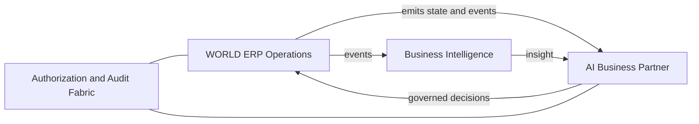

# Volume 05 - AI-Native ERP Concept

| Field | Value |
|---|---|
| Document ID | WORLD-VOL05-006 |
| Title | AI-Native ERP Concept |
| Version | 1.0 |
| Status | Approved |
| Classification | Internal |
| Founder | Mahesh Choudhary |

## Purpose

This chapter defines what it means for WORLD ERP to be AI-native, distinguishing it from ERP systems that merely add AI features. It describes the concept, its architecture, and how AI-nativeness reshapes the operational layer to serve the AI Business Partner.

## Scope

The scope covers the conceptual model of AI-native ERP: how intelligence is embedded in the record and execution layer, and how humans and AI share the same governed operations. It excludes specific model implementations and module-level automation designs (Volume 06).

## The AI-Native Concept in WORLD ERP

An AI-native ERP is not an ERP with a chatbot. It is an operational layer designed from inception so that intelligence is a first-class participant in every transaction. In WORLD, this means three things. First, the data model is **AI-consumable**: events carry the context, meaning, and lineage that models need to reason. Second, every operation is a **governed capability** callable by the AI Business Partner exactly as by a human, through the same authorization and audit fabric. Third, the system supports a **perceive-decide-act loop**: the ERP continuously emits state to intelligence, receives decisions, and executes them within declared limits.

This inverts the traditional relationship. Rather than analytics observing ERP from the outside, intelligence is woven into the operational fabric. The AI Business Partner does not sit beside the ERP; it operates through it.

| Aspect | AI-added ERP | AI-native WORLD ERP |
|---|---|---|
| AI position | External add-on | Embedded participant |
| Data readiness | Post-hoc extraction | Native, contextual events |
| Action pathway | Separate automation | Same governed operations |
| Human/AI parity | Different mechanisms | Shared authorization fabric |
| Loop | Batch, delayed | Continuous perceive-decide-act |

## Business Value

AI-nativeness compresses the distance between insight and action to near zero. Because the partner acts through the same governed operations as humans, automation is trustworthy and auditable, and can be expanded safely. Enterprises realize continuous optimization - pricing, allocation, scheduling, collections - rather than periodic, manually triggered improvements.

## Relationship to the AI Business Partner

This chapter defines the substrate that makes the AI Business Partner (Volume 03) real. The perceive-decide-act loop is the mechanism by which the partner operates a business. AI-native ERP is, in essence, the embodiment of the partner within the operational layer.

## Relationship to Business Foundation

AI actions remain bounded by the Business Foundation (Volume 02). The authorization fabric ensures the partner can only act within the roles, policies, and limits the foundation defines, so AI-nativeness never means ungoverned autonomy.

## Relationship to Business Intelligence

AI-native ERP and Business Intelligence (Volume 04) form a closed loop: ERP emits contextual events, BI derives insight, and the partner acts through ERP. Because the loop shares one event stream, BI insight and ERP action are always consistent with the same operational truth.

## Enterprise Implementation Approach

Enterprises adopt AI-nativeness incrementally by capability. For each operational domain, teams first ensure events are AI-consumable, then expose governed capabilities, then enable supervised autonomy within tight limits, widening limits as confidence grows. Every autonomous action is logged and reversible where feasible, preserving trust.

**Enterprise example:** In accounts receivable, WORLD ERP emits invoice, payment, and promise-to-pay events. The AI Business Partner perceives an aging pattern, decides on a dunning action within an approved policy limit, and executes it through the standard collections operation. The action is audited identically to a human clerk's, and BI updates the days-sales-outstanding metric in real time, informing the partner's next decision.

## Cross-References

- [ERP Design Principles](/docs/blueprint/volume-05-erp-foundation/section-a-erp-foundation/05-erp-design-principles.md)
- [Enterprise Operating Model](/docs/blueprint/volume-05-erp-foundation/section-a-erp-foundation/07-enterprise-operating-model.md)
- [Volume 03 - AI Business Partner](/docs/blueprint/volume-03-ai-business-partner/README.md)

## References

- [Volume 01 - Vision and Philosophy](/docs/blueprint/volume-01-vision-and-philosophy/README.md)
- [Document Standards](/docs/governance/document-standards.md)

## Change Log

| Version | Date | Author | Notes |
|---|---|---|---|
| 1.0 | 2026-07-12 | Lead Software Engineer | Initial approved version. |
