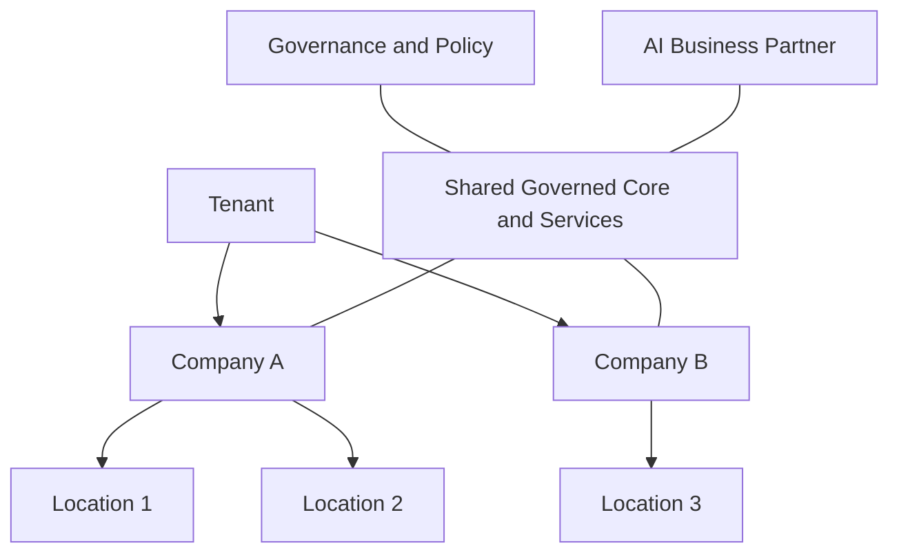

# Volume 05 - Enterprise Operating Model

| Field | Value |
|---|---|
| Document ID | WORLD-VOL05-007 |
| Title | Enterprise Operating Model |
| Version | 1.0 |
| Status | Approved |
| Classification | Internal |
| Founder | Mahesh Choudhary |

## Purpose

This chapter describes the enterprise operating model that WORLD ERP enables - how organizations of many companies, tenants, and locations run their operations on a single AI-native layer. It connects architectural capability to the way real enterprises are structured and governed.

## Scope

The scope covers the operating model: organizational dimensions, shared services, governance, and the division of work between humans and the AI Business Partner. It excludes module-specific processes (Volume 06) and success measurement (Chapter 08).

## The WORLD Enterprise Operating Model

WORLD ERP is designed for the plural enterprise. Its operating model organizes operations along explicit dimensions - **tenant** (the top-level customer or organization), **company** (a legal entity), and **location** (an operational site) - with shared, governed master data and policies flowing down and consolidated reporting flowing up. Common capabilities are delivered as shared services on one core, while local variation is handled through configuration and governed extension points.

Work is divided between three actors: **people**, who set intent and handle exceptions; the **AI Business Partner**, which operates routine and optimizing activity within limits; and the **ERP layer**, which records and executes. Governance sits across all three, defining who or what may act, within which entity, and under which policy.

| Dimension | Meaning | Governed by |
|---|---|---|
| Tenant | Top-level organization | Isolation and policy scope |
| Company | Legal entity | Ledgers, compliance rules |
| Location | Operational site | Operational configuration |
| Shared services | Common capabilities | Central governance |
| Local variation | Site or entity specifics | Configuration and extensions |

## Business Value

The operating model lets an enterprise scale by adding companies and locations as configuration rather than as new systems. Shared services reduce duplication and cost; consolidated reporting gives leadership one view; and delegating routine operation to the AI Business Partner increases throughput without proportional headcount. Growth becomes a configuration exercise, not a re-platforming project.

## Relationship to the AI Business Partner

The operating model defines the AI Business Partner's (Volume 03) operating envelope: the entities it may act within and the limits it must respect. It positions the partner as an operational actor woven into the enterprise structure, not an external tool, enabling it to run activity consistently across all companies and locations.

## Relationship to Business Foundation

The dimensions and governance of the operating model are declared in the Business Foundation (Volume 02). Tenant, company, and location structures, and the policies that govern them, originate there; WORLD ERP realizes them as the live operating model.

## Relationship to Business Intelligence

Because the operating model consolidates operations onto one core, Business Intelligence (Volume 04) can report across tenants, companies, and locations from a single source, with correct isolation. Leadership sees both group-level consolidation and site-level detail without reconciling separate systems.

## Enterprise Implementation Approach

Implementation defines the dimensional structure first, then establishes shared services and governance, and finally onboards companies and locations onto the common core. Each new entity inherits shared master data and policy while retaining space for governed local variation, allowing rapid, consistent expansion.

**Enterprise example:** A hospitality group operates twelve hotels across three legal entities. On WORLD ERP, procurement is a shared service governed centrally, each hotel is a location with local configuration, and consolidated finance rolls up per entity. The AI Business Partner optimizes purchasing across all locations within approved limits, while BI reports margin per property and per entity - all from one governed operating model.

## Cross-References

- [AI-Native ERP Concept](/docs/blueprint/volume-05-erp-foundation/section-a-erp-foundation/06-ai-native-erp-concept.md)
- [ERP Success Criteria](/docs/blueprint/volume-05-erp-foundation/section-a-erp-foundation/08-erp-success-criteria.md)
- [Volume 02 - Business Foundation](/docs/blueprint/volume-02-business-foundation/README.md)

## References

- [Volume 01 - Vision and Philosophy](/docs/blueprint/volume-01-vision-and-philosophy/README.md)
- [Document Standards](/docs/governance/document-standards.md)

## Change Log

| Version | Date | Author | Notes |
|---|---|---|---|
| 1.0 | 2026-07-12 | Lead Software Engineer | Initial approved version. |
