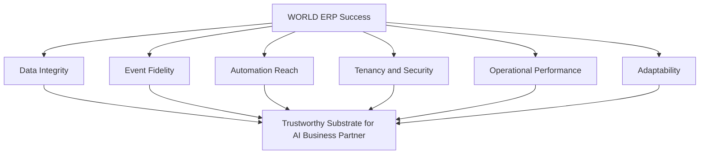

# Volume 05 - ERP Success Criteria

| Field | Value |
|---|---|
| Document ID | WORLD-VOL05-008 |
| Title | ERP Success Criteria |
| Version | 1.0 |
| Status | Approved |
| Classification | Internal |
| Founder | Mahesh Choudhary |

## Purpose

This chapter defines how the success of WORLD ERP is judged. It establishes the criteria and measures that determine whether the operational layer is fulfilling its role as the substrate for the AI Business Partner, and closes Section A by making the preceding objectives verifiable.

## Scope

The scope covers success dimensions, illustrative measures, and how they are assessed. It excludes detailed test plans and module-level acceptance criteria (Volume 06). The measures are indicative targets to be calibrated per enterprise engagement.

## Success Criteria for WORLD ERP

WORLD ERP is successful when it reliably serves as a trustworthy, governed operational layer that the AI Business Partner can act through at scale. Success is assessed across several dimensions: **data integrity** (one truth, complete and accurate), **event fidelity** (operations are captured as AI-consumable events), **automation reach** (share of routine operations executed safely by the partner), **tenancy and security** (isolation and audit hold under load), **operational performance** (transactions and consolidations complete within targets), and **adaptability** (new companies, locations, and industries onboarded through configuration).

These criteria are deliberately outcome-oriented. They measure not the presence of features but whether the layer behaves as the philosophy and objectives require.

| Success dimension | Indicative measure | Target direction |
|---|---|---|
| Data integrity | Reconciliation exceptions | Approaches zero |
| Event fidelity | Operations emitting structured events | Approaches 100% |
| Automation reach | Routine actions safely automated | Increasing |
| Tenancy and security | Isolation and audit violations | Zero |
| Operational performance | Transaction and close cycle times | Within target |
| Adaptability | Time to onboard a new entity | Decreasing |

## Business Value

Clear success criteria turn architecture into accountability. They let leadership verify that investment in WORLD ERP yields lower reconciliation cost, safer automation, reliable compliance, and cheaper growth. Because the criteria are measurable, improvement is continuous and evidence-based rather than anecdotal.

## Relationship to the AI Business Partner

Several criteria - event fidelity, automation reach, integrity - directly measure the ERP layer's readiness to serve the AI Business Partner (Volume 03). High scores mean the partner can perceive and act reliably; low scores signal where the substrate must improve before autonomy is widened.

## Relationship to Business Foundation

Success includes faithfully executing the Business Foundation (Volume 02). Adaptability and integrity measures reflect how well ERP realizes foundation definitions and policies as new entities are onboarded, ensuring the operating reality never drifts from the declared structure.

## Relationship to Business Intelligence

Event fidelity and data integrity are the criteria on which Business Intelligence (Volume 04) most depends. When they are met, BI metrics are trustworthy and reproducible; the same measures that prove ERP success also guarantee the quality of the insight layer built upon it.

## Enterprise Implementation Approach

Enterprises baseline each measure at the start of an engagement, set calibrated targets, and track them through delivery on an operational dashboard reviewed at each milestone. Criteria that fall short trigger remediation before dependent capabilities - automation, BI - are expanded, keeping the layer trustworthy as scope grows.

**Enterprise example:** A logistics enterprise adopts the success dashboard. At baseline, only sixty percent of operations emit structured events and month-end close takes eight days. After two quarters, event fidelity reaches ninety-eight percent and close falls to two days, at which point the AI Business Partner is authorized to automate carrier settlement, and BI publishes real-time cost-to-serve - each expansion justified by the measured criteria.

## Cross-References

- [ERP Objectives](/docs/blueprint/volume-05-erp-foundation/section-a-erp-foundation/04-erp-objectives.md)
- [Enterprise Operating Model](/docs/blueprint/volume-05-erp-foundation/section-a-erp-foundation/07-enterprise-operating-model.md)
- [Volume 04 - Business Intelligence](/docs/blueprint/volume-04-business-intelligence/README.md)

## References

- [Volume 01 - Vision and Philosophy](/docs/blueprint/volume-01-vision-and-philosophy/README.md)
- [Document Standards](/docs/governance/document-standards.md)

## Change Log

| Version | Date | Author | Notes |
|---|---|---|---|
| 1.0 | 2026-07-12 | Lead Software Engineer | Initial approved version. |
