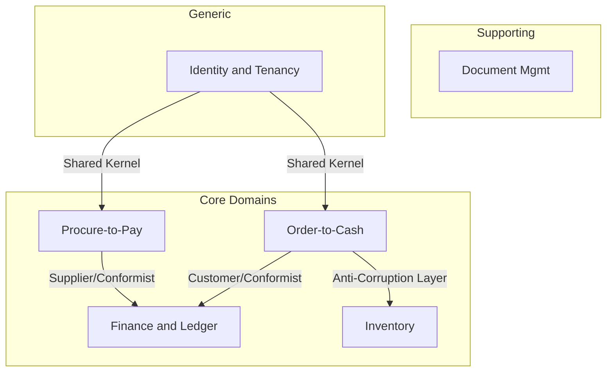

# Volume 05 - Domain-Driven ERP Architecture

| Field | Value |
|---|---|
| Document ID | WORLD-VOL05-009 |
| Title | Domain-Driven ERP Architecture |
| Version | 1.0 |
| Status | Approved |
| Classification | Internal |
| Founder | Mahesh Choudhary |

## Purpose

This chapter establishes Domain-Driven Design (DDD) as the organizing principle for the WORLD ERP. Traditional ERP suites collapse under monolithic data models where one table serves finance, inventory, and sales simultaneously, breeding coupling and ambiguity. WORLD instead partitions the enterprise into explicit **bounded contexts**, each owning its language, model, and rules. This positions the ERP as a set of coherent business domains that an AI Business Partner can reason about with precision rather than a single undifferentiated schema.

## Scope

The chapter covers the domain decomposition of the WORLD ERP, the definition of bounded contexts and their ubiquitous language, aggregate and entity boundaries, and the context map that governs inter-domain relationships. It excludes physical deployment topology (see Chapter 10) and service transport mechanics (see Chapter 11).

## Architecture as Designed for WORLD

WORLD models the enterprise as a set of **core domains** (Finance, Order-to-Cash, Procure-to-Pay, Inventory, Manufacturing, HR), **supporting domains** (Notifications, Document Management), and **generic domains** (Identity, Localization). Each bounded context is authoritative for its aggregates and exposes them only through published contracts. A ubiquitous language is enforced per context so that the term "Order" in Order-to-Cash and "Order" in Manufacturing remain deliberately distinct models rather than a shared, overloaded record.

Because WORLD is multi-company, multi-tenant, and multi-location, every aggregate carries tenant and company scoping as an invariant of the domain, not an afterthought bolted onto queries. The AI Business Partner consumes each domain's model and language directly, allowing it to explain and act on business events in the vocabulary of the business.

### Enterprise Example

A distribution company operating three legal entities in two countries books a sales order. The Order-to-Cash context owns the SalesOrder aggregate and its invariants (credit limit, pricing). On confirmation it publishes an `OrderConfirmed` domain event. Finance, a downstream conformist context, translates this into a receivable; Inventory, protected by an anti-corruption layer, reserves stock without ever exposing its internal item model to Order-to-Cash. No shared table couples the three; each remains independently evolvable.

| Concept | WORLD Implementation | Governance Rule |
|---|---|---|
| Bounded Context | One domain module with its own schema | No cross-context foreign keys |
| Ubiquitous Language | Context-scoped glossary | Terms never reused across contexts |
| Aggregate | Consistency + transaction boundary | One aggregate per transaction |
| Context Map | Published relationship registry | ACL required for legacy integration |

## Business Value

Domain-driven decomposition reduces change-blast radius: a pricing change in Order-to-Cash cannot silently break payroll. It accelerates onboarding of industry-specific extensions because new domains attach at the context map rather than mutating a shared core. It also improves data quality and auditability, since each fact has a single authoritative owner.

## Relationship to the AI Business Partner

The AI Business Partner (Vol 03) operates most reliably when the world it acts on is modeled in unambiguous, bounded terms. Domain models give the Partner a stable ontology: it can plan, simulate, and execute actions scoped to a single context, and reason across contexts through published contracts rather than guessing at overloaded fields.

## Relationship to Business Foundation

The bounded contexts are the operational realization of the business capabilities defined in the Business Foundation (Vol 02). Each capability maps to one or more domains, ensuring that the ERP structure mirrors how the enterprise is actually organized rather than an accounting-centric legacy layout.

## Relationship to Business Intelligence

Every domain publishes its events and read models with clear semantics, giving Business Intelligence (Vol 04) trustworthy, context-tagged data. Analytics can attribute a metric to its owning domain, eliminating the reconciliation ambiguity common in monolithic ERP reporting.

## Enterprise Implementation Approach

Teams begin with event storming to surface domain events and boundaries, then formalize context maps and ubiquitous language glossaries. Each context is implemented as an independently deployable module (Chapter 10) with its own persistence. Legacy or third-party systems integrate exclusively through anti-corruption layers, preserving the integrity of WORLD's domain models.

## Cross-References

- [Modular ERP Architecture](/docs/blueprint/volume-05-erp-foundation/section-b-core-architecture/10-modular-erp-architecture.md)
- [Business Object Model](/docs/blueprint/volume-05-erp-foundation/section-b-core-architecture/14-business-object-model.md)
- [Volume 02 - Business Foundation](/docs/blueprint/volume-02-business-foundation/README.md)

## References

- [Volume 01 - Vision and Philosophy](/docs/blueprint/volume-01-vision-and-philosophy/README.md)
- [Document Standards](/docs/governance/document-standards.md)

## Change Log

| Version | Date | Author | Notes |
|---|---|---|---|
| 1.0 | 2026-07-12 | Lead Software Engineer | Initial approved version. |
