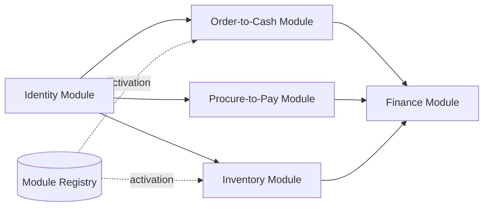

# Volume 05 - Modular ERP Architecture

| Field | Value |
|---|---|
| Document ID | WORLD-VOL05-010 |
| Title | Modular ERP Architecture |
| Version | 1.0 |
| Status | Approved |
| Classification | Internal |
| Founder | Mahesh Choudhary |

## Purpose

This chapter defines how the WORLD ERP is composed of independently deployable, independently evolvable modules. Where Chapter 09 partitions the enterprise conceptually into bounded contexts, this chapter translates those contexts into physical modules with explicit contracts, versioning, and lifecycle. The goal is an ERP that customers can compose to fit their industry and scale without forking a monolith.

## Scope

Covered: module topology, the module contract model, dependency rules, packaging and versioning, and the tenant-aware activation of modules. Not covered: intra-module service design (Chapter 11) and event transport (Chapter 12).

## Architecture as Designed for WORLD

Each bounded context is packaged as a **module** exposing three surfaces: a command API, a set of published events, and a read model. Modules depend only on other modules' published contracts, never on internal tables. A lightweight **module registry** records each module's version, dependencies, and the tenants for which it is activated, enabling multi-tenant composition where one tenant runs Manufacturing while another does not.

Modules follow a strict dependency direction: generic modules (Identity, Localization) may be depended upon; core business modules depend downward toward Finance but never upward. This acyclic graph keeps the platform releasable in increments.

### Enterprise Example

A retailer adopts WORLD with Order-to-Cash, Inventory, and Finance. Twelve months later it opens a light-manufacturing line. The Manufacturing module is activated for that tenant in the registry; it declares a dependency on Inventory's published contract and begins consuming inventory events. No existing module is redeployed or modified. A competitor tenant on the same platform never activates Manufacturing and is entirely unaffected.

| Module Attribute | Definition | Rule |
|---|---|---|
| Command API | Versioned entry points for actions | Backward compatible within a major version |
| Published Events | Domain events other modules may subscribe to | Additive changes only |
| Read Model | Query-optimized projections | Owned by the module, not shared |
| Activation | Per-tenant enablement flag | Governed by the module registry |

## Business Value

Modularity lets WORLD ship value incrementally, price by capability, and isolate failures. A defect or heavy load in one module does not degrade unrelated modules. Customers avoid the classic ERP upgrade freeze because modules version independently, and industry verticals plug in without destabilizing the core.

## Relationship to the AI Business Partner

The AI Business Partner discovers available capabilities through the module registry: it knows which modules a tenant has activated and therefore which actions it may plan and execute. New modules extend the Partner's action space automatically, without retraining or hard-coded assumptions about a fixed ERP surface.

## Relationship to Business Foundation

Modules are the deployable units of the capabilities catalogued in the Business Foundation (Vol 02). The registry provides a live map between a tenant's declared business capabilities and the running software that fulfills them, keeping strategy and system aligned.

## Relationship to Business Intelligence

Because each module owns and publishes its read model, Business Intelligence (Vol 04) can compose analytics from well-scoped, versioned projections. Metric lineage traces cleanly to the owning module and its contract version, improving trust in cross-module reporting.

## Enterprise Implementation Approach

Implementation teams define each module's contract before its internals, treat contracts as the unit of compatibility testing, and gate releases on contract conformance. The registry is the source of truth for deployment and activation, and rollout uses progressive enablement per tenant to contain risk.

## Cross-References

- [Domain-Driven ERP Architecture](/docs/blueprint/volume-05-erp-foundation/section-b-core-architecture/09-domain-driven-erp-architecture.md)
- [Service-Oriented Design](/docs/blueprint/volume-05-erp-foundation/section-b-core-architecture/11-service-oriented-design.md)
- [Volume 03 - AI Business Partner](/docs/blueprint/volume-03-ai-business-partner/README.md)

## References

- [Volume 01 - Vision and Philosophy](/docs/blueprint/volume-01-vision-and-philosophy/README.md)
- [Document Standards](/docs/governance/document-standards.md)

## Change Log

| Version | Date | Author | Notes |
|---|---|---|---|
| 1.0 | 2026-07-12 | Lead Software Engineer | Initial approved version. |
