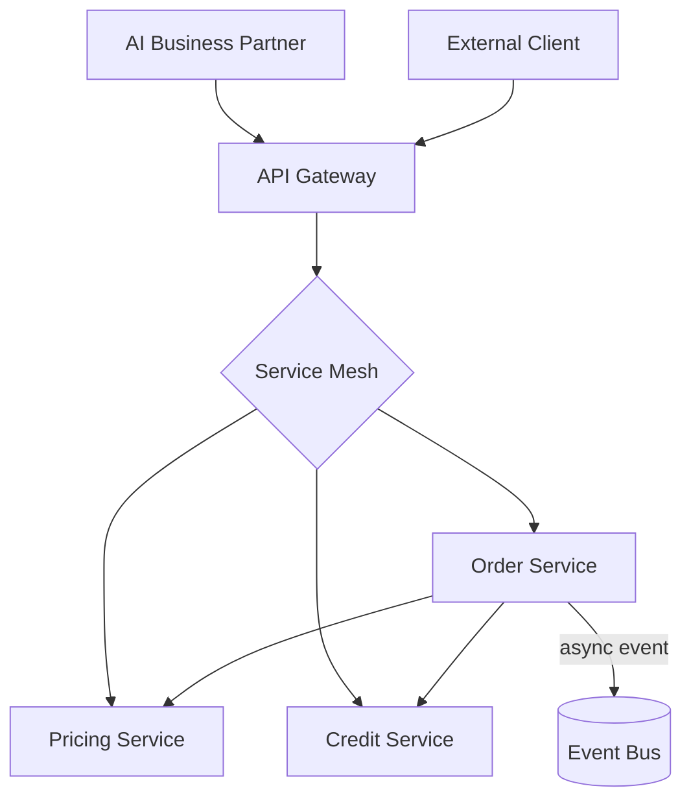

# Volume 05 - Service-Oriented Design

| Field | Value |
|---|---|
| Document ID | WORLD-VOL05-011 |
| Title | Service-Oriented Design |
| Version | 1.0 |
| Status | Approved |
| Classification | Internal |
| Founder | Mahesh Choudhary |

## Purpose

This chapter defines how WORLD ERP modules expose and consume behavior as services. It adapts service-oriented and microservice principles to an AI-native ERP, establishing contract-first interfaces, clear service boundaries aligned to bounded contexts, and the invocation patterns the AI Business Partner uses to act on the business.

## Scope

Covered: service granularity, contract-first design, synchronous versus asynchronous invocation, the API gateway and service mesh, and idempotency and resilience patterns. Excluded: event semantics (Chapter 12) and long-running orchestration (Chapter 13).

## Architecture as Designed for WORLD

Each module publishes **capability services** aligned to its bounded context. Services are contract-first: the interface is defined and versioned before implementation, and consumers bind to the contract, never the internals. Synchronous request/response is used for queries and command acknowledgment; asynchronous messaging (Chapter 12) is preferred for cross-context effects. A gateway handles authentication, tenant routing, and rate limiting, while a service mesh provides observability, retries, and circuit breaking.

Every command service is **idempotent** by design, keyed on a client-supplied request identifier, so that the AI Business Partner and integration clients can safely retry without duplicating business effects.

### Enterprise Example

The AI Business Partner creates a quote for a customer. It calls the Pricing Service (synchronous, read) to compute price, the Credit Service (synchronous, read) to confirm exposure, then issues an idempotent `CreateQuote` command to the Order Service. The command carries request-id `q-2026-0712-8842`; a transient timeout triggers an automatic retry, but because the Order Service deduplicates on that id, exactly one quote is created.

| Interaction | Pattern | Rationale |
|---|---|---|
| Price lookup | Synchronous query | Immediate result required |
| Credit check | Synchronous query | Blocks command acceptance |
| Create quote | Idempotent command | Safe retry, single effect |
| Notify fulfillment | Asynchronous event | Decouples downstream context |

## Business Value

Contract-first services let teams evolve implementations without breaking consumers, cutting integration cost and regression risk. Idempotency and mesh-level resilience convert transient infrastructure failures into non-events rather than duplicated invoices or lost orders. Clear service boundaries make capacity scaling targeted and economical.

## Relationship to the AI Business Partner

Services are the AI Business Partner's hands. The Partner plans in business terms and executes through well-defined, idempotent service contracts, receiving structured results it can verify. Because contracts are explicit and versioned, the Partner's actions remain safe and auditable, and new services expand what it can do without bespoke wiring.

## Relationship to Business Foundation

Capability services correspond to the business functions defined in the Business Foundation (Vol 02). The service catalog is a running expression of the enterprise's operating model, ensuring that what the system can do maps directly to what the business intends to do.

## Relationship to Business Intelligence

Service invocations emit structured telemetry, timing, and outcome data that Business Intelligence (Vol 04) uses to measure process performance and cost-to-serve. Because services are boundary-aligned, operational metrics attribute cleanly to the responsible capability.

## Enterprise Implementation Approach

Teams publish and review contracts first, generate client stubs from them, and enforce compatibility in continuous integration. Resilience concerns (timeouts, retries, circuit breakers) are standardized in the mesh rather than reimplemented per service. All command services implement request-id idempotency as a platform requirement.

## Cross-References

- [Modular ERP Architecture](/docs/blueprint/volume-05-erp-foundation/section-b-core-architecture/10-modular-erp-architecture.md)
- [Event-Driven ERP](/docs/blueprint/volume-05-erp-foundation/section-b-core-architecture/12-event-driven-erp.md)
- [Workflow-Centric Architecture](/docs/blueprint/volume-05-erp-foundation/section-b-core-architecture/13-workflow-centric-architecture.md)

## References

- [Volume 01 - Vision and Philosophy](/docs/blueprint/volume-01-vision-and-philosophy/README.md)
- [Document Standards](/docs/governance/document-standards.md)

## Change Log

| Version | Date | Author | Notes |
|---|---|---|---|
| 1.0 | 2026-07-12 | Lead Software Engineer | Initial approved version. |
