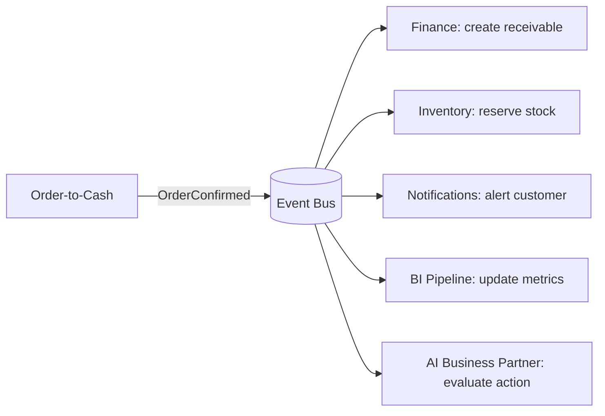

# Volume 05 - Event-Driven ERP

| Field | Value |
|---|---|
| Document ID | WORLD-VOL05-012 |
| Title | Event-Driven ERP |
| Version | 1.0 |
| Status | Approved |
| Classification | Internal |
| Founder | Mahesh Choudhary |

## Purpose

This chapter defines the event-driven backbone of the WORLD ERP. Business facts are captured as immutable **domain events** and propagated over a publish/subscribe fabric, decoupling the module that records a fact from the many modules and AI processes that react to it. This makes the ERP responsive, extensible, and observable in real time.

## Scope

Covered: domain event definition, the event bus and topic design, delivery guarantees, ordering, the outbox pattern, and event-carried state. Excluded: synchronous service contracts (Chapter 11) and stateful orchestration (Chapter 13).

## Architecture as Designed for WORLD

When an aggregate changes, its owning module records a domain event and publishes it via the **transactional outbox** so the event is persisted atomically with the state change and delivered at-least-once. Events are named in past tense (`InvoiceIssued`, `StockReserved`), versioned, and tenant-tagged. Subscribers are independent: Finance, Analytics, Notifications, and the AI Business Partner may all react to one event without any coupling to the publisher or to each other.

Ordering is preserved per aggregate key so that events for a single order are consumed in sequence, while unrelated aggregates process in parallel for throughput.

### Enterprise Example

A manufacturer confirms a large order. Order-to-Cash publishes `OrderConfirmed` once. Inventory reserves stock and, finding a shortfall, publishes `StockShortfallDetected`. The AI Business Partner subscribes to that event, evaluates supplier lead times, and proposes a purchase order. Finance meanwhile has already booked the receivable. A single business fact fanned out to four independent reactions with no publisher change and full audit history.

| Guarantee | WORLD Choice | Consequence |
|---|---|---|
| Delivery | At-least-once via outbox | Consumers must be idempotent |
| Ordering | Per-aggregate key | Parallelism across aggregates |
| Retention | Durable, replayable log | New subscribers can backfill |
| Schema | Versioned, additive | Forward and backward compatibility |

## Business Value

Event-driven design turns the ERP into a real-time nervous system. Reactions happen the instant a fact occurs rather than in nightly batches, shrinking working-capital and fulfillment latency. New capabilities attach as subscribers without touching existing code, and the durable event log provides a complete, replayable audit trail.

## Relationship to the AI Business Partner

Domain events are the primary sensory stream for the AI Business Partner (Vol 03). By subscribing to the event fabric, the Partner perceives every material change as it happens and can react proactively - proposing, deciding, or acting - rather than waiting to be asked. Replayable events also let the Partner reconstruct context for explanation and simulation.

## Relationship to Business Foundation

The catalog of domain events is a direct encoding of the meaningful business moments identified in the Business Foundation (Vol 02). Events give those moments a machine-observable form, keeping the running system faithful to how the enterprise defines significant activity.

## Relationship to Business Intelligence

The event log is the canonical source for Business Intelligence (Vol 04). Streaming pipelines consume events to maintain near-real-time metrics and to build historical fact tables, eliminating brittle extract jobs and giving analytics the same ground truth the operational system uses.

## Enterprise Implementation Approach

Every module implements the transactional outbox; no event is emitted outside a persisted transaction. Consumers are built idempotent and register their subscriptions declaratively. Event schemas are governed centrally, evolve additively, and are retained on a durable log so that new subscribers and the AI Business Partner can replay history when they come online.

## Cross-References

- [Service-Oriented Design](/docs/blueprint/volume-05-erp-foundation/section-b-core-architecture/11-service-oriented-design.md)
- [Transaction Lifecycle](/docs/blueprint/volume-05-erp-foundation/section-b-core-architecture/16-transaction-lifecycle.md)
- [Volume 04 - Business Intelligence](/docs/blueprint/volume-04-business-intelligence/README.md)

## References

- [Volume 01 - Vision and Philosophy](/docs/blueprint/volume-01-vision-and-philosophy/README.md)
- [Document Standards](/docs/governance/document-standards.md)

## Change Log

| Version | Date | Author | Notes |
|---|---|---|---|
| 1.0 | 2026-07-12 | Lead Software Engineer | Initial approved version. |
