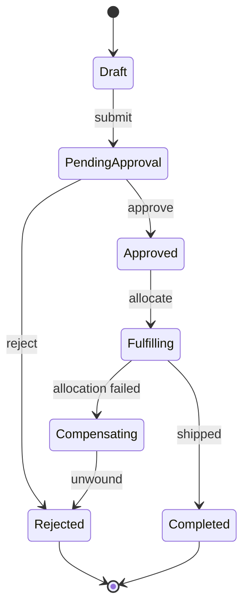

# Volume 05 - Workflow-Centric Architecture

| Field | Value |
|---|---|
| Document ID | WORLD-VOL05-013 |
| Title | Workflow-Centric Architecture |
| Version | 1.0 |
| Status | Approved |
| Classification | Internal |
| Founder | Mahesh Choudhary |

## Purpose

This chapter defines how WORLD coordinates multi-step business processes that span modules, people, and the AI Business Partner. Individual services and events handle single facts; real enterprises run **processes** - approvals, fulfillment, onboarding - that unfold over time with branching, waiting, and compensation. WORLD models these explicitly as orchestrated and choreographed workflows.

## Scope

Covered: the workflow engine, orchestration versus choreography, the saga pattern for distributed consistency, human and AI tasks, and process state and compensation. Excluded: the underlying event fabric (Chapter 12) and transaction state (Chapter 16).

## Architecture as Designed for WORLD

WORLD supports two coordination styles. **Choreography** lets modules react to each other's events for loosely coupled flows. **Orchestration**, run by a durable workflow engine, is used where a process needs explicit state, deadlines, and compensation. Long-running distributed transactions use the **saga pattern**: each step has a compensating action so that a failure late in the process cleanly unwinds earlier effects without a global lock.

A workflow step may be a service call, an event wait, a **human task**, or an **AI task** delegated to the Business Partner. The engine persists process state so a workflow can pause for days awaiting an approval and resume exactly where it left off.

### Enterprise Example

A capital-expenditure request over a threshold triggers a procurement workflow. The engine routes it for two-tier human approval, delegates supplier-risk analysis to the AI Business Partner as an AI task, then orchestrates a saga: reserve budget, raise the purchase order, and schedule payment. If the supplier onboarding step fails, the saga compensates by releasing the budget reservation and reverting the request to Rejected - no partial commitment survives.

| Coordination Style | When Used | Consistency Mechanism |
|---|---|---|
| Choreography | Loosely coupled reactions | Eventual, via events |
| Orchestration | Explicit multi-step process | Durable workflow state |
| Saga | Distributed transaction | Per-step compensation |
| Human/AI task | Judgment or approval | Persisted wait state |

## Business Value

Modeling processes explicitly makes them visible, measurable, and improvable. Bottlenecks in approvals surface as engine metrics; compliance is enforced by the process definition rather than by convention. Sagas provide reliable outcomes across modules without brittle distributed locking, and durable state means processes survive restarts and long waits.

## Relationship to the AI Business Partner

Workflows are where the AI Business Partner (Vol 03) participates as a first-class actor. It receives AI tasks - analysis, drafting, decisions within delegated authority - and returns results the engine acts on. Conversely, the Partner can initiate workflows on the user's behalf, making it an operator of end-to-end processes, not merely an advisor.

## Relationship to Business Foundation

Workflow definitions are the executable form of the business processes described in the Business Foundation (Vol 02). Approval hierarchies, thresholds, and process policies defined at the foundation level are encoded directly into workflow models, keeping execution faithful to governance intent.

## Relationship to Business Intelligence

The workflow engine emits step-level timing, outcome, and rework data. Business Intelligence (Vol 04) mines this for process performance, cycle time, and compliance analytics, enabling continuous process improvement grounded in real execution traces.

## Enterprise Implementation Approach

Teams choose orchestration when a process needs explicit state or compensation, and choreography otherwise. Every distributed process defines compensating actions before go-live. Human and AI tasks are modeled uniformly so authority can shift between people and the Partner by configuration, and all process state is persisted for durability and audit.

## Cross-References

- [Event-Driven ERP](/docs/blueprint/volume-05-erp-foundation/section-b-core-architecture/12-event-driven-erp.md)
- [Transaction Lifecycle](/docs/blueprint/volume-05-erp-foundation/section-b-core-architecture/16-transaction-lifecycle.md)
- [Volume 03 - AI Business Partner](/docs/blueprint/volume-03-ai-business-partner/README.md)

## References

- [Volume 01 - Vision and Philosophy](/docs/blueprint/volume-01-vision-and-philosophy/README.md)
- [Document Standards](/docs/governance/document-standards.md)

## Change Log

| Version | Date | Author | Notes |
|---|---|---|---|
| 1.0 | 2026-07-12 | Lead Software Engineer | Initial approved version. |
