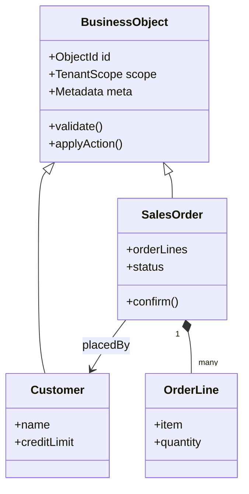

# Volume 05 - Business Object Model

| Field | Value |
|---|---|
| Document ID | WORLD-VOL05-014 |
| Title | Business Object Model |
| Version | 1.0 |
| Status | Approved |
| Classification | Internal |
| Founder | Mahesh Choudhary |

## Purpose

This chapter defines the Business Object Model (BOM) - the canonical, semantically rich representation of the entities the WORLD ERP manages. The BOM gives every domain object a consistent structure (identity, attributes, relationships, behavior, and lifecycle) so that both humans and the AI Business Partner interact with meaningful business objects rather than raw rows and columns.

## Scope

Covered: business object anatomy, the aggregate and entity model, object metadata and typing, extensibility, and multi-tenant scoping. Excluded: master-versus-transactional data governance (Chapter 15) and state transitions (Chapter 16).

## Architecture as Designed for WORLD

Every business object in WORLD is a first-class, self-describing entity. It carries a stable **identity**, typed **attributes**, explicit **relationships**, encapsulated **behavior** (the operations valid on it), and a defined **lifecycle**. Objects are grouped into aggregates (from Chapter 09) that enforce invariants. Crucially, each object exposes machine-readable **metadata** - its type, semantics, and permitted actions - so the AI Business Partner can reason about it generically.

Extensibility is built in: tenants and industry packs add custom attributes and object types through a governed extension model rather than schema forks. Every object is scoped by tenant, company, and, where relevant, location.

### Enterprise Example

A SalesOrder object aggregates its OrderLine children and references a Customer. Its metadata declares valid actions - `confirm`, `cancel`, `amend` - and the guards on each. When the AI Business Partner is asked to "confirm the pending order for Acme," it reads the object's metadata, sees that `confirm` is permitted only from Draft with a passing credit check, evaluates those conditions against the live object, and invokes the action - without any Acme-specific code.

| Object Facet | Description | Example |
|---|---|---|
| Identity | Stable, unique key | SalesOrder SO-10231 |
| Attributes | Typed business fields | orderTotal, currency |
| Relationships | Links to other objects | placedBy -> Customer |
| Behavior | Permitted actions with guards | confirm(), cancel() |
| Lifecycle | Valid states and transitions | Draft to Confirmed |

## Business Value

A consistent object model reduces integration friction, enables reuse of validation and UI generation, and makes the system self-documenting. Governed extensibility lets enterprises tailor objects to their industry without forking the platform, protecting upgradeability while supporting deep customization.

## Relationship to the AI Business Partner

The BOM is the AI Business Partner's world model. Because objects are self-describing - carrying their attributes, relationships, permitted actions, and guards - the Partner can inspect any object and determine what it means and what may be done to it. This generic reasoning is what lets one Partner operate across every industry WORLD serves without bespoke logic per entity.

## Relationship to Business Foundation

The business objects are the concrete instantiation of the entities and concepts defined in the Business Foundation (Vol 02). The foundation's conceptual model of customers, products, and agreements maps one-to-one onto BOM object types, keeping the running data model aligned with the enterprise's own language.

## Relationship to Business Intelligence

Rich object metadata gives Business Intelligence (Vol 04) semantic context for every data point - units, types, relationships, and lifecycle - so analytics can aggregate and interpret objects correctly. Self-describing objects reduce the semantic-mapping effort that traditionally burdens ERP reporting.

## Enterprise Implementation Approach

Teams model objects with explicit metadata and behavior rather than anemic data records, define aggregates to hold invariants, and use the governed extension model for tenant and industry customization. Object definitions are the shared contract between UI generation, services, and the AI Business Partner, and are versioned alongside their owning module.

## Cross-References

- [Domain-Driven ERP Architecture](/docs/blueprint/volume-05-erp-foundation/section-b-core-architecture/09-domain-driven-erp-architecture.md)
- [Master Data Strategy](/docs/blueprint/volume-05-erp-foundation/section-b-core-architecture/15-master-data-strategy.md)
- [Volume 02 - Business Foundation](/docs/blueprint/volume-02-business-foundation/README.md)

## References

- [Volume 01 - Vision and Philosophy](/docs/blueprint/volume-01-vision-and-philosophy/README.md)
- [Document Standards](/docs/governance/document-standards.md)

## Change Log

| Version | Date | Author | Notes |
|---|---|---|---|
| 1.0 | 2026-07-12 | Lead Software Engineer | Initial approved version. |
