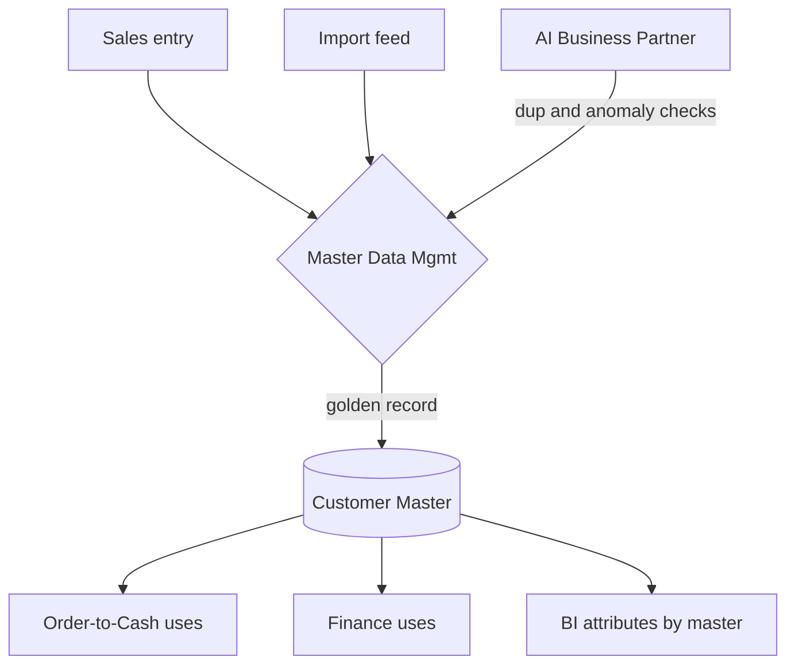

# Volume 05 - Master Data Strategy

| Field | Value |
|---|---|
| Document ID | WORLD-VOL05-015 |
| Title | Master Data Strategy |
| Version | 1.0 |
| Status | Approved |
| Classification | Internal |
| Founder | Mahesh Choudhary |

## Purpose

This chapter defines how WORLD governs master data - the shared, slowly changing reference entities (customers, suppliers, products, chart of accounts, locations) on which transactions depend. Poor master data is the leading cause of ERP failure; WORLD treats master data as a governed, authoritative asset with clear ownership, quality controls, and a defined relationship to transactional data.

## Scope

Covered: master-versus-transactional distinction, the golden-record model, data ownership and stewardship, quality and de-duplication, and multi-company data sharing. Excluded: object structure (Chapter 14) and transaction state (Chapter 16).

## Architecture as Designed for WORLD

WORLD distinguishes **master data** (reference entities reused across transactions) from **transactional data** (records of events). Each master domain has a single authoritative owner and a **golden record** - the canonical, de-duplicated version - maintained by master data management. Master data is versioned and effective-dated so historical transactions retain the values that were valid when they occurred.

In a multi-company, multi-tenant enterprise, master data can be **shared** at the tenant level (a common product catalog) or **scoped** per company (company-specific pricing), governed by an explicit sharing policy. The AI Business Partner assists stewardship by detecting duplicates and anomalies as new records are proposed.

### Enterprise Example

Two subsidiaries each created a supplier "Globex." WORLD's master data management detects the near-duplicate, and the AI Business Partner recommends a merge, mapping both to one golden record while preserving each subsidiary's payment terms as company-scoped attributes. Existing purchase orders retain their effective-dated supplier snapshot, so history stays accurate while future transactions reference the unified master.

| Aspect | Master Data | Transactional Data |
|---|---|---|
| Change frequency | Low, governed | High, continuous |
| Ownership | Assigned steward | Owning process |
| Identity | Golden record | Event record |
| Sharing | Tenant or company scoped | Company scoped |
| Correction | Versioned, effective-dated | Immutable + adjustment |

## Business Value

Authoritative master data eliminates the reconciliation, duplicate-payment, and mis-shipment costs that plague fragmented ERPs. Effective-dating preserves audit integrity, and governed sharing lets a multi-company group operate with one consistent view of customers and products while respecting entity-level differences.

## Relationship to the AI Business Partner

Master data quality directly determines how much the AI Business Partner (Vol 03) can be trusted to act autonomously. Clean, unambiguous golden records let the Partner resolve references confidently. Reciprocally, the Partner strengthens the strategy by continuously screening incoming data for duplicates and anomalies and proposing steward-approved corrections.

## Relationship to Business Foundation

The master data domains realize the core reference entities defined in the Business Foundation (Vol 02) - who the customers, products, and organizational units are. Stewardship roles and ownership map to the accountability model established at the foundation level.

## Relationship to Business Intelligence

Master data supplies the conformed dimensions of Business Intelligence (Vol 04). Because every transaction references governed golden records, analytics slice consistently by customer, product, and entity across the whole enterprise without dimension conflicts, and effective-dating enables accurate point-in-time reporting.

## Enterprise Implementation Approach

Teams assign a steward and golden-record definition per master domain, enforce de-duplication at the point of creation, and version records with effective dates. Sharing policies are declared explicitly per master type. The AI Business Partner is integrated into the stewardship loop for automated quality screening under human approval.

## Cross-References

- [Business Object Model](/docs/blueprint/volume-05-erp-foundation/section-b-core-architecture/14-business-object-model.md)
- [Transaction Lifecycle](/docs/blueprint/volume-05-erp-foundation/section-b-core-architecture/16-transaction-lifecycle.md)
- [Volume 04 - Business Intelligence](/docs/blueprint/volume-04-business-intelligence/README.md)

## References

- [Volume 01 - Vision and Philosophy](/docs/blueprint/volume-01-vision-and-philosophy/README.md)
- [Document Standards](/docs/governance/document-standards.md)

## Change Log

| Version | Date | Author | Notes |
|---|---|---|---|
| 1.0 | 2026-07-12 | Lead Software Engineer | Initial approved version. |
