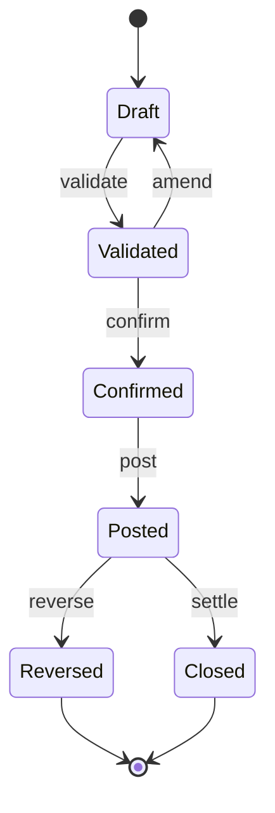

# Volume 05 - Transaction Lifecycle

| Field | Value |
|---|---|
| Document ID | WORLD-VOL05-016 |
| Title | Transaction Lifecycle |
| Version | 1.0 |
| Status | Approved |
| Classification | Internal |
| Founder | Mahesh Choudhary |

## Purpose

This chapter defines how business transactions move through their lifecycle in the WORLD ERP - from initiation to posting to closure - with consistent state management, immutability, and auditability. It unifies the concepts of the preceding chapters (objects, events, workflows, services) into a coherent model of how a transaction lives and changes.

## Scope

Covered: the canonical transaction states, state-transition rules, immutability and adjustment, posting and financial impact, and reversal and correction. Excluded: master reference governance (Chapter 15) and process orchestration mechanics (Chapter 13).

## Architecture as Designed for WORLD

Every transactional business object follows an explicit **state machine**: Draft, Validated, Confirmed, Posted, and Closed, with defined transitions and guards. Transitions emit domain events (Chapter 12) and may be driven by workflows (Chapter 13). Once **Posted**, a transaction is immutable; changes are made only through **adjustments** or **reversals** that create new, linked records, preserving a complete audit trail rather than overwriting history.

Posting is the moment a transaction takes financial and inventory effect - producing ledger entries and stock movements atomically. Multi-company transactions post to the correct company ledgers, and every state change records who or what (a user or the AI Business Partner) initiated it.

### Enterprise Example

A supplier invoice enters as Draft, is Validated against its purchase order and goods receipt (three-way match), Confirmed by an approver, then Posted - atomically creating the payable and the expense ledger entries. A later discovery of an overcharge does not edit the posted invoice; instead a linked credit adjustment is posted, and the audit trail shows both records with their initiators and timestamps. When payment settles, the transaction moves to Closed.

| State | Meaning | Mutability |
|---|---|---|
| Draft | Being prepared | Fully editable |
| Validated | Passed business rules | Editable, revalidates |
| Confirmed | Approved, committed | Locked except cancel |
| Posted | Financial/stock effect taken | Immutable; adjust/reverse only |
| Closed | Settled and complete | Immutable |

## Business Value

A disciplined lifecycle guarantees financial integrity and auditability - the non-negotiables of any ERP. Immutability after posting with linked adjustments satisfies audit and regulatory requirements, while explicit states make process status unambiguous to users, auditors, and the AI Business Partner alike.

## Relationship to the AI Business Partner

The explicit state machine defines exactly which actions the AI Business Partner (Vol 03) may take on a transaction and when. The Partner can advance transactions within its delegated authority - validating, matching, proposing postings - while immutability and audit trails ensure its actions are governed, reversible through proper adjustments, and fully accountable.

## Relationship to Business Foundation

The lifecycle states and approval gates encode the transaction policies defined in the Business Foundation (Vol 02) - separation of duties, approval thresholds, and posting rules. The state machine is the enforcement mechanism for the enterprise's financial governance intent.

## Relationship to Business Intelligence

Each state transition is a timestamped, attributed event, giving Business Intelligence (Vol 04) precise measurement of cycle times, approval latency, and adjustment rates. Because posting is the definitive financial moment, analytics can reconcile operational and financial views from one consistent lifecycle record.

## Enterprise Implementation Approach

Teams define the state machine and guards per transaction type, enforce immutability after posting, and implement corrections exclusively as linked adjustments or reversals. Every transition emits an event and records its initiator. Posting is transactional across ledger and stock effects, and multi-company posting rules are applied by the owning module.

## Cross-References

- [Event-Driven ERP](/docs/blueprint/volume-05-erp-foundation/section-b-core-architecture/12-event-driven-erp.md)
- [Workflow-Centric Architecture](/docs/blueprint/volume-05-erp-foundation/section-b-core-architecture/13-workflow-centric-architecture.md)
- [Master Data Strategy](/docs/blueprint/volume-05-erp-foundation/section-b-core-architecture/15-master-data-strategy.md)

## References

- [Volume 01 - Vision and Philosophy](/docs/blueprint/volume-01-vision-and-philosophy/README.md)
- [Document Standards](/docs/governance/document-standards.md)

## Change Log

| Version | Date | Author | Notes |
|---|---|---|---|
| 1.0 | 2026-07-12 | Lead Software Engineer | Initial approved version. |
