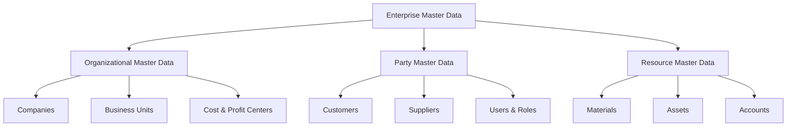

# Volume 05 - Enterprise Master Data

| Field | Value |
|---|---|
| Document ID | WORLD-VOL05-017 |
| Title | Enterprise Master Data |
| Version | 1.0 |
| Status | Approved |
| Classification | Internal |
| Founder | Mahesh Choudhary |

## Purpose

This chapter defines Enterprise Master Data as the authoritative foundation of the WORLD ERP framework. Master data is the set of governed, long-lived business objects that every transaction, process, and intelligence signal in WORLD references. Section C establishes this backbone so that the AI Business Partner operates on a single, trustworthy, semantically consistent representation of the enterprise.

## Scope

This chapter covers the classification, governance, lifecycle, and identity model of master data across all WORLD deployments. It applies to organizational master data (companies, business units, plants, warehouses, departments, cost centers, profit centers), party master data (customers, suppliers, employees, users), and resource master data (materials, assets, accounts). It defines the principles; the following chapters (18-27) specify individual organizational entities.

## Definition and Attributes

Master data in WORLD is any business object that is created once, governed centrally, and reused across many transactions. Unlike transactional data, which records events, master data describes the durable entities that events act upon. Each master record is uniquely and immutably identified, versioned, and tenant-scoped.

| Attribute | Description |
|---|---|
| Master Data ID | Globally unique, immutable identifier assigned at creation |
| Domain | Organizational, Party, or Resource classification |
| Tenant ID | Owning tenant in the multi-tenant boundary |
| Company Scope | Company or set of companies the record is valid for |
| Status | Draft, Active, Suspended, Archived |
| Effective Dating | Valid-from and valid-to for time-aware records |
| Steward | Accountable data owner role |
| Version | Monotonic revision for auditability |

Master data is organized into domains that connect the organizational backbone to the parties and resources it governs.

## Business Value

Governed master data eliminates the fragmentation, duplication, and reconciliation cost that plague conventional ERP estates. A single authoritative record per entity means every report, forecast, and automated action agrees on the same facts. It reduces onboarding time for new companies and locations, prevents master-data drift across modules, and provides the audit-grade lineage required for enterprise trust and compliance.

## Relationship to the AI Business Partner

The AI Business Partner (Volume 03) reasons, recommends, and acts only as well as the master data it stands on. Clean, semantically typed master data gives the AI unambiguous entities to reason over: which company a decision affects, which cost center bears an expense, which user is authorized. Master data is the grounding layer that makes AI actions explainable and safely reversible.

## Relationship to Business Foundation

Enterprise Master Data operationalizes the identity of the enterprise defined in the Business Foundation (Volume 02). The organizational entities described here are the executable form of the organization structure and departmental model in Volume 02 Section B. Master data governance enforces the naming, ownership, and structural rules established at the foundation level.

## Relationship to Business Intelligence

Business Intelligence (Volume 04) consumes master data as its dimensional model. Companies, business units, cost centers, and profit centers become the axes along which every metric is sliced. Because master data is governed once, intelligence is consistent everywhere, and drill-down paths are guaranteed to reconcile.

## Enterprise Implementation Approach

WORLD implements master data through a central master-data service with tenant isolation, stewardship workflows, and effective-dated versioning. Records progress through governed lifecycle states with maker-checker approval. Every downstream module references master data by immutable ID rather than by value, ensuring changes propagate without breaking history.

### Enterprise Example

A manufacturing group deploys WORLD across three legal companies. A single material master, defined once, is extended per company and per plant. When BI reports margin by profit center, and when the AI Business Partner recommends reallocating inventory, both draw on the same governed master records, so their conclusions reconcile automatically.

## Cross-References

- [Organization Structure](/docs/blueprint/volume-05-erp-foundation/section-c-erp-framework/18-organization-structure.md)
- [Companies](/docs/blueprint/volume-05-erp-foundation/section-c-erp-framework/19-companies.md)
- [Volume 02 Section B - Organization Structure](/docs/blueprint/volume-02-business-foundation/section-b-organization/README.md)
- [Volume 04 - Business Intelligence](/docs/blueprint/volume-04-business-intelligence/README.md)

## References

- [Volume 01 - Vision and Philosophy](/docs/blueprint/volume-01-vision-and-philosophy/README.md)
- [Document Standards](/docs/governance/document-standards.md)

## Change Log

| Version | Date | Author | Notes |
|---|---|---|---|
| 1.0 | 2026-07-12 | Lead Software Engineer | Initial approved version. |
