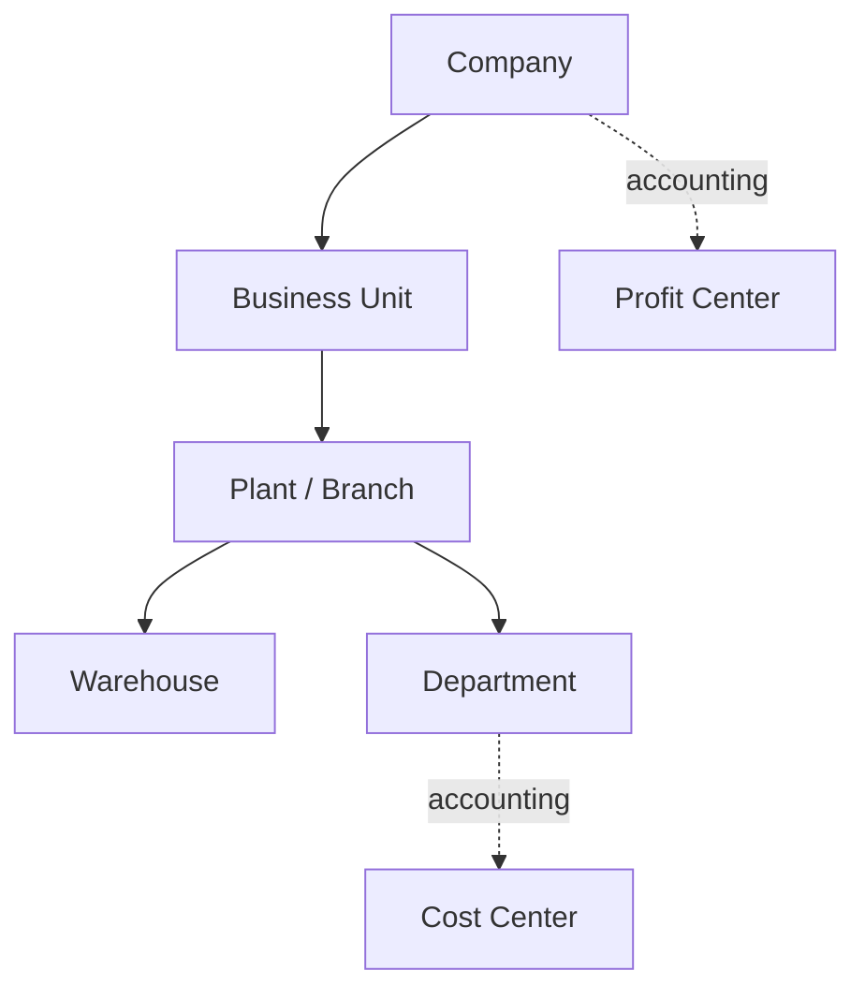

# Volume 05 - Organization Structure

| Field | Value |
|---|---|
| Document ID | WORLD-VOL05-018 |
| Title | Organization Structure |
| Version | 1.0 |
| Status | Approved |
| Classification | Internal |
| Founder | Mahesh Choudhary |

## Purpose

This chapter defines the Organization Structure as the canonical hierarchy that binds all WORLD ERP master data together. It establishes the ordered relationship between companies, business units, plants, warehouses, departments, and the accounting dimensions of cost and profit centers, giving the AI Business Partner an unambiguous map of the enterprise it operates.

## Scope

This chapter specifies the standard organizational hierarchy, the rules that govern parent-child relationships, and the way physical, legal, and accounting views coexist. It applies to all tenants and companies in WORLD and serves as the reference model for the individual entity chapters that follow.

## Definition and Attributes

The Organization Structure is a governed graph of organizational units. It expresses three coexisting perspectives: the legal view (companies), the operational view (business units, plants, warehouses, departments), and the accounting view (cost centers, profit centers). Each unit is a master-data record with an owner, validity, and a defined position in the hierarchy.

| Attribute | Description |
|---|---|
| Org Unit ID | Unique identifier for the organizational unit |
| Unit Type | Company, Business Unit, Plant, Warehouse, Department |
| Parent Unit | Immediate parent in the hierarchy |
| Tenant ID | Owning tenant boundary |
| Accounting Links | Associated cost center and profit center |
| Status | Active, Suspended, Archived |

The standard WORLD hierarchy is consistent across all Section C chapters.

## Business Value

A single canonical structure removes the ambiguity of overlapping hierarchies that fragments legacy ERP systems. It enables consistent authorization scoping, clean financial consolidation, and reliable operational rollups. New locations and units can be added without re-architecting reporting, and the structure itself becomes a reusable asset across every module.

## Relationship to the AI Business Partner

The AI Business Partner uses the organization structure to scope its reasoning and its actions. When it proposes a decision, it knows exactly which unit is affected, who is accountable, and how the impact rolls up. The hierarchy provides the boundaries within which autonomous actions are permitted and the paths along which their effects propagate.

## Relationship to Business Foundation

The organization structure is the executable realization of the organizational model defined in Volume 02 Section B. Where the Business Foundation describes the intended shape of the enterprise, this chapter renders it as governed, machine-actionable master data, preserving the same units, ownership, and departmental definitions.

## Relationship to Business Intelligence

Every metric in Volume 04 is aggregated along this hierarchy. The structure supplies the drill-down and rollup paths for financial and operational analytics, guaranteeing that a figure at company level reconciles exactly with the sum of its business units, plants, and departments.

## Enterprise Implementation Approach

WORLD models the organization structure as an effective-dated graph with strict single-parent operational containment and multi-dimensional accounting overlays. Structural changes are governed by maker-checker workflows and versioned so that historical reporting remains stable even as the enterprise reorganizes.

### Enterprise Example

A retail enterprise defines one company, two business units (Retail and Wholesale), five branch plants, and ten warehouses. Departments hang off each branch, while cost centers track departmental spend and profit centers track business-unit margin. The AI Business Partner reads this single structure to route approvals, allocate costs, and forecast branch performance.

## Cross-References

- [Enterprise Master Data](/docs/blueprint/volume-05-erp-foundation/section-c-erp-framework/17-enterprise-master-data.md)
- [Companies](/docs/blueprint/volume-05-erp-foundation/section-c-erp-framework/19-companies.md)
- [Business Units](/docs/blueprint/volume-05-erp-foundation/section-c-erp-framework/20-business-units.md)
- [Volume 02 Section B - Organization Structure](/docs/blueprint/volume-02-business-foundation/section-b-organization/README.md)

## References

- [Volume 01 - Vision and Philosophy](/docs/blueprint/volume-01-vision-and-philosophy/README.md)
- [Document Standards](/docs/governance/document-standards.md)

## Change Log

| Version | Date | Author | Notes |
|---|---|---|---|
| 1.0 | 2026-07-12 | Lead Software Engineer | Initial approved version. |
