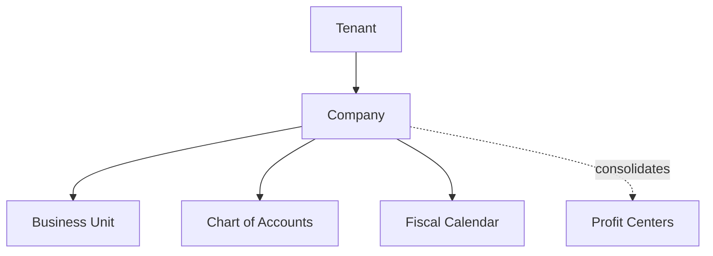

# Volume 05 - Companies

| Field | Value |
|---|---|
| Document ID | WORLD-VOL05-019 |
| Title | Companies |
| Version | 1.0 |
| Status | Approved |
| Classification | Internal |
| Founder | Mahesh Choudhary |

## Purpose

This chapter defines the Company as the top-level legal and financial entity in the WORLD ERP framework. The company is the anchor of the organization structure, the boundary for statutory reporting and consolidation, and the primary scope within which the AI Business Partner operates.

## Scope

This chapter specifies the company master-data object, its key attributes, its relationship to the tenant boundary and to subordinate organizational units, and the rules governing multi-company operation. It applies to all WORLD deployments, whether single-company or multi-company groups.

## Definition and Attributes

A Company in WORLD is a legally recognized entity with its own chart of accounts, fiscal calendar, base currency, and statutory identity. One tenant may contain many companies. The company owns business units and is the root of financial consolidation and legal reporting.

| Attribute | Description |
|---|---|
| Company ID | Unique immutable company identifier |
| Legal Name | Registered legal entity name |
| Tenant ID | Owning tenant boundary |
| Base Currency | Functional reporting currency |
| Fiscal Calendar | Accounting periods and year-end |
| Chart of Accounts | Assigned ledger structure |
| Tax Registration | Statutory tax and registration identifiers |
| Status | Active, Suspended, Archived |

## Business Value

Modeling the company as a first-class master object enables clean multi-company operation on a single WORLD platform. Groups can consolidate financials, share master data selectively, and enforce statutory boundaries without deploying separate systems. Intercompany transactions, currency translation, and legal reporting all derive from this well-defined entity.

## Relationship to the AI Business Partner

The company defines the primary legal and financial context in which the AI Business Partner acts. Autonomous and advisory actions are scoped to a company, ensuring that decisions respect statutory boundaries, currency, and fiscal calendars. When the AI operates across companies, it explicitly reasons about intercompany implications.

## Relationship to Business Foundation

The company realizes the legal-entity identity described in the Business Foundation (Volume 02). It carries the mission-aligned governance and ownership rules of Volume 02 into an executable financial and legal boundary within the ERP.

## Relationship to Business Intelligence

The company is the top consolidation dimension in Volume 04 analytics. Group-level intelligence rolls up from company figures, and cross-company comparisons rely on the company master to normalize currency and fiscal periods for accurate benchmarking.

## Enterprise Implementation Approach

WORLD provisions companies within a tenant, each with its own ledger, currency, and calendar, while allowing controlled sharing of party and resource master data. Intercompany rules, consolidation hierarchies, and currency translation are configured at the company level and governed through approval workflows.

### Enterprise Example

A holding group runs three companies in WORLD: a manufacturing entity in one currency, a distribution entity in another, and a services entity in a third. Each maintains its own statutory books, yet the group consolidates monthly, and the AI Business Partner flags an intercompany pricing imbalance between the manufacturing and distribution companies.

## Cross-References

- [Organization Structure](/docs/blueprint/volume-05-erp-foundation/section-c-erp-framework/18-organization-structure.md)
- [Business Units](/docs/blueprint/volume-05-erp-foundation/section-c-erp-framework/20-business-units.md)
- [Profit Centers](/docs/blueprint/volume-05-erp-foundation/section-c-erp-framework/25-profit-centers.md)
- [Volume 02 Section B - Organization Structure](/docs/blueprint/volume-02-business-foundation/section-b-organization/README.md)

## References

- [Volume 01 - Vision and Philosophy](/docs/blueprint/volume-01-vision-and-philosophy/README.md)
- [Document Standards](/docs/governance/document-standards.md)

## Change Log

| Version | Date | Author | Notes |
|---|---|---|---|
| 1.0 | 2026-07-12 | Lead Software Engineer | Initial approved version. |
