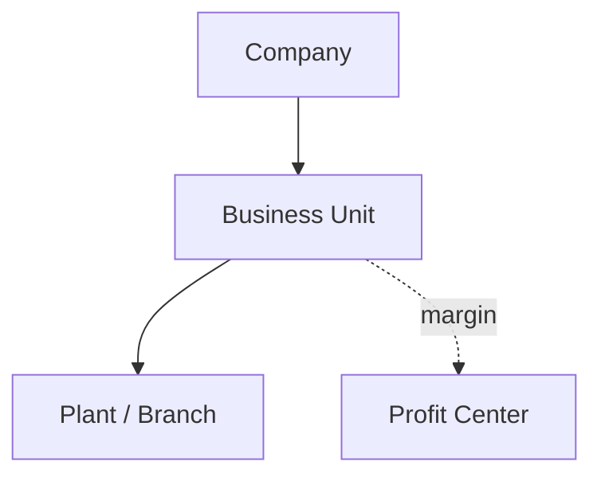

# Volume 05 - Business Units

| Field | Value |
|---|---|
| Document ID | WORLD-VOL05-020 |
| Title | Business Units |
| Version | 1.0 |
| Status | Approved |
| Classification | Internal |
| Founder | Mahesh Choudhary |

## Purpose

This chapter defines the Business Unit as the operational division within a company in the WORLD ERP framework. Business units organize a company into lines of business or divisions, giving structure to operations, accountability, and performance management below the legal-entity level.

## Scope

This chapter specifies the business-unit master-data object, its attributes, its position between company and plant in the hierarchy, and its role as a primary axis of operational and financial accountability. It applies to all multi-division WORLD deployments.

## Definition and Attributes

A Business Unit is a governed subdivision of a company representing a distinct line of business, division, or operating segment. It owns plants and branches, is typically associated with a profit center for margin accountability, and provides a management view that sits between statutory reporting and physical operations.

| Attribute | Description |
|---|---|
| Business Unit ID | Unique immutable identifier |
| Company ID | Parent company |
| Name | Division or line-of-business name |
| Manager Role | Accountable leadership role |
| Profit Center | Associated margin accountability dimension |
| Status | Active, Suspended, Archived |

## Business Value

Business units give large enterprises a management structure that reflects how they actually operate, independent of legal boundaries. They enable divisional performance measurement, focused accountability, and flexible reorganization without disturbing the statutory company structure. Segment reporting and resource allocation become natural and consistent.

## Relationship to the AI Business Partner

The business unit gives the AI Business Partner a divisional lens for reasoning and recommendation. It can compare divisions, detect underperformance, and target interventions at the right operating segment. Authorization and action scoping can be delegated to business-unit boundaries, enabling divisional autonomy under group governance.

## Relationship to Business Foundation

Business units realize the divisional and line-of-business structure defined in Volume 02 Section B. They translate the foundation's operating-model intent into an ERP object that carries accountability and ownership through to daily operations.

## Relationship to Business Intelligence

Business units are a core reporting dimension in Volume 04. Segment margin, divisional KPIs, and cross-division benchmarking all aggregate along the business-unit axis, giving leadership a clear view of where value is created within each company.

## Enterprise Implementation Approach

WORLD provisions business units under companies with an associated profit center and management role. Structural changes are effective-dated so historical divisional reporting remains stable through reorganizations. Operational and financial authorizations can be scoped to the business unit for delegated governance.

### Enterprise Example

A company operates two business units: Consumer Products and Industrial Solutions. Each owns its own plants and warehouses, and each maps to a profit center. The AI Business Partner identifies that Industrial Solutions is carrying excess inventory relative to its sales velocity and recommends a rebalancing plan scoped to that unit.

## Cross-References

- [Companies](/docs/blueprint/volume-05-erp-foundation/section-c-erp-framework/19-companies.md)
- [Plants](/docs/blueprint/volume-05-erp-foundation/section-c-erp-framework/21-plants.md)
- [Profit Centers](/docs/blueprint/volume-05-erp-foundation/section-c-erp-framework/25-profit-centers.md)
- [Volume 02 Section B - Organization Structure](/docs/blueprint/volume-02-business-foundation/section-b-organization/README.md)

## References

- [Volume 01 - Vision and Philosophy](/docs/blueprint/volume-01-vision-and-philosophy/README.md)
- [Document Standards](/docs/governance/document-standards.md)

## Change Log

| Version | Date | Author | Notes |
|---|---|---|---|
| 1.0 | 2026-07-12 | Lead Software Engineer | Initial approved version. |
