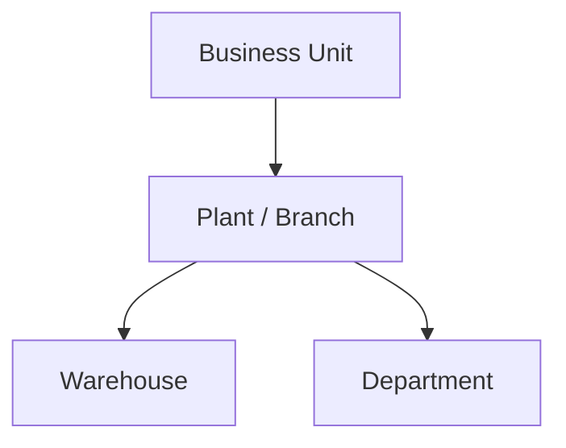

# Volume 05 - Plants

| Field | Value |
|---|---|
| Document ID | WORLD-VOL05-021 |
| Title | Plants |
| Version | 1.0 |
| Status | Approved |
| Classification | Internal |
| Founder | Mahesh Choudhary |

## Purpose

This chapter defines the Plant as the physical operating location within a business unit in the WORLD ERP framework. A plant (also modeled as a branch for non-manufacturing enterprises) is where production, service delivery, distribution, or sales physically occur, and it anchors location-specific operations, inventory, and logistics.

## Scope

This chapter specifies the plant master-data object, its attributes, its position between business unit and warehouse or department, and its role as the operational location for physical processes. It applies industry-independently, treating manufacturing plants, service branches, and retail locations as instances of the same object.

## Definition and Attributes

A Plant is a governed physical location owned by a business unit. It hosts warehouses and departments, carries a physical address and operating calendar, and is the point at which materials, capacity, and logistics are localized. Plants make the organization structure geographically concrete.

| Attribute | Description |
|---|---|
| Plant ID | Unique immutable identifier |
| Business Unit ID | Parent business unit |
| Type | Manufacturing, Distribution, Service, Retail Branch |
| Address | Physical location and region |
| Operating Calendar | Working days and shifts |
| Status | Active, Suspended, Archived |

## Business Value

Plants localize operations, capacity, and inventory to real places, enabling site-level planning, logistics optimization, and regional compliance. They allow the enterprise to scale geographically while maintaining consistent processes, and they provide the granularity needed for location-based cost and performance analysis.

## Relationship to the AI Business Partner

The plant gives the AI Business Partner spatial context. It can reason about capacity by site, propose inventory transfers between plants, optimize logistics routes, and detect location-specific bottlenecks. Actions such as replenishment or production scheduling are scoped and grounded at the plant level.

## Relationship to Business Foundation

Plants realize the physical operating footprint described in the Business Foundation (Volume 02). They convert the foundation's location and capacity model into governed ERP objects that daily logistics and production processes act upon.

## Relationship to Business Intelligence

Plants are the geographic dimension in Volume 04 analytics. Throughput, utilization, and cost-to-serve are measured per plant and rolled up to business unit and company, enabling site benchmarking and network optimization insights.

## Enterprise Implementation Approach

WORLD provisions plants under business units with type, address, and operating calendar. Each plant hosts one or more warehouses and departments and links to cost centers for site expense tracking. Plant records are effective-dated to preserve historical location reporting through network changes.

### Enterprise Example

A distribution business unit operates four plants across three regions. When a regional demand spike occurs, the AI Business Partner evaluates capacity and inventory at each plant and recommends transferring stock from an underutilized plant to the one nearest the surge, minimizing cost-to-serve.

## Cross-References

- [Business Units](/docs/blueprint/volume-05-erp-foundation/section-c-erp-framework/20-business-units.md)
- [Warehouses](/docs/blueprint/volume-05-erp-foundation/section-c-erp-framework/22-warehouses.md)
- [Departments](/docs/blueprint/volume-05-erp-foundation/section-c-erp-framework/23-departments.md)
- [Volume 02 Section B - Organization Structure](/docs/blueprint/volume-02-business-foundation/section-b-organization/README.md)

## References

- [Volume 01 - Vision and Philosophy](/docs/blueprint/volume-01-vision-and-philosophy/README.md)
- [Document Standards](/docs/governance/document-standards.md)

## Change Log

| Version | Date | Author | Notes |
|---|---|---|---|
| 1.0 | 2026-07-12 | Lead Software Engineer | Initial approved version. |
