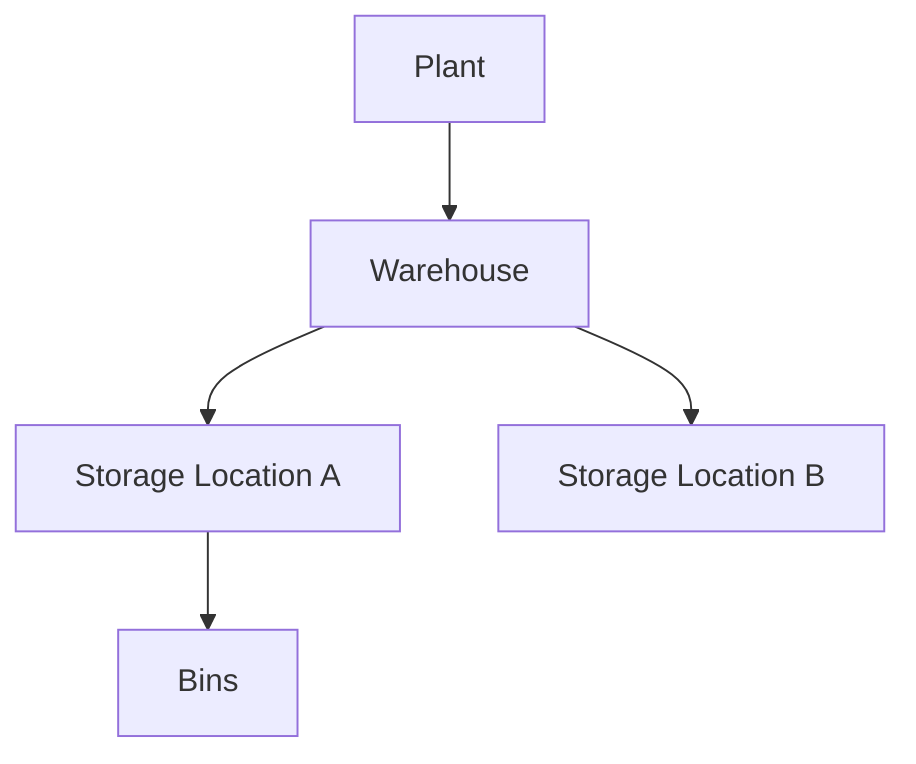

# Volume 05 - Warehouses

| Field | Value |
|---|---|
| Document ID | WORLD-VOL05-022 |
| Title | Warehouses |
| Version | 1.0 |
| Status | Approved |
| Classification | Internal |
| Founder | Mahesh Choudhary |

## Purpose

This chapter defines the Warehouse as the inventory-holding location within a plant in the WORLD ERP framework. Warehouses are where physical stock is stored, moved, and controlled, providing the spatial granularity required for accurate inventory management and fulfillment.

## Scope

This chapter specifies the warehouse master-data object, its attributes, its storage-location substructure, and its relationship to the plant that owns it. It applies to all WORLD deployments that handle physical or serialized inventory.

## Definition and Attributes

A Warehouse is a governed storage facility belonging to a plant. It is subdivided into storage locations or bins that pinpoint where inventory resides. Warehouses hold stock, record movements, and provide the inventory positions that fulfillment and replenishment processes depend on.

| Attribute | Description |
|---|---|
| Warehouse ID | Unique immutable identifier |
| Plant ID | Parent plant |
| Type | Raw, Finished Goods, Distribution, Transit |
| Storage Locations | Bins, zones, or aisles within the warehouse |
| Capacity | Volumetric or unit storage capacity |
| Status | Active, Suspended, Archived |

## Business Value

Warehouses provide the precision that turns inventory from an abstract number into a controllable asset. Accurate storage-location tracking reduces stockouts and overstock, accelerates fulfillment, and improves inventory accuracy. Capacity modeling supports space optimization and warehouse network planning.

## Relationship to the AI Business Partner

The warehouse gives the AI Business Partner fine-grained inventory awareness. It can recommend replenishment at the storage-location level, optimize put-away and picking paths, predict capacity constraints, and trigger transfers before stockouts occur. Inventory actions are grounded at the warehouse and location level.

## Relationship to Business Foundation

Warehouses realize the inventory and fulfillment capabilities implied by the operating model in Volume 02. They give physical form to the enterprise's promise to hold and deliver goods, governed as ERP master data.

## Relationship to Business Intelligence

Warehouses are the inventory dimension in Volume 04 analytics. Stock turns, carrying cost, fill rate, and inventory accuracy are measured per warehouse and location, then rolled up to plant and business unit for network-level insight.

## Enterprise Implementation Approach

WORLD provisions warehouses under plants with typed storage locations and capacity. Inventory movements are recorded against warehouse and storage location, giving real-time positions. Warehouse master records are effective-dated so historical inventory reporting survives facility changes.

### Enterprise Example

A finished-goods warehouse within a manufacturing plant is organized into zones by product family. As demand shifts seasonally, the AI Business Partner detects that a fast-moving family is stored in a distant zone and recommends re-slotting it to a nearer zone to cut picking time and improve throughput.

## Cross-References

- [Plants](/docs/blueprint/volume-05-erp-foundation/section-c-erp-framework/21-plants.md)
- [Business Units](/docs/blueprint/volume-05-erp-foundation/section-c-erp-framework/20-business-units.md)
- [Cost Centers](/docs/blueprint/volume-05-erp-foundation/section-c-erp-framework/24-cost-centers.md)
- [Volume 04 - Business Intelligence](/docs/blueprint/volume-04-business-intelligence/README.md)

## References

- [Volume 01 - Vision and Philosophy](/docs/blueprint/volume-01-vision-and-philosophy/README.md)
- [Document Standards](/docs/governance/document-standards.md)

## Change Log

| Version | Date | Author | Notes |
|---|---|---|---|
| 1.0 | 2026-07-12 | Lead Software Engineer | Initial approved version. |
